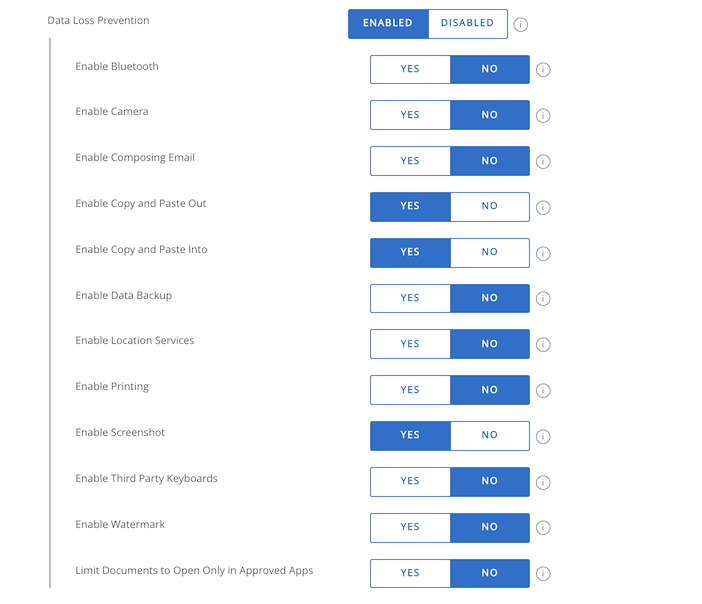
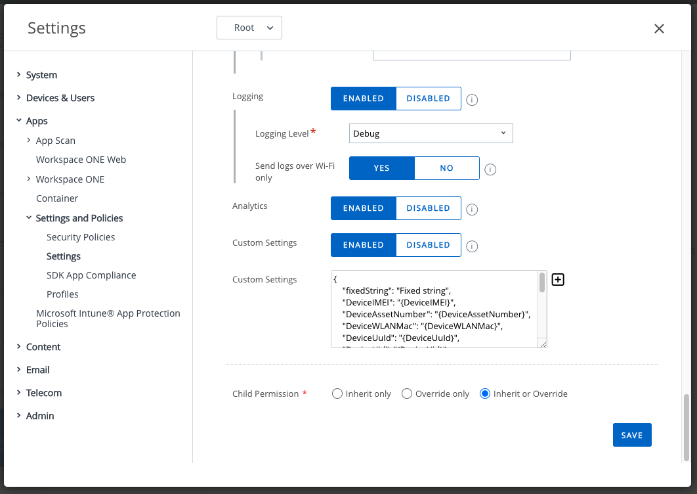

# Applications
The project in the Workspace ONE Integration Guide for Android code repository
contains a number of demonstration applications. Links to the application code
are here. For an introduction to the repository, see the [parent directory](..)
readme file.

There is a single project under the [Apps](../Apps) directory. Individual
applications are in sub-directories, each holding a complete application written
either in Java or in Kotlin, as follows.

# Base Application
The base applications have no integration with the Workspace ONE for Android
software development kit (SDK). The code is used as a base for other
applications.

-   [Apps/baseJava](../Apps/baseJava)
-   [Apps/baseKotlin](../Apps/baseKotlin)

The user interface is a single text that appears in the centre of the screen.
When you tap the text, it cycles between

-   fixed message.
-   module name of the application, "base Kotlin" for example.
-   dark mode message.

The user interface appears in dark mode if the device is in dark mode, and vice
versa.

# Base Integration Guide
The following applications are demonstrations for the
[Base Integration Guide](../Guides/03BaseIntegration/WorkspaceONE_Android_BaseIntegration.md).

## Client level integration
Demonstration apps for client level integration.

-   [Apps/clientJava](../Apps/clientJava)
-   [Apps/clientKotlin](../Apps/clientKotlin)

The user interface displays the console version. Tapping the console version
message toggles a display of the SDK profile that was retrieved from the
console.

The console version is also displayed in an Android toast message when the SDK
has been initialized.

## Framework level integration
Demonstration apps for framework level integration, either by delegation or by
extension.

-   [Apps/frameworkDelegateJava](../Apps/frameworkDelegateJava)
-   [Apps/frameworkDelegateKotlin](../Apps/frameworkDelegateKotlin)
-   [Apps/frameworkExtendJava](../Apps/frameworkExtendJava)
-   [Apps/frameworkExtendKotlin](../Apps/frameworkExtendKotlin)

The user interface is the same as the Client level integration demonstration
apps except as follows.

-   SDK status is displayed instead of the console version.
-   The SDK profile has a plain text layout instead of JavaScript Object
    Notation (JSON).

# Branding Integration Guide
The following applications are demonstrations for the 
[Branding Integration Guide](../Guides/04Branding/WorkspaceONE_Android_Branding.md).

These applications are all integrated to the Framework level, either by
delegation or by extension.

## Enterprise branding support only
Demonstration apps for support of enterprise branding.

-   [Apps/brandEnterpriseOnlyDelegateJava](../Apps/brandEnterpriseOnlyDelegateJava)
-   [Apps/brandEnterpriseOnlyDelegateKotlin](../Apps/brandEnterpriseOnlyDelegateKotlin)
-   [Apps/brandEnterpriseOnlyExtendJava](../Apps/brandEnterpriseOnlyExtendJava)
-   [Apps/brandEnterpriseOnlyExtendKotlin](../Apps/brandEnterpriseOnlyExtendKotlin)

Branding resources from the management console, if configured, will appear in
the SDK user interface, as follows.

-   On the SDK splash screen that is displayed when the application starts
    cold:
    -   Logo will be a branding image.
    -   Color of the progress bar will be from the brand palette.

-   On the SDK login screen that is displayed when, for example, the end
    user sets a passcode after registration:
    -   Logo will be a branding image.
    -   Background color of, for example, the Next and Confirm navigation
        controls will be from the brand palette.

If any of the above branding resources don't appear, check the configuration in
the management console. Instructions can be found in the appendix to the
Branding Integration Guide.

## Static application branding
Demonstration apps for support of static branding.

-   [Apps/brandStaticDelegateJava](../Apps/brandStaticDelegateJava)
-   [Apps/brandStaticDelegateKotlin](../Apps/brandStaticDelegateKotlin)
-   [Apps/brandStaticExtendJava](../Apps/brandStaticExtendJava)
-   [Apps/brandStaticExtendKotlin](../Apps/brandStaticExtendKotlin)

Resources from the app appear in the SDK user interface, as follows.

-   On the SDK splash screen that is displayed when the application starts
    cold:
    -   Logo will be an app drawable.
    -   Color of the progress bar will be an app color.
    -   Background color will be an app color, unless in dark mode.

-   On the SDK login screen that is displayed when, for example, the end
    user sets a passcode after registration:
    -   Logo will be an app drawable.
    -   Background color will be an app color, unless in dark mode.

A drawable from the app resources also appears in the app user interface.

## Static application branding with optional override to enterprise branding
Demonstration apps for support of static branding overridden by enterprise
branding.

-   [Apps/brandEnterprisePriorityDelegateJava](../Apps/brandEnterprisePriorityDelegateJava)
-   [Apps/brandEnterprisePriorityDelegateKotlin](../Apps/brandEnterprisePriorityDelegateKotlin)
-   [Apps/brandEnterprisePriorityExtendJava](../Apps/brandEnterprisePriorityExtendJava)
-   [Apps/brandEnterprisePriorityExtendKotlin](../Apps/brandEnterprisePriorityExtendKotlin)

Resources from the app and the management console appear in the SDK and app user
interface, as described in the preceding sections. In case both the console and
app specify a resource, the console specification has priority.

## Dynamic branding
Demonstration apps for dynamic branding.

-   [Apps/brandDynamicDelegateJava](../Apps/brandDynamicDelegateJava)
-   [Apps/brandDynamicDelegateKotlin](../Apps/brandDynamicDelegateKotlin)
-   [Apps/brandDynamicExtendJava](../Apps/brandDynamicExtendJava)
-   [Apps/brandDynamicExtendKotlin](../Apps/brandDynamicExtendKotlin)

Dynamically generated resources appear in the SDK user interface, as follows.

-   On the SDK splash screen that is displayed when the application starts cold:
    -   Logo will be an image generated at run time from the following texts:
        -   The word "Loading".
        -   The current date and time.
        -   A hexadecimal representation of the Primary Color in the enterprise
            brand palette if one is set, or the word "null" if unset or
            unavailable.
    -   Color of the progress bar will be red.

-   On the SDK login screen that is displayed when, for example, the end user
    sets a passcode after registration:
    -   Logo will be an image generated at run time from the following texts:
        -   The word "Input".
        -   The current date and time.
        -   A hexadecimal representation of the Primary Color in the enterprise
            brand palette if one is set, or the word "null" if unset or
            unavailable.
    -   Background color of, for example, the Next and Confirm navigation
        controls will be red.

-   When the SDK posts a notification, the small icon that is displayed in the
    device status bar will be an app drawable.
    
    In some deployments, power cycling the mobile device will cause the SDK to
    post a notification, that the application requires authentication.

The app user interface has the following elements.

-   An image from the app drawable resources is displayed in the upper half of
    the screen. When the image is tapped, an Android notification is posted. The
    notification icon will be an app drawable.
-   An enterprise branding image is displayed in the lower half of the screen,
    if configured in the management console.

# Privacy Agreement Integration Guide
The following application is a demonstration for the
[Privacy Agreement Module Integration Guide](../Guides/05Privacy/WorkspaceONE_Android_Privacy.md).

-   [Apps/privacyKotlin](../Apps/privacyKotlin)

When the app is launched after a fresh install a privacy agreement is displayed
that the user must accept. The agreement isn't displayed on subsequent launches.
After the agreement has been accepted the app user interface opens.

The app user interface displays the following options.

-   Review the privacy agreement.
-   Revert the privacy agreement.

When the agreement is reverted, the review option changes to an accept option.

Note that this app doesn't integrate the core SDK, neither at the client nor
framework level.

# Data Loss Prevention Application
Demonstration app for Data Loss Prevention Workspace ONE features:

-   [Apps/dlpExtendKotlin](../Apps/dlpExtendKotlin)

This integrates the SDK at the framework level.
This app utilizes custom Workspace ONE Data Loss Prevention settings and UI components to showcase some features that can be configured from the management console.

To configure these settings proceed as follows:

1.  Log in to your Workspace ONE Unified Endpoint Manager (UEM) console and
    select the organization group (OG) for your end user.

2.  Navigate to Groups & Settings, All Settings, Settings.

3.  Select Apps: Settings and Policies: Security Policies.

    Here you can enable Data Loss Prevention which will give you the ability to configure different mechanisms that restrict extracting data from the app in an unauthorized manner.

    

The app user interface begins with the main page that can take the user to a variety of demonstration activities from the navigation app bar.

The SDK tab page will take the user to a screen that showcases the policies and settings associated with the device's SDK profile
This includes information on Passcode Policies, Data Loss Prevention Settings, and much more. This page also has the ability to fetch the latest settings from the console,
just in case you want to change settings and have them instantly reflected in the app.

Selecting UI titled pages will take you to an activity dedicated to showing the difference between them and their stock counterpart.
These apps do not show the full extent of what is possible using DLP settings, however they give a quick briefing over some such as:
- Enable Copy and Paste Out
- Enable Copy and Paste Into
- Enable Watermark

Other than the UI pages, the app features an Inactivity Countdown page which can be used to track the app inactivty time needed to lock out the user.

# Additional Sample Applications
The following applications are additional demonstrations that aren't associated
with particular integration guides.

## Identification and Custom Settings
The following application demonstrates device identification and custom settings
features of the Workspace ONE platform.

-   [Apps/identificationDemo](../Apps/identificationDemo)

The app integrates the SDK at the client level.

The app utilizes Workspace ONE custom settings to receive device identification
values from the management console. To configure the settings in the console,
proceed as follows.

1.  Log in to your Workspace ONE Unified Endpoint Manager (UEM) console and
    select the organization group (OG) for your end user.

2.  Navigate to Groups & Settings, All Settings, Settings.

3.  Select Custom Settings: Enabled.

    This will make a Custom Settings text field appear.

4.  Paste into the Custom Settings text field the contents of the file:
    [Resources/customSettings.json](../Resources/customSettings.json)

The following screen capture shows the location in the UEM user interface.

The app user interface is a static display of the custom settings values and
other settings and information retrieved from the console and device. Note that
the  custom settings have instantiated template values.

# Duplication
A lot of the code in the project is duplicated between applications. In theory,
code could be, for example, pulled in from common directories by Gradle or a
custom tool. In practice, those approaches have limitations, lead to more
maintenance overhead than duplication, and don't result in a repository that is
easy to understand for prospective application developers.  
Duplication is managed by the maintainers of the repository. See also the
[samers.md](samers.md) file.

# License
Copyright 2022 VMware, Inc. All rights reserved.  
The Workspace ONE Software Development Kit integration samples are licensed
under a two-clause BSD license.  
SPDX-License-Identifier: BSD-2-Clause
