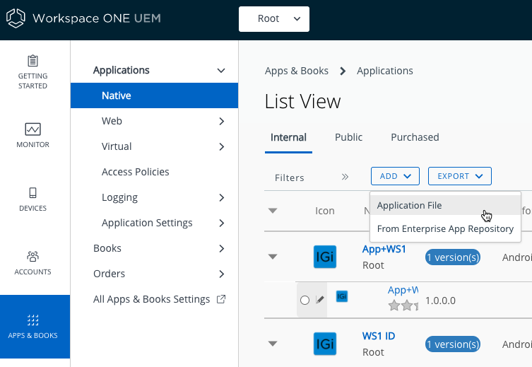
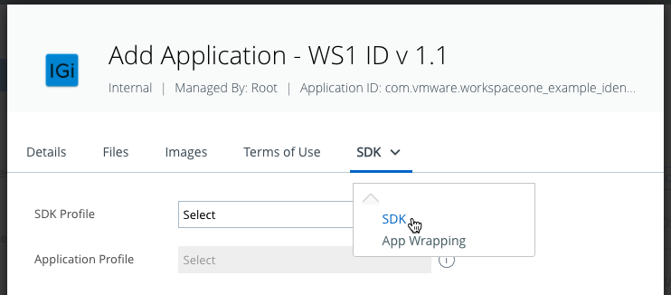
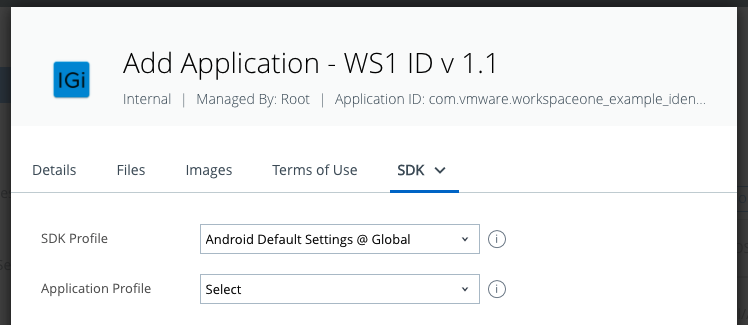
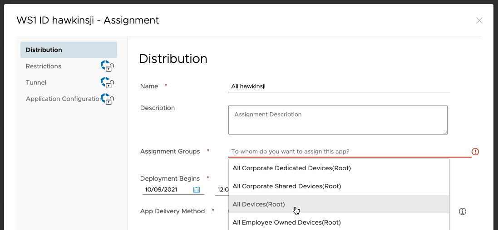
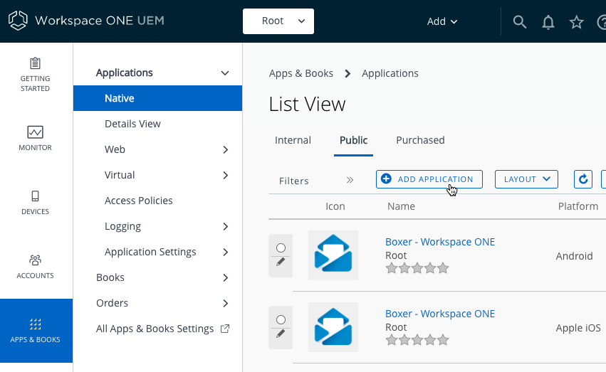
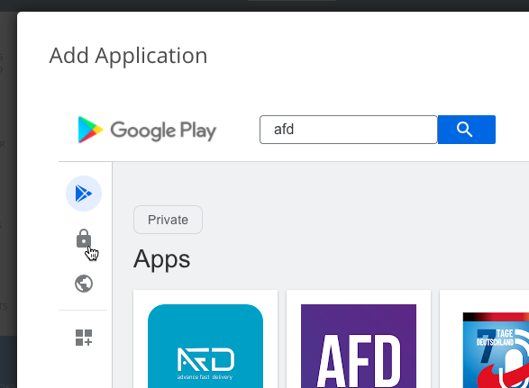
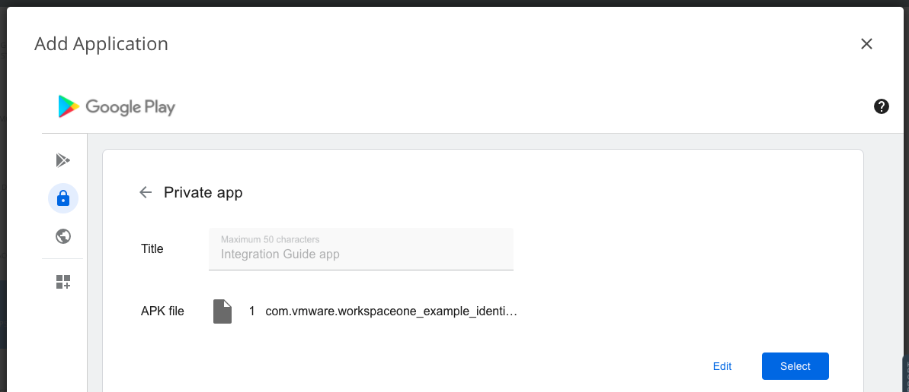
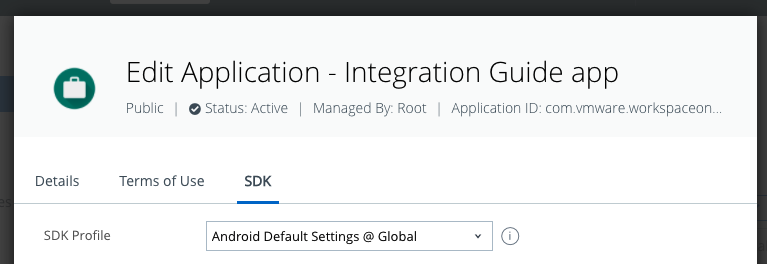
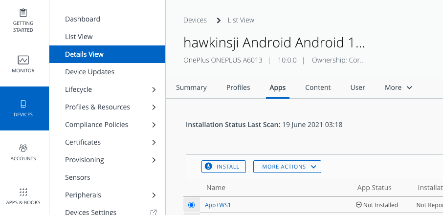

# Integration Preparation Guide
## Workspace ONE for Android
Android applications can be integrated with the VMware Workspace ONE® platform,
by using its mobile software development kit. Complete the tasks below to
prepare for integration.

This document is part of the Workspace ONE Integration Guide for Android set.

# Table of Contents
{{TOC}}

# Introduction
The tasks detailed below should be done first, to prepare for integration of
your Android application with the Workspace ONE platform. After completing these
tasks, you will be ready to begin the integration.

## Integration Guides
This document is part of the Workspace ONE Integration Guide for Android set. An
overview that includes links to all the guides is available

-   in Markdown format, in the repository that also holds the sample code:  
    [https://github.com/vmware-samples/...IntegrationOverview.md](https://github.com/vmware-samples/workspace-ONE-SDK-integration-samples/blob/main/IntegrationGuideForAndroid/Guides/01Overview/WorkspaceONE_Android_IntegrationOverview.md)

-   in Portable Document Format (PDF), on the VMware website:  
    [https://developer.vmware.com/...IntegrationOverview.pdf](https://developer.vmware.com/docs/12354/WorkspaceONE_Android_IntegrationOverview.pdf)

# Prerequisite Conditions
Before you begin, you will need the following.

-   Access to a Workspace ONE management console.

    You will need access to a Workspace ONE management console to work on
    application integration. The management console is sometimes referred to as
    the UEM, an abbreviation for Unified Endpoint Manager.

    You will need to know the following:

    -   Server address.
    -   Administrative login credentials.

    You will need the following privileges:

    -   Upload an application package (APK) file.
    -   Either create an organisation group for an end user, or get the name of
        an existing group.
    -   Either create a new end user with a suitable profile for development
        purposes, or get the name of an existing suitable user.
    -   Either create enrolment credentials for an end user, or get existing
        credentials.

    Best practice is to have a separate console, or organisation group, for 
    software development.

    Check the [Compatibility] table for a recommended version.

-   Developer environment.

    The instructions in the integration guide documents assume you use the
    Android Studio integrated developer environment (IDE). Check the
    [Compatibility] table for a recommended version.

-   Android application source code.

    Integrating an application with Workspace ONE will involve changes to the
    application source code. You will need access to the Java or Kotlin source,
    to the manifest and resources, and to any other files required to build the
    application.

    You can integrate Workspace ONE with an existing Android application of your
    own, or with an Android sample application, or start a new application from
    an Android Studio template, for example.

    The instructions in the integration guide documents assume your application
    uses AndroidX instead of the original support library. Instructions for
    migrating from the support library to AndroidX can be found on the Android
    developer website, for example here:  
    [https://developer.android.com/jetpack/androidx/migrate](https://developer.android.com/jetpack/androidx/migrate)

-   Developer device.

    You will need a physical Android device to to work on application
    integration.
    
    The Android emulator cannot be used because emulated devices may appear as
    rooted or otherwise compromised to the Workspace ONE Intelligent Hub
    application. The Hub must be used to install the application that is being
    integrated at least once during the integration work.

    After the first installation via Hub, subsequent installations can be made
    using the Android Debug Bridge (adb) tool. The device must be set up for
    developer use. Instructions for setting up a developer device can be found
    on the Android developer website, for example on the following pages.
    
    -   [https://developer.android.com/studio/debug/dev-options.html](https://developer.android.com/studio/debug/dev-options.html)
    -   [https://developer.android.com/studio/run/device](https://developer.android.com/studio/run/device)

    Don't use a device that is already enrolled with a production Workspace ONE
    console. A device can be unenrolled by removing or resetting the Hub
    application on the device, and uninstalling any associated applications.

When the prerequisite conditions are met, you can start the first
[Task: Install application via Workspace ONE].

## Compatibility
Instructions in this document have been followed with the Workspace ONE Software
Development Kit (SDK) for Android and other software, to confirm compatibility.

The following table shows the software versions used for the instructions, and
the minimum supported versions if different.

Software                                           | Instructions | Supported |
---------------------------------------------------|--------------|-----------|
Workspace ONE software development kit for Android | 24.01        |           |
Workspace ONE management console                   | 2306         | 2206      |
Workspace ONE Intelligent Hub application          | 24.01        | 22.02     |
Android Operating System                           | Android 13   | Android 5 |
Android Studio integrated development environment  | 2022.3.1     | 2020.3.1  |
Gradle plugin for Android                          | 7.2.2        | 7.2.1     |

# Task: Install application via Workspace ONE
Installing the application via Workspace ONE is a platform integration task for
Android application developers. It applies to all levels of platform
integration.

## Installation Order
If you follow the integration guide, you will install your application on a
developer device as follows.

-   The first installation will be of a non-integrated version of the
    application via Workspace ONE, by following the instructions below.

-   Subsequent installations will be of integrated versions of the application,
    via the Android Debug Bridge (adb) tool.

The adb installations will be upgrades. The application won't ever be
uninstalled after the first installation via Workspace ONE.

It actually isn't necessary to install an application via Workspace ONE if it
isn't integrated. It might therefore seem natural to delay installation via
Workspace ONE until some integration work has been done. This guide doesn't
follow that order though.

The rationale is that installation via Workspace ONE involves activities with
which you may be unfamiliar, such as setting up signed builds, and use of the
Workspace ONE management console. It's better to do those activities with the
application in a known working state.

## Instructions
The instructions assume that the [Prerequisite Conditions] are all met.

Proceed as follows.

1.  Install and enrol the Hub application.

    Install the Workspace ONE Intelligent Hub application on the device and
    complete enrolment. The Hub can be installed from Google Play. Search for
    "workspace one intelligent hub", for example.

    Follow the instructions in the Hub application to complete enrolment. You
    will need to know the server address and a set of end user enrolment
    credentials.

    **Tip**: Set a device passcode before you begin enrolment. Typical UEM
    configurations will require a passcode, as a security policy. If a device
    passcode isn't set at the start of the enrolment interaction, you will be
    forced to  set it as an enrolment step, which sometimes doesn't go smoothly.

    **Warning**: The Hub application cannot be enrolled with more than one
    management console at a time. If the Hub is already installed and enrolled
    on your developer device, then it must now be removed and re-installed, or
    must be reset, i.e. have its storage cleared. Removing or resetting the Hub
    may cause removal of any associated applications from the device.

    Check the [Compatibility] table for a recommended version of Hub.

2.  Generate a signed package file for your application.

    You will need a signed Android package (APK) file for your application. A
    signed APK can be generated by Android Studio. If you need instructions, see
    the [Appendix: How to generate a signed Android package every build].

    Note that you don't need to do any Workspace ONE integration in the
    application at this stage.

    You can use any key store to sign the APK, even one you create ad hoc now.
    You don't have to use the same key your organisation uses to sign APK files
    for production.

3.  Upload your application to the management console.

    Upload the APK file from the previous step to the Workspace ONE management
    console.

    If you need instructions, see the
    [Appendix: How to upload an Android application to the management console].

    The signing details from the uploaded APK will be used by the Hub for
    verification going forwards.

4.  Install your application from Hub.

    Your application can now be installed from the Hub on the device. Find it in
    the App Catalog section, or in the  and select to install it.

    **Warning**: If the App Catalog opens in the browser instead of in Hub,
    don't install your app from there. If you do, then the application under
    development won't work later when installed via the Android Debug Bridge
    (adb). Instead, follow the instructions in the 
    [Appendix: How to push installation of an application from the console].

    In case of difficulties, see the [Troubleshooting] tips.

This completes the task.

Subsequent installations of your application can be made from Android Studio via
the Android Debug Bridge (adb), if you use the same signing configuration. If
you need instructions, see the
[Appendix: How to generate a signed Android package every build].

You can now proceed to the [Next Steps].

## Troubleshooting
In case the **App Catalog section doesn't appear** in the Hub app on your
device, try navigating in Hub to This Device, Managed Apps instead.

In case your **application doesn't appear** in the Hub, try pushing installation
from the UEM console. For instructions, see the
[Appendix: How to push installation of an application from the console].

In case **installation doesn't start** immediately, try any of the following:

-   Open the Hub application and select This Device, Managed Apps, and then your
    application.
-   Open the Hub application and select This Device, Sync device.
-   Terminate the Hub using the device task manager, then open Hub again.

There could be a number of **warnings about the trustworthiness** of the
application, if you used an ad hoc key store to sign the APK. These warnings are
generated by the device operating system because it doesn't recognise your ad
hoc certificate by default.

-   Accept the warnings to proceed.
-   The warnings shouldn't be displayed again after first installation. The
    device will recognize the certificate on subsequent installations, even if
    made via adb.
# Next Steps
This completes the preparation for integrating your Android application with the
Workspace ONE platform. You are now ready to start either of the following.

-   Client-level integration.
-   Framework-level integration.

See the Base Integration guide for instructions. The Base Integration Guide is
available

-   in Markdown format, in the repository that also holds the sample code:  
    [https://github.com/vmware-samples/...BaseIntegration.md](https://github.com/vmware-samples/workspace-ONE-SDK-integration-samples/blob/main/IntegrationGuideForAndroid/Guides/03BaseIntegration/WorkspaceONE_Android_BaseIntegration.md)

-   in Portable Document Format (PDF), on the VMware website:  
    [https://developer.vmware.com/...BaseIntegration.pdf](https://developer.vmware.com/docs/12356/WorkspaceONE_Android_BaseIntegration.pdf)

# Appendix: How to generate a signed Android package file once
You can generate a signed Android package file (APK) for your application by
following these instructions. These are provided here for convenience; for
definitive information, see the Android developer website.

1.  Open the project in Android Studio.

2.  In the menu, select Build, Generate Signed Bundle / APK.

    This opens the first step in the Generate Signed Bundle or APK dialog.

3.  In the dialog, select APK and then click Next.

    This opens the next step in the dialog.

4.  Select a key store path and enter the key store password.

    You can create a new key store and key ad hoc at this step. If you do then
    you can also set the key store password, and the individual key password
    here.

5.  Select a key, enter the key password, and then click Next.

    This opens the next step in the dialog.

6.  Make a note of the Destination Folder so that the APK file can be located
    after.

7.  Select the release build variant.

    If you select debug, the app might be flagged as a test-only build and cause
    installation by Hub to fail.

8.  If given the options, select Signature Version V2 (Full APK Signature).

9.  Click Finish.

The processing runs and a notification will pop up in Android Studio. The
destination folder can be opened from a link in the notification. It can also be
opened from the Event Log panel, even after the notification has been dismissed.

The .apk file is the one to upload to the management console.

# Appendix: How to generate a signed Android package every build
You can configure Gradle to build a signed Android package file (APK) every time
you build the application by following these instructions. These are provided
here for convenience; for definitive information, see the Android developer
website.

1.  Create a key store file.

    You can create a key store file by following the instructions in the
    [Appendix: How to generate a signed Android package file once].

    The details of the key and key store file will be needed for the next step.

2.  Create a script plugin for the key store.

    You can create a Gradle script plugin file that adds the signing
    configuration to an Android application build specification. The file could
    look like this:

        android {
            signingConfigs {
                debug {
                    storeFile file('/path/to/your/keystore')
                    storePassword 'password123'
                    keyPassword 'password456'
                    keyAlias = 'key0'
                }
            }
            buildTypes {
                release {
                    signingConfig signingConfigs.debug
                }
            }
        }

    The name of the file could be like `keystore.gradle` for example.
    
    The location of the file should be outside the application directory, unless
    you want to place the passwords under revision control.

3.  Apply the plugin to the application build.

    In the application module build.gradle file, after the android block, insert
    an apply command, for example as follows.

        android {
            // Existing configuration such as ...
            compileSdk 33
            defaultConfig {
                // ...
            }
            buildTypes {
                // ...
            }
        }

        // Following line is inserted to apply the signing configuration.
        apply from: file("/path/to/keystore.gradle")

Every time the application is built, it will now be signed.

# Appendix: How to verify that an Android package file is signed
You can verify that an APK file is signed, by using the apksigner tool. The
following notes are provided for convenience; for definitive information, see
the Android developer website.

The tool comes with Android Studio. The command line is like this:

    /path/to/Android/sdk/build-tools/version/apksigner verify --verbose /path/to/App-release.apk

The top of the output should be like this:

    Verifies
    Verified using v1 scheme (JAR signing): true
    Verified using v2 scheme (APK Signature Scheme v2): true
    Number of signers: 1

After that, there could be a large number of warnings. Those can be ignored.

# Appendix: How to upload an Android application to the management console
You can upload an APK file to the Workspace ONE management console by following
these instructions. These are provided here for application developer
convenience and aren't intended to replace the system administrator user guides
for the Workspace ONE product.

For context of when these instructions would be followed, see the
[Task: Install application via Workspace ONE].

## Upload for Registered mode and Device Owner managed mode
If you are using registered mode or Device Owner (DO) managed mode enrollment on
your Android developer device, proceed as follows.

1.  Log in to the UEM and select the Organization Group (OG) of the end user
    that you are using for development.

2.  Navigate to: Apps & Books, Applications, Native.

    This opens a list of applications.

3.  Select the Internal tab if it isn't selected by default.

4.  Expand the Add control and select Application File.

    The following screen capture shows the location in the user interface.

    

    This opens the Add Application dialog.

5.  Select the group of the end user that you are using for development if it
    isn't selected by default.

6.  Click Upload, which opens the Add dialog.

7.  On the Add dialog: select Local File, then click Choose file.

    This opens a file chooser dialog.

8.  Locate and select your signed APK file, then click Save.

    The file will be uploaded and progress will be indicated on the screen.

    When the upload finishes, the Add dialog closes and you return to the Add
    Application dialog. The file name will have been filled in.

9.  On the Add Application dialog, click Continue.

    This opens the next step, which is a dialog in which the details can be
    edited.

10. Append your user name to the application name, if you like.

    Appending your user name will make clear, to anybody with access to the
    console, that you are responsible for this application.

11. Ensure that an SDK profile is selected.

    Select the SDK tab in the dialog, then select an SDK profile if one isn't
    selected already. The following screen captures show the interaction and a
    selected profile.

    

    

    (In the above screen capture, the selected profile is "Android Default
    Settings @ Global".)

    Click Save & Assign. The Assignment Distribution dialog will open.

Continue with the [Set App Assignment] instructions, below.

## Set App Assignment
Setting app assignment is a step in adding an app to the management console. The
instructions are the same for all enrollment modes.

Proceed as follows.

1.  Set the Name and Assignment Groups as follows.

    -   Set a Name that includes your user name.
    -   Select the assignment group for all devices in the OG.

    The following screen capture shows selection of the group.

    

    (In the above screen capture the OG name is Root.)
    
    There is no need to add or enable any other items, like restrictions, at
    this time.

    Click Create and a dialog will open in which you can review the new
    assignment.

2.  On the assignment review dialog, click Save.

    This opens the Preview Assigned Devices dialog.

3.  Check that your developer device appears in the preview of assigned devices.

    If it doesn't appear, retrace your steps and check you followed all the
    instructions.

4.  Click Publish.

    This finalizes the addition and returns you to the Applications part of the
    console. The detail view of the app you just added will be open.

The application that you uploaded can now be installed from the Workspace ONE
Hub application.

See also the [Troubleshooting] tips elsewhere in this document.

## Upload for Profile Owner mode
If you are using Profile Owner (PO) managed mode, sometimes referred to as Work
Profile mode, enrollment on your Android developer device, proceed as follows.

1.  Log in to the UEM and select the Organization Group (OG) of the end user
    that you are using for development.

2.  Navigate to: Apps & Books, Applications, Native.

    This opens a list of applications.

3.  Select the Public tab.

4.  Click the Add Application button.

    If the button doesn't appear, then you can't proceed. The following screen 
    capture shows the location in the user interface.

    

    This opens an Add Application dialog

5.  Select and enter values as follows.

    -   Managed by: the group of the end user that you are using for development
        if it isn't selected by default.
    -   Platform: Android.
    -   Source: Search App Store, even though this seems incorrect.
    -   Name: Any text you like, this will be ignored in the ensuing
        interaction.
    
    Click Next. This opens a view of the Google Play store in a frame. If you
    are prompted to do so, accept that the site uses cookies.

6.  In the Google Play side navigation, click the padlock Private Apps icon.

    The following screen capture shows the location in the user interface.

    

    This opens the enterprise private apps page of your Google Play store.

7.  On the Private apps screen, click the plus button.

    The plus button is towards the bottom right corner of the frame.

    A screen will open from which you can create a new private app by uploading
    an APK file.

8.  On the add Private app screen, select and enter values as follows.

    -   Set the Title to a display name for your app, and add your username if
        you like.
    -   Click the button to upload an APK file. This opens a file chooser
        dialog. Locate and select your signed APK file.

    In case of difficulties, check the
    [Tips for the app store used in Profile Owner mode], below.

    Click Create when you're ready to proceed. This returns you to the Private
    apps screen. Your new app will be shown.

    The new app might be flagged as unavailable for a time. If this happens and
    you close the app store, you can return to it by following the above
    instructions up to step 6. Don't click the plus button.

9.  On the Private apps screen, click on your new app.

    This opens a management page for the app. The page should be like the
    following screen capture.

    

    Click the button to Select the app. The button is shown in the above screen
    capture, in the bottom right corner.

    The Google Play store will close. An Edit Application dialog opens.

10. Append your user name to the application name, if you like.

    Appending your user name will make clear, to anybody with access to the
    console, that you are responsible for this application.

11. Ensure that an SDK profile is selected.

    Select the SDK tab in the dialog, then select an SDK profile if one isn't
    selected already. The following screen capture show the tab location and a
    selected profile.

    

    Click Save & Assign. The Assignment Distribution dialog will open.

Continue with the [Set App Assignment] instructions, above.

## Tips for the app store used in Profile Owner mode
Note the following in relation to the Android app store used in Profile Owner
managed mode, sometimes referred to as Work Profile mode.

-   Private apps that you upload can't be removed from the store.

-   Creating a private app can fail with the error:
    **Upload an APK with an unrestricted package name**.

    Some internet domains names aren't allowed for the package name prefix.
    One domain that isn't allowed is example.com so you couldn't upload an
    APK for an app with com.example.myfirstapp as its package name.

    If you attempt to create a private app with a banned internet domain in
    its prefix, you get the above error message.

-   Creating a private app can fail with the error:
    **Upload a new APK file with a different package name**.

    This means that there is already an app in the store with the same package
    name as the app in the APK file you are uploading.

    If you wanted to upload a new version of a private app, do this as an
    upgrade, using a slightly different user interaction.

-   To upload an upgrade to a private app in the store, proceed as follows.

    1.  Follow the [Upload for Profile Owner mode] instructions up to step 6.

    2.  Click on the app.

    3.  Select to edit the APK file and choose the file for the new version.
    
    The version number in the new APK must be later than the incumbent.

    Note that there is no need to upload during development. Install your app
    once via Workspace ONE Hub and then side load upgrades in development from
    Android Studio as usual.

# Appendix: How to push installation of an application from the console
You can push installation of an app from the Workspace ONE management console by
following these instructions. These are provided here for application developer
convenience and aren't intended to replace the system administrator user guides
for the Workspace ONE product.

Push installation will sometimes work when installing an app from the Hub on the
device doesn't work.

1.  Open the Workspace ONE management console in a web browser and log in.

    This opens a dashboard.

2.  From the dashboard, navigate to: Devices and select the List View.

    This opens a list of enrolled devices.

3.  Select the latest enrollment of your developer device.

    This opens a detailed view of the selected device.

4.  Select the Apps tab.

    This opens a list of the apps that are assigned to the device.

5.  Select the circle on the row of the app you wish to install.

    Buttons for install and other actions will appear as shown in the following
    screen capture.

    

    (In this screen capture, the selected application is named App+WS1.)

    Buttons for other actions might appear next to the install button. Ignore
    them.

6.  Click the install button, and click OK to confirm if prompted.

    A message confirming successful save of the request to install will appear.

7.  On your developer device, launch the Hub app.

    If installation hasn't started automatically, navigate to the App Catalog
    section and select to install it.

The application that you pushed should now install on the device.

If it doesn't see the other [Troubleshooting] tips elsewhere in this document.

# Appendix: How to run integrated applications on Huawei devices
Additional preparation of some Huawei mobile devices is required in order to run
applications that have integrated the Workspace ONE mobile software development
kit.

On some devices, an integrated application will crash when launched, if the
anchor app, either Workspace ONE Intelligent Hub or Workspace ONE, isn't already
running.

The crash can be prevented by setting up Secondary Launch Management on the
device. Proceed as follows.

1.  On the device, launch the **Tablet Manager** or **Phone Manager** app.
2.  Select the **Auto-Launch** option and **Secondary Launch Management**.
3.  Enable for Secondary Launch whichever anchor app is installed, either
    Workspace ONE Intelligent Hub or Workspace ONE.

This completes the additional preparation.

# Document Information
## Published Locations
This document is available

-   in Markdown format, in the repository that also holds the sample code:  
    [https://github.com/vmware-samples/...IntegrationPreparation.md](https://github.com/vmware-samples/workspace-ONE-SDK-integration-samples/blob/main/IntegrationGuideForAndroid/Guides/02Preparation/WorkspaceONE_Android_IntegrationPreparation.md)

-   in Portable Document Format (PDF), on the VMware website:  
    [https://developer.vmware.com/...IntegrationPreparation.pdf](https://developer.vmware.com/docs/12355/WorkspaceONE_Android_IntegrationPreparation.pdf)

## Revision History
|Date     |Revision                                           |
|---------|---------------------------------------------------|
|03jul2020|First publication, for 20.4 SDK for Android.       |
|31jul2020 to 09dec2021|Updated for 20.7 to 21.11 SDK for Android releases.|
|26Jan2022|Updated for 22.1 SDK for Android.                  |
|28Feb2022|Updated for 22.2 SDK for Android.                  |
|04Apr2022|Updated for 22.3 SDK for Android.                  |
|29Apr2022|Updated for 22.4 SDK for Android.                  |
|06Jun2022|Updated for 22.5 SDK for Android.                  |
|05Jul2022|Updated for 22.6 SDK for Android.                  |
|23Aug2022|Updated for 22.8 SDK for Android.                  |
|04Nov2022|Updated for 22.10 SDK for Android.                 |
|08nov2022|Add instructions and tips for app store in PO mode.|
|13Dec2022|Updated for 22.11 SDK for Android.                 |
|25Jan2023|Updated for 23.01 SDK for Android.                 |
|15Mar2023|Updated for 23.03 SDK for Android.                 |
|27Apr2023|Updated for 23.04 SDK for Android.                 |
|06Jun2023|Updated for 23.06 SDK for Android.                 |
|24Jul2023|Updated for 23.07 SDK for Android.                 |
|07Sep2023|Updated for 23.09 SDK for Android.                 |
|25Oct2023|Updated for 23.10 SDK for Android.                 |
|18Dec2023|Updated for 23.12 SDK for Android.                 |
|25Jan2024|Updated for 24.01 SDK for Android.                 |

## Legal
-   **VMware LLC** 3401 Hillview Avenue Palo Alto CA 94304 USA
    Tel 877-486-9273 Fax 650-427-5001 www.vmware.com
-   Copyright © 2024 VMware LLC All rights reserved.
-   This content is protected by U.S. and international copyright and
    intellectual property laws. VMware products are covered by one
    or more patents listed at
    [https://www.vmware.com/go/patents](https://www.vmware.com/go/patents).
    VMware is a registered trademark or trademark of VMware LLC and its
    subsidiaries in the United States and other jurisdictions. All other marks
    and names mentioned herein may be trademarks of their respective companies.
-   The Workspace ONE Software Development Kit integration samples are
    licensed under a two-clause BSD license.  
    SPDX-License-Identifier: BSD-2-Clause