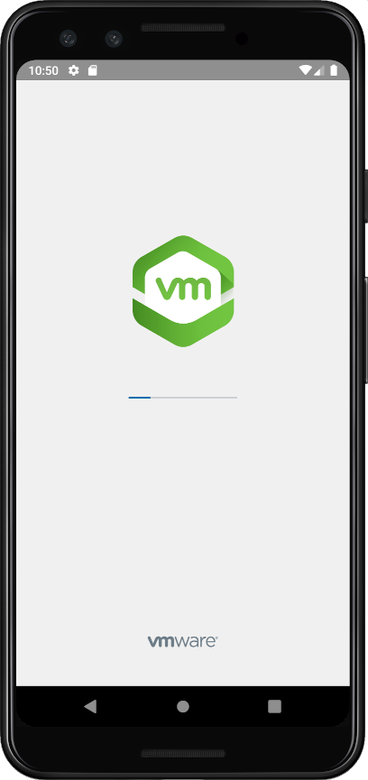
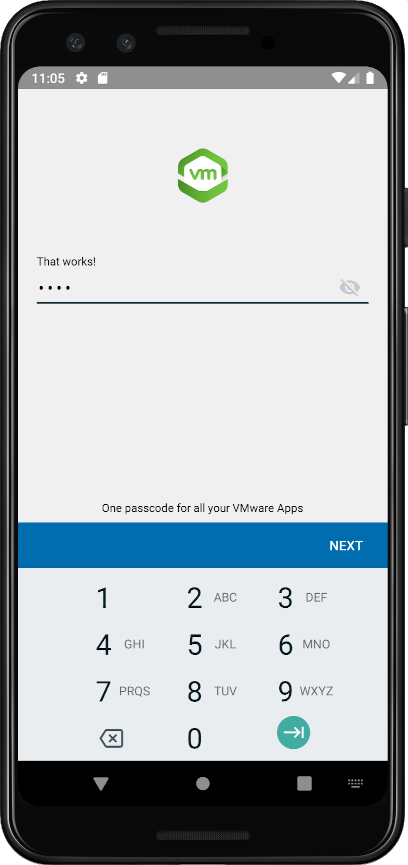

# Base Integration Guide
## Workspace ONE for Android
Android applications can be integrated with the VMware Workspace ONE® platform,
by using its mobile software development kit. Complete the tasks below as a base
for feature integration.

This document is part of the Workspace ONE Integration Guide for Android set.

# Table of Contents
{{TOC}}

# Introduction
The tasks detailed below represent the basic steps in integrating your Android
application with the Workspace ONE platform. The tasks you will complete depend
on the required integration level of your application.

Integration at the Framework level is necessary if the application will make use
of platform features such as authentication, single sign-on, data encryption, or
networking.

To integrate at the **Client level**, do the following tasks:

1.  [Add the Client SDK].
2.  [Initialize the Client SDK].

To integrate at the **Framework level**, do the following tasks:

1.  [Add the Client SDK].
2.  [Add the Framework].
3.  [Initialize the Framework].

Note that you don't add Client SDK initialization if you are integrating at the
Framework level.

## Agreement
Before downloading, installing or using the VMware Workspace ONE SDK you must:

-   Review the
    [VMware Workspace ONE Software Development Kit License Agreement](https://developer.vmware.com/docs/12215/WorkspaceONE_SDKLicenseAgreement.pdf).
    By downloading, installing, or using the VMware Workspace ONE SDK you agree
    to these license terms. If you disagree with any of the terms, then do not
    use the software.

-   Review the [VMware Privacy Notice](https://www.vmware.com/help/privacy.html)
    and the
    [Workspace ONE UEM Privacy Disclosure](https://www.vmware.com/help/privacy/uem-privacy-disclosure.html),
    for information on applicable privacy policies.

That applies however you obtain or integrate the software.

## Integration Guides
This document is part of the Workspace ONE Integration Guide for Android set.

See other guides in the set for

-   an overview of integration levels and the benefits of each.
-   details of the integration preparation tasks, which must be done before the
    tasks in this document.

An overview that includes links to all the guides is available

-   in Markdown format, in the repository that also holds the sample code:  
    [https://github.com/vmware-samples/...IntegrationOverview.md](https://github.com/vmware-samples/workspace-ONE-SDK-integration-samples/blob/main/IntegrationGuideForAndroid/Guides/01Overview/WorkspaceONE_Android_IntegrationOverview.md)

-   in Portable Document Format (PDF), on the VMware website:  
    [https://developer.vmware.com/...IntegrationOverview.pdf](https://developer.vmware.com/docs/12354/WorkspaceONE_Android_IntegrationOverview.pdf)

## Compatibility

Instructions in this document have been tested with the following software
versions.

Software                                         | Version
-------------------------------------------------|---------
Workspace ONE SDK for Android                    | 24.01
Workspace ONE management console                 | 2306
Android Studio integrated development environment| 2022.3.1
Gradle plugin for Android                        | 7.2.2
Kotlin language                                  | 1.8.21

# Integration Paths Diagram
The following diagram shows the tasks involved in base integration and the order
in which they can be completed. Integration Preparation is a prerequisite to
base integration. Framework integration is a prerequisite to integrating any of
the framework features, which are covered by other guides.

# Task: Add Client SDK [Add the Client SDK]
Adding the Client SDK is a Workspace ONE platform integration task for Android
application developers. It applies to all levels of platform integration.

**If you haven't installed your application via Workspace ONE** at least once,
then do so now. If you don't, the application under development won't work when
installed via the Android Debug Bridge (adb). Instructions for installing via
Workspace ONE can be found in the [Integration Guides] document set, in the
Integration Preparation guide.

The first step will be to set up the build configuration and files. These
instructions assume that your application has a typical project structure, as
follows:

-   *Project* files in the root directory.
-   *Application* module in a sub-directory.
-   Separate `build.gradle` files for the project and application.

## Project Structure Diagram
The following diagram illustrates the expected project directory structure, and
the locations of changes to be made.

**Tip**: It might be easier to see the structure, and identify which Gradle file
is which, in the Android Studio project navigator if you select the Project
view, instead of the Android view.

## Software Development Kit Download Structure Diagram
The following diagram illustrates the directory structure of the SDK download. 

Files from within the above structure are copied under your application project
in the following instructions.

## Instructions
Proceed as follows.

### Build Configuration and Files [BuildConfigurationAndFilesClientSDKIntegration]
First, update the build configuration and add the required library files.

1.  Update the Gradle Android plugin version, if necessary.

    In the project build.gradle file, check the Android plugin version. This is
    typically near the top of the file, inside the `buildscript` block, in the
    `dependencies` sub-block. The top of the file might look like this:

        buildscript {
            ...
            repositories {
                ...
            }
            dependencies {
                classpath 'com.android.tools.build:gradle:7.2.2'
                ...
            }
        }
    
    In this example, the Gradle Android plugin version is 7.2.2

    Ensure that the plugin version is at least 7.2.1

    The location of this change is shown in the [Project Structure Diagram].

2.  Add the required packaging and compile options.

    In the application build.gradle file, in the `android` block, add the Java
    version compatibility declarations shown in the following snippet.

        ...
        android {
            compileSdk 33

            // Following blocks are added.
            compileOptions {
                sourceCompatibility JavaVersion.VERSION_1_8
                targetCompatibility JavaVersion.VERSION_1_8
            }
            kotlinOptions {
                jvmTarget = "1.8"
            }
            packagingOptions {
               exclude 'META-INF/kotlinx-serialization-runtime.kotlin_module'
            }
            // End of added blocks.

            defaultConfig {
                targetSdk 33
                ...
            }
            buildTypes {
                ...
            }
        }

3.  Add the required libraries to the build.

    Still in the application build.gradle file, in the `dependencies` block, add
    references to the required libraries. For example:

        repositories {
            maven {
                url 'https://vmwaresaas.jfrog.io/artifactory/Workspace-ONE-Android-SDK/'
            }
        }

        dependencies {
            // Integrate Workspace ONE at the Client level.
            //
            // Before downloading, installing, or using the VMware Workspace ONE
            // SDK you must:
            //
            // -   Review the VMware Workspace ONE Software Development Kit License 
            //     Agreement that is posted here.
            //     https://developer.vmware.com/docs/12215/WorkspaceONE_SDKLicenseAgreement.pdf
            //
            //     By downloading, installing, or using the VMware Workspace ONE SDK you 
            //     agree to these license terms. If you disagree with any of the terms, then
            //     do not use the software.
            //
            // -   Review the VMware Privacy Notice and the Workspace ONE UEM Privacy
            //     Disclosure for information on applicable privacy policies.
            //     https://www.vmware.com/help/privacy.html
            //     https://www.vmware.com/help/privacy/uem-privacy-disclosure.html
            implementation "com.airwatch.android:AirWatchSDK:24.01"
        }

    The location of this change is shown in the [Project Structure Diagram].

This completes the required changes to the build configuration. Build the
application to confirm that no mistakes have been made. After that, continue
with the next step, which is [Anchor Event Handler Implementation].

In case you encounter an error, check the [Early Version Support Build Error]
first.

**If you haven't installed your application via Workspace ONE** at least once,
then the application under development won't work when installed via the Android
Debug Bridge (adb). Instructions for installing via Workspace ONE can be found
in the [Integration Guides] document set, in the Integration Preparation guide.

### Anchor Event Handler Implementation
The Workspace ONE Client SDK runtime receives various essential notifications
from the management console. An implementation of a specific Android broadcast
receiver and action handler must be added to your application to support this.
From SDK 23.04 onwards, application need not add implementation for 
AirWatchSDKBaseIntentService, and must be removed.

Proceed as follows.

1.  Implement a Workspace ONE SDK Event handler class.

    -   Add a new class to your application.
    -   Declare the new class and implement
        `WS1AnchorEvents` interface. 
    -   While upgrading to SDK 23.04 or above, migrate AirWatchSDKBaseIntentService API implementation to WS1AnchorEvents.

    In Java, the class could look like this:

        public class AppWS1AnchorEvents implements WS1AnchorEvents {
            @Override
            public void onClearAppDataCommandReceived(Context context, ClearReasonCode reasonCode) {}

            @Override
            public void onApplicationConfigurationChange(Bundle applicationConfiguration, Context context) {}

            @Override
            public void onApplicationProfileReceived(
                Context context,
                String profileId,
                ApplicationProfile awAppProfile) {}

            @Override
            public void onAnchorAppStatusReceived(Context context, AnchorAppStatus awAppStatus) {}

            @Override
            public void onAnchorAppUpgrade(Context context, boolean isUpgrade) {}
        }

    In Kotlin, the class could look like this:

        class AppWS1AnchorEvents : WS1AnchorEvents {
            override fun onClearAppDataCommandReceived(context: Context?, reasonCode: ClearReasonCode?) {}

            override fun onApplicationConfigurationChange(
                applicationConfiguration: Bundle?,
                context: Context?,
            ) {}

            override fun onApplicationProfileReceived(
                context: Context?,
                profileId: String?,
                awAppProfile: ApplicationProfile?) {}

            override fun onAnchorAppStatusReceived(context: Context?, awAppStatus: AnchorAppStatus?) {}

            override fun onAnchorAppUpgrade(context: Context?, isUpgrade: Boolean) {}
        }

2.  Declare the permission and interaction filter.

    In the Android manifest file, inside the `manifest` block but outside the
    `application` block, add declarations like the following.

        <?xml version="1.0" encoding="utf-8"?>
        <manifest ...>

        <!-- Following declarations are added -->
        <uses-permission android:name="com.airwatch.sdk.BROADCAST" />

        <!-- Following tag applies to compileSdkVersion 30 or later. -->
        <queries>
            <intent>
                <action android:name="com.airwatch.p2p.intent.action.PULL_DATA" />
            </intent>
        </queries>

        <!-- End of added declarations.>

        <application ...>
        ...

3.  Declare the notification receiver. From SDK 23.04 onwards, 
    declaration for AirWatchSDKBaseIntentService must be removed from manifest.

    In the Android manifest file, inside the `application` block, add
    `receiver` declaration like the following.

        <application>

            ...

            <receiver
                android:name="com.airwatch.sdk.AirWatchSDKBroadcastReceiver"
                android:permission="com.airwatch.sdk.BROADCAST" >
                <intent-filter>
                    <action android:name="${applicationId}.airwatchsdk.BROADCAST" />
                </intent-filter>
                <intent-filter>
                    <action
                        android:name="com.airwatch.intent.action.APPLICATION_CONFIGURATION_CHANGED"
                        />

                    <!--
                    In the host attribute, replace com.your.package with the package name of your
                    application.
                    -->
                    <data android:scheme="app" android:host="com.your.package" />

                </intent-filter>
                <intent-filter>
                    <action android:name="android.intent.action.PACKAGE_ADDED" />
                    <action android:name="android.intent.action.PACKAGE_REMOVED" />
                    <action android:name="android.intent.action.PACKAGE_REPLACED" />
                    <action android:name="android.intent.action.PACKAGE_CHANGED" />
                    <action android:name="android.intent.action.PACKAGE_RESTARTED" />
                    <data android:scheme="package" />
                </intent-filter>
            </receiver>

        </application>

4.  Apps need to implement SDKClientConfig in
    their Application class and override getEventHandler()
    and return WS1AnchorEvents Implementation object. 
    From SDK 23.04 onwards, application need to migrate to SDKClientConfig instead of AirWatchSDKBaseIntentService.

            public class AppApplication extends Application implements SDKClientConfig {
               @NonNull
               @Override
               public WS1AnchorEvents getEventHandler() {
                  return new AppWS1AnchorEvents();
               }
            }`

This completes the required anchor event handler implementation. Build the application to
confirm that no mistakes have been made.

**If you haven't installed your application via Workspace ONE** at least once,
then the application under development won't work when installed via the Android
Debug Bridge (adb). Instructions for installing via Workspace ONE can be found
in the [Integration Guides] document set, in the Integration Preparation guide.

### Next Steps
After completing the above, continue with the next task, which could be either
of the following.

-   [Initialize the Client SDK], if your application will use only Client-level
    integration.
-   [Add the Framework], otherwise.

# Task: Initialize Client SDK [Initialize the Client SDK]
Client SDK initialization is a Workspace ONE platform integration task for
Android application developers. It applies only to Client-level integration, not
to Framework integration.

The Client SDK initialization task is dependent on the [Add the Client SDK]
task. The following instructions assume that the dependent task is complete
already.

## SDKManager
The main class of the Client SDK is SDKManager. It must be initialized before
use. Initialize it by calling the `init` class method. The call must be on a
background thread. An Android Context object is required, which could be an
Activity instance for example.

In Java, code for an Activity that initializes the SDKManager could look like
this:

    public class MainActivity extends Activity {
        SDKManager sdkManager = null;

        @Override
        protected void onCreate(@Nullable Bundle savedInstanceState) {
            super.onCreate(savedInstanceState);
            ...
            startSDK();
        }

        private void startSDK() { new Thread(new Runnable() {
            @Override
            public void run() {
                try {
                    final SDKManager initSDKManager = SDKManager.init(MainActivity.this);
                    sdkManager = initSDKManager;
                    toastHere(
                        "Workspace ONE console version:" + initSDKManager.getConsoleVersion());
                }
                catch (Exception exception) {
                    sdkManager = null;
                    toastHere(
                        "Workspace ONE failed " + exception + ".");
                }
            }
        }).start(); }

        private void toastHere(final String message) {runOnUiThread(new Runnable() {
            @Override
            public void run() {
                Toast.makeText(MainActivity.this, message, Toast.LENGTH_LONG).show();
            }
        });}

        ...
    }

In Kotlin, code for an Activity that initializes the SDKManager could look like
this:

    class MainActivity : Activity() {

        private var sdkManager: SDKManager? = null

        override fun onCreate(savedInstanceState: Bundle?) {
            super.onCreate(savedInstanceState)
            ...
            startSDK()
        }

        private fun startSDK() { thread {
            try {
                val initSDKManager = SDKManager.init(this)
                sdkManager = initSDKManager
                toastHere("Workspace ONE console version:${initSDKManager.consoleVersion}")
            }
            catch (exception: Exception) {
                sdkManager = null
                toastHere("Workspace ONE failed $exception.")
            }
        } }

        private fun toastHere(message: String) { runOnUiThread {
            Toast.makeText(this, message, Toast.LENGTH_LONG).show()
        } }

        ...
    }

Calling the `init` method completes SDK Manager initialization. Build and run
the application to verify that no mistakes have been made.

## Next Steps [NextStepsClientSDKInitialization]
After the SDKManager instance has been received from the init call, its other
methods can be called. Check the reference documentation for details of the
programming interface.

This completes Client-level integration.

# Task: Add Framework [Add the Framework]
Adding the Framework is a Workspace ONE platform integration task for Android
application developers. Adding the Framework is necessary if the application
will make use of platform features such as authentication, single sign-on, data
encryption, or networking.

This task is dependent on the [Add the Client SDK] task. The following
instructions assume that the dependent task is complete already.

## Build Configuration and Files [BuildConfigurationAndFilesFrameworkIntegration]
This task involves changing your application project's build configuration and
files. These instructions assume that your application has a typical project
structure, same as the Add Client SDK task, as shown in the
[Project Structure Diagram].

A number of libraries will be added to the project. These can be divided into
the following categories.

-   Workspace ONE libraries that are part of the SDK.
-   Third party libraries that are distributed with the SDK.
-   Third party libraries that are hosted remotely, for example in a Maven
    repository, and included via Gradle.

Proceed as follows.

1.  Add the required libraries to the build.

    In the application build.gradle file, in the `dependencies` block, add
    references to the required libraries. For example:
    

        repositories {
            maven {
                url 'https://vmwaresaas.jfrog.io/artifactory/Workspace-ONE-Android-SDK/'
            }
        }

        dependencies {
            // Integrate Workspace ONE at the Framework level.
            //
            // Before downloading, installing, or using the VMware Workspace ONE
            // SDK you must:
            //
            // -   Review the VMware Workspace ONE Software Development Kit License 
            //     Agreement that is posted here.
            //     https://developer.vmware.com/docs/12215/WorkspaceONE_SDKLicenseAgreement.pdf
            //
            //     By downloading, installing, or using the VMware Workspace ONE SDK you 
            //     agree to these license terms. If you disagree with any of the terms, then
            //     do not use the software.
            //
            // -   Review the VMware Privacy Notice and the Workspace ONE UEM Privacy
            //     Disclosure for information on applicable privacy policies.
            //     https://www.vmware.com/help/privacy.html
            //     https://www.vmware.com/help/privacy/uem-privacy-disclosure.html
            implementation "com.airwatch.android:AWFramework:24.01"
        }
    
    Your application might already require different versions of some of the
    same libraries required by the SDK. Warning messages will be generated in
    the build output in that case, for example stating that there are
    incompatible JAR files in the classpath.
    
    You can resolve this by selecting one or other version, either the SDK
    requirement or your app's original requirement.  
    In principle, the SDK isn't supported with versions other than those given
    in the above. In practice however, problems are unlikely to be encountered
    with later versions.

2.  Add annotation processor support.

    In the application build.gradle file, add the `kotlin-kapt` plugin. The
    plugin can be added in the plugins block at the start of the file, for
    example as shown in the following snippet.

        plugins {
            id 'com.android.application'
            id 'kotlin-android'
            id 'kotlin-android-extensions'

            // Following line adds the required plugin.
            id 'kotlin-kapt'
        }
        ...

3.  Add the required packaging and compile options.

    Still in the application build.gradle file, in the `android` block, add the
    packaging option shown in the following snippet.

        ...
        android {
            compileSdk 33

            // Following block is added.
            packagingOptions {
                pickFirst '**/*.so'
            }
            // End of added block.

            defaultConfig {
                targetSdk 33
                ...
            }
            buildTypes {
                ...
            }
        }
        ...

    The above assumes that support for earlier Android operating system versions
    and processor architectures isn't required in the application. If support is
    required, also follow the instructions in the
    [Appendix: Early Version Support].

4. App targeting API level 31 or above, override getEventHandler() in App's Application class to return
    WS1AnchorEvents object.

            public class AppApplication extends AWApplication {
               @NonNull
               @Override
               public WS1AnchorEvents getEventHandler() {
                  return new AppWS1AnchorEvents();
               }
            }

This completes the required changes to the build configuration. Build the
application to confirm that no mistakes have been made. After that, continue
with the next task, which is to [Initialize the Framework].

In case you encounter an error, check the [Early Version Support Build Error]
first.

# Task: Initialize Framework [Initialize the Framework]
Framework initialization is a Workspace ONE platform integration task for
Android application developers. It applies to Framework-level integration, not
to Client-level integration.

The Framework initialization task is dependent on the [Add the Framework] task.
The following instructions assume that the dependent task is complete already.

## Select initialization class
Framework initialization can start from either an Android Application subclass,
referred to as initialization by *delegation*, or from a Workspace ONE SDK
AWApplication subclass, referred to as initialization by *extension*.
Choose the better option for your application, as follows.

-   **If your application has an Android Application subclass**, then choose it
    as the Framework initialization class. Proceed to these instructions:  
    [Initialize by delegation from an Android application subclass].

-   **Otherwise, create a Workspace ONE SDK AWApplication subclass** and it will
    be the Framework initialization class. Proceed to these instructions:  
    [Create an initialization subclass by extension].

### Initialize by delegation from an Android Application subclass
Follow these instructions to initialize from an Android Application subclass.
This is an alternative to creating an AWApplication subclass. See
[Select initialization class] for a discussion of the alternatives.

Update your Android Application subclass as follows.

-   Declare that the class implements the AWSDKApplication interface.

-   Add an AWSDKApplicationDelegate instance as a property.

-   Move the code from the body of your onCreate method, if any, to an override
    of the AWSDKApplication onPostCreate method.

-   Override the AWSDKApplication getMainActivityIntent() method to return an
    Intent for the application's main Activity.

-   Override the following Android Application methods:

    -   onCreate
    -   getSystemService
    -   attachBaseContext

    The required overrides are shown in the code snippets below, in Kotlin and
    in Java.

-   Implement all the other AWSDKApplication methods by calling the same method
    in the AWSDKApplicationDelegate instance.

    Kotlin delegation-by can be used for the implementation. This is illustrated
    in the [Initialization by delegation in Kotlin] code snippet below.

### Initialization by delegation in Java
In Java, the class could look like this:

    public class Application extends android.app.Application implements AWSDKApplication {
        // SDK Delegate.
        private final AWSDKApplicationDelegate awDelegate = new AWSDKApplicationDelegate();
        @NotNull
        @Override
        public AWSDKApplication getDelegate() { return awDelegate; }

        // Android Application overrides for integration.
        @Override
        public void onCreate() {
            super.onCreate();
            this.onCreate(this);
        }

        @Override
        public Object getSystemService(String name) {
            return this.getAWSystemService(name, super.getSystemService(name));
        }

        @Override
        public void attachBaseContext(@NotNull Context base) {
            super.attachBaseContext(base);
            attachBaseContext(this);
        }

        // Application-specific overrides.
        @Override
        public void onPostCreate() {
            // Code from the application's original onCreate() would go here.
        }

        @NonNull
        @Override
        public Intent getMainActivityIntent() {
            // Replace MainActivity with application's original main activity.
            return new Intent(getApplicationContext(), MainActivity.class);
        }

        // Mechanistic AWSDKApplication abstract method overrides.

        // Methods that return a value could follow this as a template:
        @Nullable
        @Override
        public Object getAWSystemService(@NotNull String name, @Nullable Object systemService) {
            return awDelegate.getAWSystemService(name, systemService);
        }

        // Methods that return void could follow this as a template:
        @Override
        public void attachBaseContext(@NotNull android.app.Application application) {
            awDelegate.attachBaseContext(application);
        }

        

        // ... Many more overrides here.
    }

### Initialization by delegation in Kotlin
In Kotlin, the class could look like this:

    // This class uses Kotlin delegation to implement the AWSDKApplication
    // interface.  
    // A new AWSDKApplicationDelegate instance is allocated on the fly as the
    // delegate. For background on Kotlin delegation, see:
    // https://kotlinlang.org/docs/reference/delegation.html
    open class Application:
        android.app.Application(),
        AWSDKApplication by AWSDKApplicationDelegate()
    {
        // Android Application overrides for integration.
        override fun onCreate() {
            super.onCreate()
            onCreate(this)
        }

        override fun getSystemService(name: String): Any? {
            return getAWSystemService(name, super.getSystemService(name))
        }

        override fun attachBaseContext(base: Context?) {
            super.attachBaseContext(base)
            attachBaseContext(this)
        }

        // Application-specific overrides.
        override fun onPostCreate() {
            // Code from the application's original onCreate() would go here.
        }

        override fun getMainActivityIntent(): Intent {
            // Replace MainActivity with application's original main activity.
            return Intent(applicationContext, MainActivity::class.java)
        }
    }

### Next
This completes initialization from an Android Application subclass. Now continue
with the next step, which is to
[configure the initialization class in the manifest].

### Create an initialization subclass by extension
Follow these instructions to create a Framework initialization AWApplication
subclass. This is an alternative to initialising from an Android Application
subclass. See [Select initialization class] for a discussion of the
alternatives.

Add to your application code a new class that:

-   Is declared as an AWApplication subclass.
-   Overrides the getMainActivityIntent() method to return an Intent for the
    application's main Activity.
-   Implements the other required methods with dummies.

In Java, the class could look like this:

    // Note the fully qualified class name in the extends declaration.
    public class AWApplication extends com.airwatch.app.AWApplication {
        @NotNull
        @Override
        public Intent getMainActivityIntent() {
            return new Intent(getApplicationContext(), MainActivity.class);
        }

        @Override
        public void onSSLPinningRequestFailure(
                @NotNull String host, X509Certificate x509Certificate
        ) {
        }

        @Override
        public void onSSLPinningValidationFailure(
                @NotNull String host, X509Certificate x509Certificate
        ) {
        }
    }

In Kotlin, the class could look like this:

    // Note the fully qualified base class name.
    open class AWApplication: com.airwatch.app.AWApplication() {
        override fun getMainActivityIntent(): Intent {
            return Intent(applicationContext, MainActivity::class.java)
        }

        override fun onSSLPinningRequestFailure(
            host: String,
            serverCACert: X509Certificate?
        ) {
        }

        override fun onSSLPinningValidationFailure(
            host: String,
            serverCACert: X509Certificate?
        ) {
        }

    }

This completes the creation of an initialization subclass. Now continue with the
next step, which is to [configure the initialization class in the manifest].

## Configure the initialization class in the manifest [configure the initialization class in the manifest]
Follow these instructions to configure your selected initialization class in the
Android manifest. The initialization class will be either the existing Android
Application subclass, or a new AWApplication subclass that was just created. See
[Select initialization class] for a discussion of the alternatives.

Proceed as follows.

1.  Add the Android schema tools.

    The tools can be added at the top of the file, in the manifest tag, for
    example like this:

        <manifest
            xmlns:android="http://schemas.android.com/apk/res/android"
            package="com.example.integrationguide"
            xmlns:tools="http://schemas.android.com/tools"
            >

2.  Update the application declaration.

    The application declaration must be updated to:

    -   Declare an application class name, if it wasn't already declared.
    -   Replace the label.
    -   Override the allowBackup flag with the setting from the SDK manifest.

    These updates can be made in the application tag, for example like this:

        <application
            android:name=".YourApplicationOrAWApplicationSubClass"
            android:label="@string/app_name"
            ...
            tools:replace="android:label, android:allowBackup, android:networkSecurityConfig"
            >

3.  Set the launcher and main Activity to be from the Framework.

    If the application had a previous declaration for launcher and main
    Activity, remove it. Instead, declare the Framework SDKSplashActivity as
    launcher and main.

    New declarations could look like this, for example:

        <activity
            android:name=".MainActivity"
            >
            <!-- Original launcher and main declarations removed. -->
        </activity>
        <activity
            android:name="com.airwatch.login.ui.activity.SDKSplashActivity"
            android:label="@string/app_name"
            >
            <intent-filter>
                <action android:name="android.intent.action.MAIN" />
                <category android:name="android.intent.category.LAUNCHER" />
            </intent-filter>
        </activity>

4.  From SDK 23.04 onwards, application need not add implementation for AirWatchSDKBaseIntentService, and must be removed while upgrading SDK.

5.  Declare the required permission.

   If your app targets Android 13 or higher, then in order to see notifications declare the
   below permission in your app's manifest file if not present already.
   [developer.android.com/...13/...#notification-permission](https://developer.android.com/about/versions/13/behavior-changes-all#notification-permission)

       <uses-permission android:name="android.permission.POST_NOTIFICATIONS"/>

This completes the initialization class configuration.

## Request the required Permissions 
If your app targets Android 13 or higher, request the new notification permission from your app's MainActivity if not requested already.
[developer.android.com/...13/...#notification-permission](https://developer.android.com/about/versions/13/behavior-changes-all#notification-permission)

   Below is the code snippet, for example:

        private void setupPermissions() {
            if(Build.VERSION.SDK_INT >= Build.VERSION_CODES.TIRAMISU) {
                int permission = ContextCompat.checkSelfPermission(
                    this,
                    Manifest.permission.POST_NOTIFICATIONS
                );

                if (permission != PackageManager.PERMISSION_GRANTED) {
                    ActivityCompat.requestPermissions(
                        this,
                        new String[]{Manifest.permission.POST_NOTIFICATIONS},
                        NOTIFICATION_REQ_CODE
                    );
                }
            }
        }

        @Override
        public void onRequestPermissionsResult(int requestCode, @NonNull String[] permissions, @NonNull int[] grantResults) {
            super.onRequestPermissionsResult(requestCode, permissions, grantResults);

            if (requestCode == NOTIFICATION_REQ_CODE){
                if (grantResults.length == 0 || grantResults[0] != PackageManager.PERMISSION_GRANTED) {
                toastHere("Notification Permission has been denied by user");
                } else {
                toastHere("Notification Permission has been granted by user");
                }
            }
        }

This completes requesting the required permissions.

## Next Steps [NextStepsFrameworkInitialization]
Build and run the application to confirm that no mistakes have been made.

The Workspace ONE splash screen should be shown at launch, Other SDK screens
might also be shown depending on the configuration in the management console.
See the [Appendix: User Interface Screen Capture Images].

After completing the above, you can proceed to:

-   Networking integration.
-   Branding integration.
-   Integration of other framework features.

See the respective documents in the Workspace ONE Integration Guide for Android
set. An overview that includes links to all the guides in the set is available

-   in Markdown format, in the repository that also holds the sample code:  
    [https://github.com/vmware-samples/...IntegrationOverview.md](https://github.com/vmware-samples/workspace-ONE-SDK-integration-samples/blob/main/IntegrationGuideForAndroid/Guides/01Overview/WorkspaceONE_Android_IntegrationOverview.md)

-   in Portable Document Format (PDF), on the VMware website:  
    [https://developer.vmware.com/...IntegrationOverview.pdf](https://developer.vmware.com/docs/12354/WorkspaceONE_Android_IntegrationOverview.pdf)

# Appendix: Early Version Support
The Workspace ONE SDK can be integrated with early versions of Android, by
following some additional steps. Early versions here means back to 5.0 Android,
which is API level 21. If your application won't support devices running early
Android versions, skip the instructions in this section.

To support early versions, change the build configuration to:

-   Enable Multidex explicitly.

To make the changes, proceed as follows.

1.  Configure the build.

    In the application build.gradle file, in the `android` block, within the
    `defaultConfig` block, add the required settings, for example:

        ...
        android {
            ...
            defaultConfig {
                ...
                multiDexEnabled true
                ...
            }
            ...
        }
        ...

This concludes the required changes to support early Android versions. Build the
application to confirm that no mistakes have been made.

In case the above changes don't seem to work, you can instead try the changes in
the [Alternative Early Version Support] section, below.

All being well, continue with other integration tasks.

## Alternative Early Version Support
The following code snippet shows an alternative approach to early version
support to the above build configuration change. The alternative is to specify a
conditional minimum SDK version, dependent on the build type.

Use this approach in case the first approach doesn't work or isn't suitable for
your app.

    ext {
        minSdkVersion = 21
    }
    android {
        defaultConfig {
            minSdkVersion getMinSDK()
        }
    }
    buildTypes {
        release {
            minifyEnabled true
            signingConfig signingConfigs.debug
        }
    }
    def getMinSDK() {
        if (gradle.startParameter.taskNames.toString().contains("Debug")) {
            return 23
        } else {
            return minSdkVersion
        }
    }

## Early Version Support Build Error
If early version support is required but hasn't been implemented, error messages
like the following will be shown at build time.

    Caused by: com.android.tools.r8.utils.AbortException: Error: null, 
    Cannot fit requested classes in the main-dex file (# methods: 66121 > 65536)
    Caused by: java.lang.RuntimeException:
    com.android.builder.dexing.DexArchiveMergerException: Error while merging dex archives

To resolve the error, make the build configuration changes at the start of this
[Appendix: Early Version Support].

## Background Reading for Early Version Support
For background, see these pages on the Android developer website.

-   Multidex:  
    [https://developer.android.com/...multidex#mdex-on-l](https://developer.android.com/studio/build/multidex#mdex-on-l)

(Some PDF viewers incorrectly escape the hash anchor marker in the above links.
If that happens, edit the link in the browser address bar.)

# Appendix: User Interface Screen Capture Images
The following images show screens that are part of the Workspace ONE SDK user
interface.

The splash screen should be shown during every launch of an application that is
integrated to the Framework level. The login screen might be shown afterwards,
depending on the application state and the configuration in the management
console.

# Appendix: Troubleshooting

## Kotlin Compatibility
Occasionally, one may encounter an exception containing the message "Class 'kotlin.Unit' was compiled with an 
incompatible version of Kotlin. The binary version of its metadata is 1.7.1, expected version is 
1.5.1." during compilation. This exception is due to incompatible versions of your app with the 
Workspace One SDK. As of Release 23.03, all apps consuming WS1 will be required to use Kotlin v1.7.1
or higher. 

## Empty Response from AirWatch MDM Service
Occasionally, one may encounter the message "Empty Response from Airwatch MDM Service" 
in the adb log during app integration into Workspace ONE. This error message is triggered 
when the app was not installed via Intelligent Hub. 

To resolve this error, it is recommended to upload the APK to the UEM once, then install the 
app through Intelligent Hub. 

For detailed instructions please refer to the Integration Preperation Guide, specifically 

Appendix: How to upload an Android application to the management console 
- as Markdown: [Preperation Guide - Appendix: How to upload an Android application to the management console](https://github.com/vmware-samples/workspace-ONE-SDK-integration-samples/blob/main/IntegrationGuideForAndroid/Guides/02Preparation/WorkspaceONE_Android_IntegrationPreparation.md#appendix-how-to-upload-an-android-application-to-the-management-console-how-to-upload-an-android-application-to-the-management-console) 
- as PDF: [Preperation Guide - Appendix: How to upload an Android application to the management console](https://vdc-download.vmware.com/vmwb-repository/dcr-public/5c29b39f-3090-49aa-8fa6-1fd0d9fd0020/a5fe6014-4fe6-4ac7-9290-c67343d1f27d/WorkspaceONE_Android_IntegrationPreparation.pdf#page=15) 

and 

Task: Install application via Workspace ONE 
- as Markdown: [Preparation Guide - Task: Install application via Workspace ONE](https://github.com/vmware-samples/workspace-ONE-SDK-integration-samples/blob/main/IntegrationGuideForAndroid/Guides/02Preparation/WorkspaceONE_Android_IntegrationPreparation.md#task-install-application-via-workspace-one-install-your-application-via-workspace-one) 
- as PDF: [Preparation Guide - Task: Install application via Workspace ONE](https://vdc-download.vmware.com/vmwb-repository/dcr-public/5c29b39f-3090-49aa-8fa6-1fd0d9fd0020/a5fe6014-4fe6-4ac7-9290-c67343d1f27d/WorkspaceONE_Android_IntegrationPreparation.pdf#page=5) 

Once the APK has been uploaded to the UEM and installed via Workspace ONE, the app can then 
be subsequently side-loaded by the ABD provided the side load is signed by the same developer 
key as the original upload. To ensure your APK is signed on every build please refer to the 
Preperation Guide, specifically 

Appendix: How to generate a signed Android package every build 
- as Markdown [Preparation Guide - How to generate a signed Android package every build](https://github.com/vmware-samples/workspace-ONE-SDK-integration-samples/blob/main/IntegrationGuideForAndroid/Guides/02Preparation/WorkspaceONE_Android_IntegrationPreparation.md#appendix-how-to-generate-a-signed-android-package-every-build-how-to-generate-a-signed-android-package-every-build) 
- as PDF: [Preparation Guide - How to generate a signed Android package every build](https://vdc-download.vmware.com/vmwb-repository/dcr-public/5c29b39f-3090-49aa-8fa6-1fd0d9fd0020/a5fe6014-4fe6-4ac7-9290-c67343d1f27d/WorkspaceONE_Android_IntegrationPreparation.pdf#page=13) 

# Document Information
## Published Locations
This document is available

-   in Markdown format, in the repository that also holds the sample code:  
    [https://github.com/vmware-samples/...BaseIntegration.md](https://github.com/vmware-samples/workspace-ONE-SDK-integration-samples/blob/main/IntegrationGuideForAndroid/Guides/03BaseIntegration/WorkspaceONE_Android_BaseIntegration.md)

-   in Portable Document Format (PDF), on the VMware website:  
    [https://developer.vmware.com/...BaseIntegration.pdf](https://developer.vmware.com/docs/12356/WorkspaceONE_Android_BaseIntegration.pdf)

## Revision History
|Date     |Revision                                    |
|---------|--------------------------------------------|
|03jul2020|First publication, for 20.4 SDK for Android.|
|31jul2020 to 09dec2021|Updated for 20.7 to 21.11 SDK for Android releases.|
|26Jan2022|Update for 22.1 SDK for Android.            |
|28Feb2022|Update for 22.2 SDK for Android.            |
|04Apr2022|Updated for 22.3 SDK for Android.           |
|29Apr2022|Updated for 22.4 SDK for Android.           |
|06Jun2022|Updated for 22.5 SDK for Android.           |
|05Jul2022|Updated for 22.6 SDK for Android.           |
|23Aug2022|Updated for 22.8 SDK for Android.           |
|04Nov2022|Updated for 22.10 SDK for Android.          |
|13Dec2022|Updated for 22.11 SDK for Android.          |
|25Jan2023|Updated for 23.01 SDK for Android.          |
|15Mar2023|Updated for 23.03 SDK for Android.          |
|27Apr2023|Updated for 23.04 SDK for Android.          |
|06Jun2023|Updated for 23.06 SDK for Android.          |
|24Jul2023|Updated for 23.07 SDK for Android.          |
|07Sep2023|Updated for 23.09 SDK for Android.          |
|25Oct2023|Updated for 23.10 SDK for Android.          |
|18Dec2023|Updated for 23.12 SDK for Android.          |
|25Jan2024|Updated for 24.01 SDK for Android.          |

## Legal
-   **VMware LLC** 3401 Hillview Avenue Palo Alto CA 94304 USA
    Tel 877-486-9273 Fax 650-427-5001 www.vmware.com
-   Copyright © 2024 VMware LLC All rights reserved.
-   This content is protected by U.S. and international copyright and
    intellectual property laws. VMware products are covered by one
    or more patents listed at
    [https://www.vmware.com/go/patents](https://www.vmware.com/go/patents).
    VMware is a registered trademark or trademark of VMware LLC and its
    subsidiaries in the United States and other jurisdictions. All other marks
    and names mentioned herein may be trademarks of their respective companies.
-   The Workspace ONE Software Development Kit integration samples are
    licensed under a two-clause BSD license.  
    SPDX-License-Identifier: BSD-2-Clause