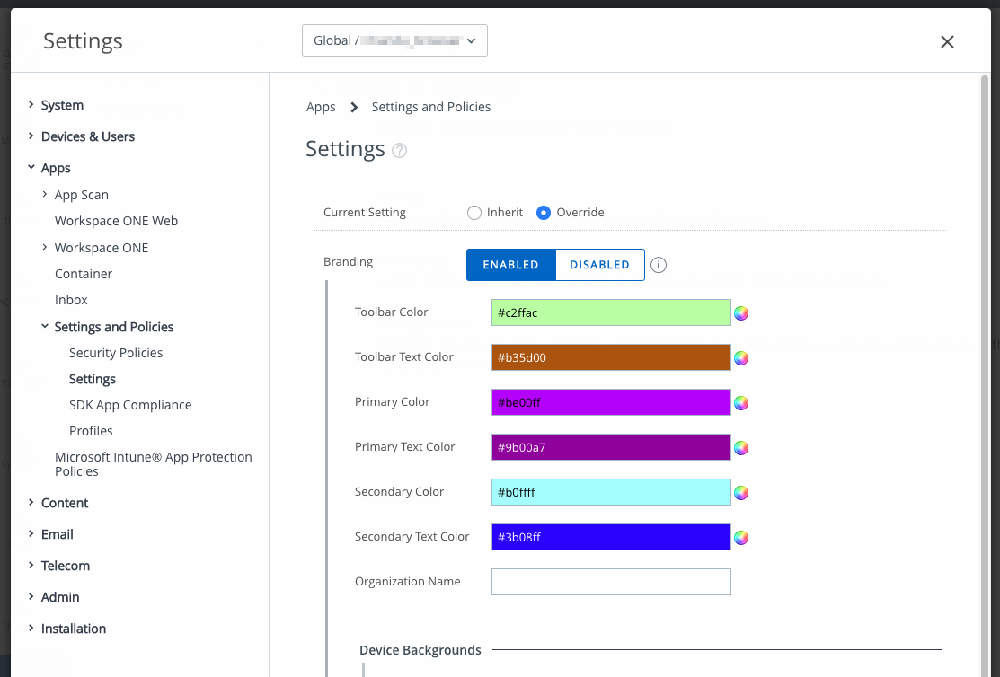
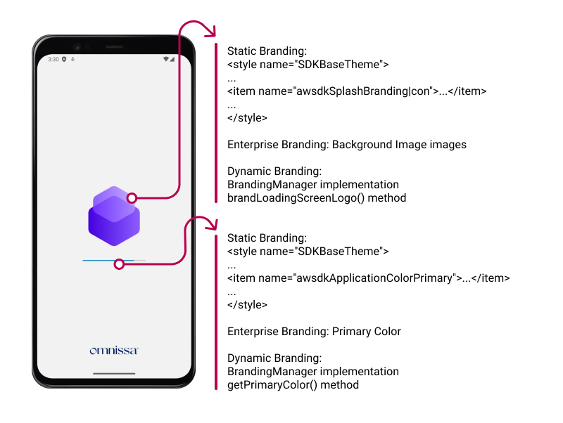
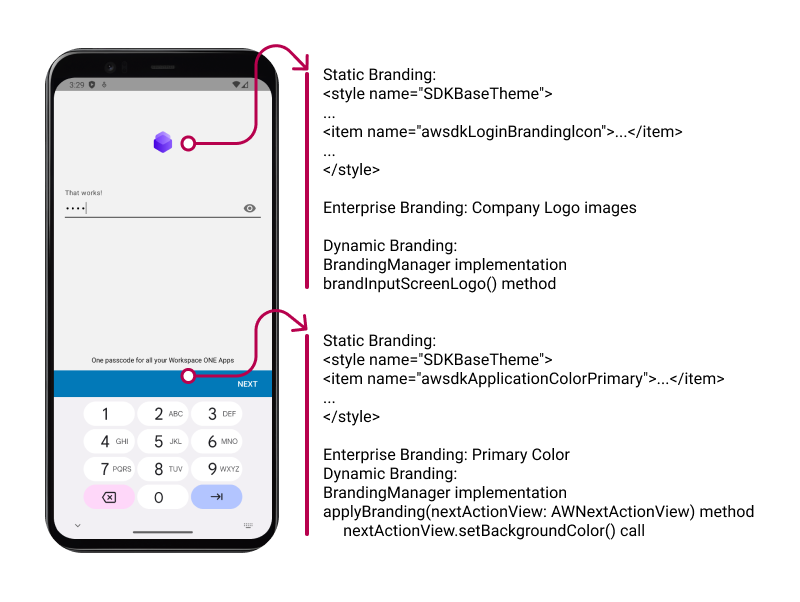
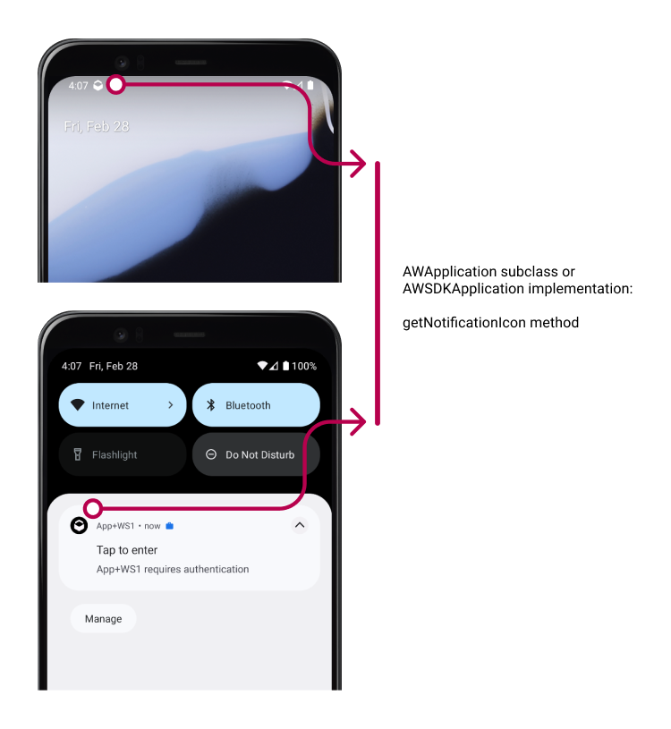

# Branding Integration Guide
## Workspace ONE for Android
Android applications can be integrated with the VMware Workspace ONE® platform,
by using its mobile software development kit. Complete the tasks below to
utilize the branding features of the platform.

This document is part of the Workspace ONE Integration Guide for Android set.

# Table of Contents
{{TOC}}

# Introduction
The Workspace ONE platform supports the following types of branding.

-   Static application branding.
-   Enterprise branding.
-   Dynamic branding.

For a quick overview of the elements that can be branded in the Workspace ONE
user interface, see the [Splash Screen] and [Login Screen] images in the
appendix to this document. The images are annotated to show brand elements in
the SDK user interface.

This guide also covers the following independent branding options.

-   Dark mode configuration.
-   Notification icon.

Branding is implemented by the following platform components:

-   Workspace ONE Unified Endpoint Manager (UEM) console.
-   Workspace ONE mobile Software Development Kit (SDK).

## Integration Tasks
The tasks detailed below will integrate your Android application with the
branding support of the Workspace ONE platform. The tasks you will complete
depend on which branding features are required.

-   Static application branding.

    Branding colors and images to be applied by the SDK can be configured in the
    application code. This is *static application branding*. Static application
    branding is built on the Android resources system.

    To add static application branding to your application, follow the
    [Implement Static Application Branding] instructions.

-   Enterprise branding support.

    Branding colors and images for mobile applications can be configured in the
    UEM. This is *enterprise branding*. The enterprise branding configuration
    from the UEM gets applied by the SDK to its own user interface elements,
    such as the splash screen and the login screen.

    Adding support for enterprise branding to an application is only a small
    amount of work for the developer, see [Support Enterprise Branding].

-   Dynamic Branding.

    Branding colors and images to be applied by the SDK can be provided at run
    time by the application code. This is *dynamic branding*. Dynamic branding
    requires implementation of a branding manager interface in the application
    code.

    Dynamic branding offers the most flexibility to the application developer.
    To add dynamic branding to your application, follow the
    [Implement Dynamic Branding] instructions.

-   Dark mode configuration.

    The SDK user interface supports Android dark mode. The SDK will select dark
    mode according to configuration from the application code.
    
    This is an independent branding option, separate to the other branding
    features. To use this option, follow the [Configure Dark Mode Selection]
    instructions.

-   Notification icon.

    The application code can provide a small icon for the SDK to apply to
    notifications that it posts, for example in the device status bar.
    
    This is an independent branding option, separate to the other branding
    features. To use this option, follow the [Set a Notification Icon]
    instructions.

Some requirements analysis, leading to suggestions for which features to
integrate in your application, may be found under [Use Cases]. Compatibility of
these features with each other is discussed under
[Branding Feature Compatibility]. 

Screen capture images, annotated to show the elements that can be branded in the
Workspace ONE user interface, can be found in the [Splash Screen] and
[Login Screen] images in the appendix to this document.

## Integration Guides
This document is part of the Workspace ONE Integration Guide for Android set.

See other guides in the set for

-   an introduction to SDK integration in general.
-   details of the base integration tasks for the Framework integration level,
    which must be done before the tasks in this document.

An overview that includes links to all the guides is available

-   in Markdown format, in the repository that also holds the sample code:  
    [https://github.com/vmware-samples/...IntegrationOverview.md](https://github.com/vmware-samples/workspace-ONE-SDK-integration-samples/blob/main/IntegrationGuideForAndroid/Guides/01Overview/WorkspaceONE_Android_IntegrationOverview.md)

-   in Portable Document Format (PDF), on the VMware website:  
    [https://developer.vmware.com/...IntegrationOverview.pdf](https://developer.vmware.com/docs/12354/WorkspaceONE_Android_IntegrationOverview.pdf)

## Compatibility
Instructions in this document have been tested with the following software
versions.

Software                                         | Version
-------------------------------------------------|---------
Workspace ONE SDK for Android                    | 24.01
Workspace ONE management console                 | 2306
Android Studio integrated development environment| 2022.3.1

# Use Cases
The following use cases can be read as a starting point for requirements
analysis of branding.

## Use Case: Customer Application
In some cases, a mobile application will be developed by a team at the same
enterprise as its end users, and integrated with Workspace ONE. This type of
application is referred to here as a *customer application*.

The following questions can be discussed to help establish the branding
requirements for a customer application.

-   What brand images should be shown in the SDK user interface when it appears
    in the application?

    The answer could be one of the following, for example.
    
    -   No required images.
    -   The application's own images, if the application has a brand.
    -   The corporate logo, or other enterprise brand images.
    -   Image requirement is more complicated than any of the above.

-   Are application branding resources configured in the management console?

    See the instructions for [how to configure enterprise branding] in the
    appendix to this document in case you need to check.

-   If resources are configured, do they reflect the desired brand for the
    application user interface?

If there are no required images, then the default SDK branding can be left in 
place. There is no need to implement static, enterprise, nor dynamic branding.

If the required images are from the enterprise's corporate brand, and they are
configured in the console, then the suggested integration is to
[Support Enterprise Branding]. This will be the least amount of work and
maintenance for the application development team.

If the required images are from the application's brand, then the suggested
integration is to [Implement Static Application Branding]. That is also the
suggested integration if the required images are from the enterprise's corporate
brand, but they aren't configured in the console.

If the image requirement is more complicated, then the suggested integration is
to [Implement Dynamic Branding].

## Use Case: Branded Partner Application
In some cases, a mobile application will be developed by an Independent Software
Vendor (ISV) or other third party, and integrated with the Workspace ONE SDK for
use at more than one customer enterprise. This type of application is referred
to here as a *partner application*.

The typical partner application has its own brand, for example a logo that
appears on the device home screen, app store, and elsewhere. The default
integration would be to [Implement Static Application Branding]. You will need
to obtain or create image files and other resources that reflect the application
brand.

## Use Case: Branded Partner Application with Optional Override
In some cases a branded partner application, as described above, is required to
support overriding of its branding by some customer enterprises that deploy the
application.

For example, some customers might want to have their corporate logo shown
instead of the application brand. Showing the corporate logo to end users might
be felt to reinforce the association of the application with their employer.

This option can be supported by doing both integrations:
[Implement Static Application Branding] and [Support Enterprise Branding].

Customers that want the override would configure their required logo as an
application branding resource in their UEM console. See the instructions for
[how to configure enterprise branding] in the appendix for the location of the
configuration in the console.

## Other Use Cases: Complex Branding Requirements
Some branding requirements are more complex than those covered by the above use
cases. Some examples are:

-   Generate brand images at run time.
-   Change brand images without re-enrolment and without app upgrade on the
    device.
-   Retrieve resources from the management console after enrolment has started
    but before completion, like the Workspace ONE Intelligent Hub.

In these cases, the suggested integration is to [Implement Dynamic Branding].

# Branding Feature Compatibility
The branding features are compatible with each other as follows.

## Static application branding and enterprise branding
Your application can have both its own static branding resources, and support
enterprise branding as an override. In that case, the SDK will apply one or
other branding, as follows.

-   When the application starts for the first time after installation, the SDK
    will apply the static application branding.

-   When the UEM server has been contacted by the SDK and at least the
    organizational group has been specified, the SDK will check whether
    enterprise branding has been configured.
    
-   If enterprise branding isn't configured, then the SDK will continue to
    apply the static application branding.

-   Otherwise, the SDK will retrieve the enterprise branding resources and
    apply them going forwards.

The enterprise branding can be partial, omitting some configurable images or
colors. The SDK will apply static application branding resources where a UEM
resource is omitted.

It can occur that enterprise branding resources are fetched and applied in the
early stages of registration, but the end user then cancels, or registration
isn't finalized for some other reason. In that case, enterprise branding will be
applied next time the application starts.

## Dynamic branding and other types of branding
A dynamic branding implementation can, at run time:

-   Access static application resources.
-   Access enterprise branding resources that have been retrieved from the UEM.
-   Fetch custom branding resources from a server associated with the
    application.
-   Generate branding resources programmatically.

The SDK will apply any or all of the above types of branding resources as
directed by the dynamic branding implementation.

Dynamic branding can be compatible with static branding and with enterprise
branding, depending on how it is implemented.

## Independent branding options
The independent branding option implementations are compatible with static
branding, enterprise branding, and dynamic branding.

# Integration Paths Diagram
The following diagram shows the tasks and options for integrating each of the
branding features. Framework base integration is a prerequisite to branding
integration.

# Task: Implement Static Application Branding [Implement Static Application Branding]
Implementing static application branding is an optional Workspace ONE platform
integration task for Android application developers.

Static application branding is configured in the application code, using Android
resources. The configuration can include colors and images. If your application
has static branding resources, the SDK will render the configured colors and
images in its own user interface elements.

## Add brand resources to the project
First, add brand resources for colors and images to your Android Studio project.
If you don't have final brand resources, you can create placeholders using the
tools that come with Android Studio.

-   You can create simple image resources with the Image Asset Studio.

    Instructions can be found here:  
    [https://developer.android.com/studio/write/image-asset-studio#access](https://developer.android.com/studio/write/image-asset-studio#access)

    The instructions in either of the following sections will help you create a
    suitable placeholder image.
    
    -   Create adaptive and legacy launcher icons.
    -   Create a notification icon.
    
    Save your image either in `res/drawable`, or in `res/mipmap` for example.

-   You can configure color values in Android Studio.

    Instructions for [how to add a color resource to an Android application] can
    be found in the appendix to this document, if needed.

After adding your brand resources, you can move on to the next step.

## Static style configuration
Add references to your brand resources to the application styles configuration.

The styles configuration can be opened as follows.

1.  Open your project in Android Studio.
2.  Under the application module, expand `res`, `values`, and then open the
    `styles.xml` file.

This snippet illustrates the configuration:

    <resources xmlns:tools="http://schemas.android.com/tools">
        
        <!-- Other style definitions here. -->
    </resources>

Note the following:

-   The Android schema tools have been added, in the resources tag. The tools
    enable override declarations in the rest of the configuration, to suppress
    warnings.

-   The style tag with name "SDKBaseTheme" holds the items the are relevant to
    the SDK. The parent attribute must be set to "SDKVisionBaseTheme".

See also the [Splash Screen] and [Login Screen] images in the appendix to this
document. The images are annotated to show brand elements in the SDK user
interface.

### Static style configuration item tags
Item tags within the base theme with the following names are relevant to the
SDK.

-   awsdkSplashBrandingIcon

    Sets the image on the SDK splash screen, ic_splash in the mipmap
    resources in the above snippet.

-   awsdkLoginBrandingIcon
    
    Sets the image on the SDK login screen, ic_login in the mipmap resources
    in the above snippet.

-   awsdkApplicationColorPrimary

    Sets the color for certain user interface elements, for example:

    -   The progress bar on the splash screen.
    -   The background of the Next and Confirm navigations on the login
        screen.
    
    In the above snippet, the color is set to the value of the color 
    resource `appLine`. That value could be defined in the `colors.xml`
    file, for example.

    This color will be overridden by the enterprise branding configuration,
    if specified.

## Next steps [ImplementStaticApplicationBrandingNextSteps]
This completes static application branding implementation. Build and run the
application to confirm that your brand is displayed.

Note that your application branding mightn't be applied to all screens in the
enrolment and unlock interactions. This is true of screens whose Activity code
is in the Hub application, such as the Single Sign-On login screen for example.

Consider whether to support branding override by the enterprise.

### Enterprise Branding Considerations
Enterprise branding can override static application branding. This depends on
the following factors.

-   If the application doesn't support enterprise branding, then its static
    branding won't be overridden.

-   If enterprise branding hasn't been configured in the UEM with which an
    application instance is enrolled, then static branding won't be overridden.

Enterprise branding configurations can be changed by UEM administrators at any
time. Changes are retrieved and applied by the SDK at run time, without the need
for an application upgrade.

If your application branding shouldn't be overridden:

-   Don't add support for enterprise branding.

    If support has already been added, then remove it. See
    [Support Enterprise Branding] for the code changes. In those instructions,
    either set the support flag to false instead of true, or you can remove the
    override because false is the default.

-   Advise the appropriate system administrators, depending on your application
    type.

    For a Customer Application, this could be your own IT department or
    helpdesk.
    
    For other application types, this would be all the customer enterprises that
    deploy the application.

    Application types are introduced in the [Use Cases] requirements analysis
    discussion.

# Task: Set a Notification Icon [Set a Notification Icon]
Setting a notification icon is an optional Workspace ONE platform integration
task for Android application developers.

Notification icon setting is implemented in the application code, using Android
resources and a method override. If an icon is set, the SDK will apply it as the
small icon to notifications that it posts, for example in the device status bar.
The SDK posts a notification when, for example, authentication is required.

If the application doesn't set a notification icon, the SDK applies a built-in
Workspace ONE brand icon.

See also the [Notification Icon Screen Capture] in the appendix.

## Add notification icon resource
First, add a suitable resource for a notification icon to your Android Studio
project. If you don't have final brand resources, you can create placeholders
using the tools that come with Android Studio.

If you are unfamiliar with Android notification icon requirements, these tips
might help.

-   Use a simple, single-color graphic, on a transparent background, as your
    notification icon.

-   A typical representation is a small portable network graphics (PNG) format
    file. The file could be in the project's resources, in the `res` `drawable`
    directory, for example.

See the Android developer website for official guidance on notification design.

## Register notification resource
Register the notification icon resource, as follows.

-   Identify the class in which to register the icon, depending on framework
    initialization mechanism:

    -   The Android Application subclass, if initialized by extension.
    -   The AWApplication subclass, if initialized by delegation.

    Either subclass could have been created as part of the Initialize Framework
    task in the Base Integration guide. See that guide for a discussion of the
    extension and delegation mechanisms.

-   Override `getNotificationIcon` to be a method that returns the resource
    identifier of the icon graphic.

See the following code snippets for examples. Note that the same code applies
to the extension and delegation mechanisms.

In Java, the override method could look like this:

    @Override
    public int getNotificationIcon() { return R.drawable.brand_logo_onecolour; }

In Kotlin, the override method could look like this:

    override fun getNotificationIcon(): Int { return R.drawable.brand_logo_onecolour }

## Next Steps [NotificationIconNextSteps]
This completes notification icon implementation.

Test the changes by causing the SDK to post a notification. How to do this
depends on the UEM configuration. In some deployments, power cycling the mobile
device will trigger a notification that the application requires authentication.

# Task: Configure Dark Mode Selection [Configure Dark Mode Selection]
Configuring Android dark mode selection by the SDK is an optional Workspace ONE
platform integration task for Android application developers. Dark mode is
sometimes referred to as night mode.

The SDK user interface supports dark mode. Depending on the application
configuration and device settings, the SDK may select to display its user
interface in dark mode. Dark mode selection configuration is implemented in the
application code, by a method override.

By default, if the application doesn't configure dark mode selection, the SDK
user interface won't be displayed in dark mode.

For details of dark mode, see this page on the Android developer website:  
[https://developer.android.com/guide/topics/ui/look-and-feel/darktheme](https://developer.android.com/guide/topics/ui/look-and-feel/darktheme)

## Determine required dark mode selection
First, determine what dark mode selection is required by your application.

Your application might support device dark mode selection, for example by
applying one of the Android application compatibility `DayNight` themes to its
user interface. In that case, the requirement would be to follow the system
selection.

For other selections, see the Android developer website page mentioned above.

## Override dark mode selection method
Override the dark mode selection method, as follows.

-   Identify the class in which to configure dark mode selection by the SDK,
    depending on framework initialization mechanism:

    -   The Android Application subclass, if initialized by extension.
    -   The AWApplication subclass, if initialized by delegation.

    Either subclass could have been created as part of the Initialize Framework
    task in the Base Integration guide. See that guide for a discussion of the
    extension and delegation mechanisms.

-   Override `getNightMode` to be a method that returns the dark mode selection
    to be made by the SDK. The SDK supports the `MODE_NIGHT_` values documented
    on the Android developer website.

See the following code snippets for examples. Note that the same code applies
to the extension and delegation mechanisms.

In Java, the override method could look like this:

    @Override
    public int getNightMode() { return AppCompatDelegate.MODE_NIGHT_FOLLOW_SYSTEM; }

In Kotlin, the override method could look like this:

    override fun getNightMode(): Int { return AppCompatDelegate.MODE_NIGHT_FOLLOW_SYSTEM }

## Next Steps [DarkModeNextSteps]
This completes dark mode selection configuration.

Test the changes by making different dark mode selections in the device settings
and checking that the SDK user interface display is as required.

# Task: Support Enterprise Branding [Support Enterprise Branding]
Supporting enterprise branding is an optional Workspace ONE platform integration
task for Android application developers.

Enterprise branding is configured in the management console. The configuration
can include colors and images. Instructions for
[how to configure enterprise branding] can be found in the appendix to this
document, if needed.

If your application supports enterprise branding, the SDK will render the
configured colors and images in its own user interface elements.

## Set the enterprise branding support flag
You support enterprise branding by setting a flag that the SDK reads. Proceed as
follows.

-   Identify the class in which to set the flag, depending on framework
    initialization mechanism:

    -   The Android Application subclass, if initialized by extension.
    -   The AWApplication subclass, if initialized by delegation.

    Either subclass could have been created as part of the Initialize Framework
    task in the Base Integration guide. See that guide for a discussion of the
    extension and delegation mechanisms.

-   Override `isInputLogoBrandable` to be a method that always returns `true`.

See the following code snippets for examples. Note that the same code applies
to the extension and delegation mechanisms.

In Java, the override method could look like this:

    @Override
    public boolean isInputLogoBrandable() { return true; }

In Kotlin, the override method could look like this:

    override fun isInputLogoBrandable(): Boolean { return true }

## Next steps [SupportEnterpriseBrandingNextSteps]
This completes support for enterprise branding.

Test the changes by installing the application on a device and enrolling with a
UEM that has enterprise branding configured.

See the appendix to this document for:

-   Instructions for [how to configure enterprise branding], if needed.
-   Annotated [Splash Screen] and [Login Screen] images that show where
    configurable elements appear in the SDK user interface.
-   Instructions for [how to reset application state], which could be used to
    force the SDK to replay some interactions in which brand resources appear.

# Task: Implement Dynamic Branding [Implement Dynamic Branding]
Implementing dynamic branding is an optional Workspace ONE platform integration
task for Android application developers.

Dynamic branding is implemented as a programming interface from the application
code. The SDK will call methods in the programming interface as needed to apply
branding to its user interface. The dynamic branding programming interface can
be written in Java or Kotlin.

To implement dynamic branding, you create an object that implements the
BrandingManager interface, and then register it with the SDK. Your
implementation can, depending on your branding requirements, make use of
enterprise branding resources from the UEM.

Follow these instructions to create a skeleton dynamic branding manager that can
be the starting point for your own implementation.

## Create a branding manager object with access to enterprise branding
Add a class to your application that:

-   Declares that it implements the interface:  
    com.airwatch.login.branding.BrandingManager

-   Delegates implementation of all methods in the interface to a property of
    type:  
    com.airwatch.login.branding.DefaultBrandingManager

    The DefaultBrandingManager constructor isn't documented here but examples of
    its instantiation are given below.

-   Facilitates creation of an instance of the required property.

-   Is a singleton class.

See the following code snippets for examples.

### Java Branding Manager Class
In Java, the code could look like this:

    class BrandingManager implements com.airwatch.login.branding.BrandingManager
    {
        static DefaultBrandingManager createDefaultBrandingManager(
            android.app.Application application
        ) {
            return new DefaultBrandingManager(
                SDKContextManager.getSDKContext().getSDKConfiguration(),
                new SDKDataModelImpl(application.getApplicationContext()),
                application.getApplicationContext(),
                true
            );
        }

        private static BrandingManager instance = null;
        public static BrandingManager getInstance(android.app.Application application) {
            if (instance == null) {
                instance = new BrandingManager(createDefaultBrandingManager(application));
            }
            return instance;
        }
        public static BrandingManager getInstance(android.app.Activity activity) {
            return getInstance(activity.getApplication());
        }
        public static BrandingManager getInstance() { return instance; }

        private BrandingManager(DefaultBrandingManager defaultBrandingManager) {
            this.defaultBrandingManager = defaultBrandingManager;
        }

        private DefaultBrandingManager defaultBrandingManager;
        public DefaultBrandingManager getDefaultBrandingManager() {
            return this.defaultBrandingManager;
        }

        @Override
        public void applyBranding(android.app.Activity activity) {
            defaultBrandingManager.applyBranding(activity);
        }

        @Override
        public void applyBranding(AWInputField inputField) {
            defaultBrandingManager.applyBranding(inputField);
        }

        @Override
        public void brandLoadingScreenLogo(BrandingCallBack callback) {
            defaultBrandingManager.brandLoadingScreenLogo(callback);
        }

        @Override
        public void brandInputScreenLogo(BrandingCallBack callback) {
            defaultBrandingManager.brandInputScreenLogo((callback));
        }

        @Override
        public Integer getPrimaryColor() {
            return defaultBrandingManager.getPrimaryColor();
        }

        @Override
        public void applyBranding(AWNextActionView nextActionView) {
            defaultBrandingManager.applyBranding(nextActionView);
        }
    }

### Kotlin Branding Manager Class
In Kotlin, the code could look like this:

    open class BrandingManager private constructor (
        val defaultBrandingManager: DefaultBrandingManager
    ) : com.airwatch.login.branding.BrandingManager by defaultBrandingManager
    {
        companion object {
            // Helper function.
            fun createDefaultBrandingManager(
                application: android.app.Application
            ): DefaultBrandingManager
            {
                return DefaultBrandingManager(
                    SDKContextManager.getSDKContext().sdkConfiguration,
                    SDKDataModelImpl(application.applicationContext),
                    application.applicationContext,
                    true
                )
            }

            // Singleton business.
            private var instance: BrandingManager? = null
            fun getInstance(application: android.app.Application):BrandingManager {
                return instance ?:
                BrandingManager(createDefaultBrandingManager(application)).also {
                    instance = it
                }
            }
            fun getInstance(activity: android.app.Activity):BrandingManager {
                return getInstance(activity.application)
            }
            fun getInstance():BrandingManager? {
                return instance
            }
        }
    }

## Register the branding manager
Register your branding manager class from the previous instructions with the SDK
as follows.

-   Identify the class in which to register the branding manager, depending on
    framework initialization mechanism:

    -   Android Application subclass, if initialized by extension.
    -   AWApplication subclass, if initialized by delegation.

-   Return the singleton instance of your branding manager from your override
    for the method:  
    getBrandingManager()

(Note: The enterprise branding support flag is ignored if a branding manager is
registered. See [Support Enterprise Branding] for usage of the flag.)

See the following code snippets for examples. Note that the same code applies
to the extension and delegation mechanisms.

Java:

    @NotNull
    @Override
    public com.airwatch.login.branding.BrandingManager getBrandingManager() {
        return BrandingManager.getInstance(this);
    }

Kotlin:

    override fun getBrandingManager(): com.airwatch.login.branding.BrandingManager {
        return BrandingManager.getInstance(this)
    }

Build and run the application after making these changes to check that no
mistakes have been made.

## Implement branding
You are now ready to implement your own dynamic branding. Override the following
methods in your BrandingManager implementation.

-   brandLoadingScreenLogo

    Provides the image that the SDK will show on the splash screen.

    Your method will receive as parameters a callback object and required
    dimensions, width and height in pixels. The callback object will have an
    onComplete method that you call to provide your Bitmap.
    
    There is also a method with the same name that receives only the callback
    object. The SDK will fall back to this method if your class doesn't
    implement the first method signature.
    
    For example, as shown in these snippets.

    Java code:

        // Preferred, with dimensions.
        @Override
        public void brandLoadingScreenLogo(BrandingCallBack callBack, int width, int height) {
            callback.onComplete( yourBitmapReturningFunction(width, height) );
        }

        // Fallback, without dimensions.
        @Override
        public void brandLoadingScreenLogo(BrandingCallBack callback) {
            callback.onComplete( yourBitmapReturningFunction() );
        }

    Kotlin code:

        // Preferred, with dimensions.
        override fun brandLoadingScreenLogo(callback: BrandingCallBack?, width: Int, height: Int) {
            callback?.onComplete( yourBitmapReturningFunction(width, height) )
        }

        // Fallback, without dimensions.
        override fun brandLoadingScreenLogo(callback: BrandingCallBack?) {
            callback?.onComplete( yourBitmapReturningFunction() )
        }

-   brandInputScreenLogo
    
    Provides the image that the SDK will show on the login screen. The image is
    provided using the same callback mechanism as the previous method.

-   getPrimaryColor

    Provides the color that the SDK will apply to certain user interface
    elements, for example, the progress bar on the splash screen.
    
    Return an Android Color value. For example, as shown in these snippets.

    Java code:

        @Override
        public Integer getPrimaryColor() { return Color.RED; }

    Kotlin code:

        override fun getPrimaryColor(): Int? { return Color.RED }

-   applyBranding
    
    For example, to set the background color of the Next and Confirm navigations
    on the login screen.
    
    Your method will receive as a parameter an object on which to call methods 
    in order to apply branding. You can first pass the object to the default
    branding manager, to apply a default. For example, as shown in these 
    snippets.

    Java code:

        @Override
        public void applyBranding(AWNextActionView nextActionView) {
            // Apply default overall.
            defaultBrandingManager.applyBranding(nextActionView);

            // Apply a specific override.
            nextActionView.setBackgroundColor(Color.RED);
        }

    Kotlin code:

        override fun applyBranding(nextActionView: AWNextActionView) {
            // Apply default overall.
            defaultBrandingManager.applyBranding(nextActionView)

            // Apply a specific override.
            nextActionView.setBackgroundColor(Color.RED)
        }

This is an incomplete list but covers the main customizable brand resources.

## Apply enterprise branding to the app user interface
Enterprise branding resources from the UEM can be applied to the user interface
of your application. (The preceding section deals with the opposite case,
customizing the SDK user interface.)

Access the image and color branding resources via an instance of:  
DefaultBrandingManager

The code snippets under [Java Branding Manager Class] and
[Kotlin Branding Manager Class] show how DefaultBrandingManager can be
instantiated. DefaultBrandingManager implements the SDK BrandingManager
interface and has the same methods listed in the preceding section.

One use of UEM resources could be to show the splash screen logo in an Activity
in the application, for example. The following snippets illustrate how that
could be coded, in the onCreate method.

The UEM resources can contain multiple branding images, of different sizes.
DefaultBrandingManager will select the most suitable image resource based on the
display characteristics of the device. Also, if a width and height are specified
and the most suitable resource is too big, DefaultBrandingManager will scale it
down to fit within the specified dimensions and preserve aspect ratio.

Java:

    // With specified width and height.
    BrandingManager.getInstance(this).getDefaultBrandingManager().brandLoadingScreenLogo( bitmap -> {
        ((ImageView)findViewById(R.id.imageViewEnterpriseLogo)).setImageBitmap(bitmap);
    }, width, height);

    // Without specified width and height.
    BrandingManager.getInstance(this).getDefaultBrandingManager().brandLoadingScreenLogo( bitmap -> {
        ((ImageView)findViewById(R.id.imageViewEnterpriseLogo)).setImageBitmap(bitmap);
    });

Kotlin:

    // With specified width and height.
     BrandingManager.getInstance(this).defaultBrandingManager.brandLoadingScreenLogo({
            findViewById<ImageView>(R.id.imageViewEnterpriseLogo).setImageBitmap(it)
     }, width, height)

    // Without specified width and height.
    BrandingManager.getInstance(this).defaultBrandingManager.brandLoadingScreenLogo {
        findViewById<ImageView>(R.id.imageViewEnterpriseLogo).setImageBitmap(it)
    }

Another use of UEM resources could be to apply the primary color to some user
interface elements. The color can be accessed via the getPrimaryColor method.
The method returns null if a primary color isn't configured in the UEM.

## Next steps [ImplementDynamicBrandingNextSteps]
This completes initial implementation of dynamic branding.

Test the changes by installing the application on a device, perhaps enrolling
with a UEM that has enterprise branding configured if you made use of enterprise
branding resources.

See the appendix to this document for:

-   Instructions for [how to configure enterprise branding], if needed.
-   Annotated [Splash Screen] and [Login Screen] images that show where
    configurable elements appear in the SDK user interface.
-   Instructions for [how to reset application state], which could be used to
    force the SDK to replay some interactions in which brand resources appear.

# Task: Configure Android 12 Splashscreen

Android 12, enables a new launch animation with system splashscreen using application launcher icon.
[https://developer.android.com/develop/ui/views/launch/splash-screen](https://developer.android.com/develop/ui/views/launch/splash-screen)

To replace Android 12 splashscreen icon, override splash logo attribute, in `res/values-v31/styles.xml`.
Splashscreen icon should be vector drawable, and must be sized as per the adaptive icon
[guideline](https://developer.android.com/guide/practices/ui_guidelines/icon_design_adaptive) for a smoother
transition from Android 12 splashscreen to sdk splashscreen.

This snippet illustrates the configuration:

    <?xml version="1.0" encoding="utf-8"?>
    <resources xmlns:tools="http://schemas.android.com/tools">
        
        <!-- Other style definitions here. -->
    </resources>

Above configuration is used to customize Android 12 splashscreen logo, and application should [Implement Static Application Branding]
to setup static branding.

# Appendix: How to configure enterprise branding in the management console [how to configure enterprise branding]
You can configure enterprise branding in the Workspace ONE management console by
following these instructions. These are provided here for application developer
convenience and aren't intended to replace the system administrator user guides
for the Workspace ONE product.

For context of when these instructions would be followed, see
[Support Enterprise Branding].

1.  Open the Workspace ONE management console in a web browser and log in.

    This opens the dashboard.

2.  Select an organization group.

    By default, the Global group is selected.

3.  Navigate to: Groups & Settings, All Settings, Apps, Settings and Policies,
    Settings.

    This opens a configuration screen, on which a number of settings can be
    switched on and off, and configured.

4.  For the Branding setting, select Enabled.

    When Enabled is selected, further controls will be displayed.

5.  Use the controls to configure the enterprise branding.

    For example:
    
    -   Upload images to all the Android Background Image slots. It is
        recommended to use small image files, no more than 100kb in size.
    
        One of the images that you upload will appear on the SDK splash screen
        that is displayed when the application starts cold.

    -   Upload images to all the Android Company Logo Phone and Tablet slots. It
        is recommended to use small image files, no more than 100kb in size.
    
        One of the images that you upload will appear on the SDK login screen
        that is displayed when, for example, the end user sets a passcode after
        registration.

    -   Set the Primary Color value.

        The progress bar on the SDK splash screen will be the color that you
        set.

        The background of, for example, the Next and Confirm navigation controls
        in the set passcode interaction will be the color that you set.

6.  Select Save to commit your changes to the configuration.

See also the console user interface screen capture, below.

## Console User Interface Screen Capture
The following screen capture shows configuration of enterprise brand colors in
the management console. Configuration of brand images would be accessed by
scrolling down in the same location.

        
# Appendix: Branding elements on the splash screen [Splash Screen]
The following screen capture shows brand elements in the SDK splash screen.

# Appendix: Branding elements on the login screen [Login Screen]
The following screen capture shows brand elements in the SDK login screen.

# Appendix: Notification Icon [Notification Icon Screen Capture]
The following screen captures show the notification icon that can be branded.

# Appendix: How to reset application state [how to reset application state]
You can reset an application to its just-installed state by following these
instructions. Some SDK user interactions only take place once per installation.
In case you are testing the appearance of a branding resource in one of those
interactions, resetting the application might force the SDK to show that
interaction.

1.  Open the App Info screen for the application whose data you want to reset.

    For example, do one of the following.

    -   From the device home screen, long press the application icon and then
        select App info in the context menu that appears.
    -   Open the device Settings and search for the application by its long
        name. (The long name isn't necessarily the same as the package
        identifier.)
    -   Open the device Settings and navigate to Apps and notifications, then
        select the application from the recent list, or from the all list.

2.  Select Storage & cache.

    This opens the Storage management screen for the application.

3.  Select to Clear Storage, and confirm this if prompted.

All application data has now been deleted and the SDK instance will have been
reset to the just-installed state.

# Appendix: How to add a color resource to an Android application [how to add a color resource to an Android application]
You can configure color resources in Android Studio by following these
instructions. These are provided here for convenience; for definitive
information, see the Android developer website.

1.  Open your project in Android Studio.

2.  Under the application module, expand `res`, `values`, and then open the
    `colors.xml` file.

3.  Add a new `<color>` item inside the `<resources>`.

4.  Set the `name` attribute, which you will need later.

5.  Enter an initial hexadecimal value inside the item tags. For example:

        <color name="appLine">#000000</color>

6.  Click the coloured square that appears in the left margin of the editor,
    next to the line number.

    This opens a color picker control, populated with the current color.

7.  Click or enter a color in the picker and it will overwrite the value in the
    tag.

8.  Close the picker by clicking anywhere outside it in the editor.

Save the file and the color will have been added to the application resources.

# Document Information
## Published Locations
This document is available

-   in Markdown format, in the repository that also holds the sample code:  
    [https://github.com/vmware-samples/...Branding.md](https://github.com/vmware-samples/workspace-ONE-SDK-integration-samples/blob/main/IntegrationGuideForAndroid/Guides/04Branding/WorkspaceONE_Android_Branding.md)

-   in Portable Document Format (PDF), on the VMware website:  
    [https://developer.vmware.com/...Branding.pdf](https://developer.vmware.com/docs/12357/WorkspaceONE_Android_Branding.pdf)

## Revision History
|Date     |Revision                                    |
|---------|--------------------------------------------|
|03jul2020|First publication, for 20.4 SDK for Android.|
|31jul2020 to 09dec2021|Updated for 20.7 to 21.11 SDK for Android releases.|
|26Jan2022|Updated for 22.1 SDK for Android.           |
|28Feb2022|Updated for 22.2 SDK for Android.           |
|04Apr2022|Updated for 22.3 SDK for Android.           |
|29Apr2022|Updated for 22.4 SDK for Android.           |
|06Jun2022|Updated for 22.5 SDK for Android.           |
|05Jul2022|Updated for 22.6 SDK for Android.           |
|23Aug2022|Updated for 22.8 SDK for Android.           |
|04Nov2022|Updated for 22.10 SDK for Android.          |
|13Dec2022|Updated for 22.11 SDK for Android.          |
|25Jan2023|Updated for 23.01 SDK for Android.          |
|15Mar2023|Updated for 23.03 SDK for Android.          |
|27Apr2023|Updated for 23.04 SDK for Android.          |
|06Jun2023|Updated for 23.06 SDK for Android.          |
|24Jul2023|Updated for 23.07 SDK for Android.          |
|07Sep2023|Updated for 23.09 SDK for Android.          |
|25Oct2023|Updated for 23.10 SDK for Android.          |
|18Dec2023|Updated for 23.12 SDK for Android.          |
|25Jan2024|Updated for 24.01 SDK for Android.          |

## Legal
-   **VMware LLC** 3401 Hillview Avenue Palo Alto CA 94304 USA
    Tel 877-486-9273 Fax 650-427-5001 www.vmware.com
-   Copyright © 2024 VMware LLC All rights reserved.
-   This content is protected by U.S. and international copyright and
    intellectual property laws. VMware products are covered by one
    or more patents listed at
    [https://www.vmware.com/go/patents](https://www.vmware.com/go/patents).
    VMware is a registered trademark or trademark of VMware LLC and its
    subsidiaries in the United States and other jurisdictions. All other marks
    and names mentioned herein may be trademarks of their respective companies.
-   The Workspace ONE Software Development Kit integration samples are
    licensed under a two-clause BSD license.  
    SPDX-License-Identifier: BSD-2-Clause