# Privacy Agreement Module Integration Guide
## Workspace ONE for Android
VMware Workspace ONE® for Android can be used to present privacy agreements and
track their acceptance by the end user. Presentation and tracking of agreements
is handled by a separate privacy module in the software development kit for
Android. Use of the module in an app isn't dependent on integration with the
rest of the Workspace ONE platform.

This document is part of the Workspace ONE Integration Guide for Android set.

# Table of Contents
{{TOC}}

# Introduction
Privacy agreements are commonplace for enterprise applications on mobile
devices. Enterprise end users typically must agree to some data collection and
app permissions in order to make use of mobile apps.

The VMware Workspace ONE privacy module for Android can be used to present
privacy agreements and track their acceptance by the end user. Note that the
privacy module doesn't itself collect data, protect the privacy of the user, nor
protect application data.

For an overview of privacy agreement configuration, see the 
[Configuration Screen Capture Images] section.

## Features
The privacy agreements module supports the following types of agreement.

-   Mandatory privacy agreement.
-   Optional privacy agreement.
-   Additional data sharing opt-in.

The privacy module supports the following interactions.

-   Accept the privacy agreement.
-   Open a privacy policy web page.
-   Opt in or out of additional data sharing.
-   Check if the privacy agreement has been accepted before opening the app user
    interface.
-   Check if the privacy agreement has changed since it was accepted.
-   Review the privacy agreement from within the app user interface.
-   Revoke acceptance of the privacy agreement.

The module is configurable, for example in the following aspects.

-   Descriptions, titles, and clauses in the privacy agreement are configurable.
    -   An icon can be configured for each clause in the agreement.
-   A privacy policy web address can be configured, if required.
-   The additional data sharing opt-in, if required, can be configured.

For an overview of privacy agreement configuration, see the 
[Configuration Screen Capture Images] section.

## Integration Guides
This document is part of the Workspace ONE Integration Guide for Android set.

See other guides in the set for an introduction to integration with the
Workspace ONE platform.

An overview that includes links to all the guides is available

-   in Markdown format, in the repository that also holds the sample code:  
    [https://github.com/vmware-samples/...IntegrationOverview.md](https://github.com/vmware-samples/workspace-ONE-SDK-integration-samples/blob/main/IntegrationGuideForAndroid/Guides/01Overview/WorkspaceONE_Android_IntegrationOverview.md)

-   in Portable Document Format (PDF), on the VMware website:  
    [https://developer.vmware.com/...IntegrationOverview.pdf](https://developer.vmware.com/docs/12354/WorkspaceONE_Android_IntegrationOverview.pdf)

## Compatibility
Instructions in this document have been followed with the Workspace ONE Software
Development Kit (SDK) for Android and other software, to confirm compatibility.

Software                                         | Version
-------------------------------------------------|---------
Workspace ONE SDK for Android                    | 24.01
Android Studio integrated development environment| 2022.3.1
[**Table 1:** Software compatibility versions]

# Open Source Sample Code
This document includes illustrative Kotlin code for some integration tasks. The
code is taken from an Open Source sample application. You can use the code in
the sample application as a starting point for your own implementation.

The application is published in the Workspace ONE Software Development Kit
Integration Samples repository. See:  
[github.com/.../workspace-ONE-SDK-integration-samples/.../privacyKotlin](https://github.com/vmware-samples/workspace-ONE-SDK-integration-samples/tree/main/IntegrationGuideForAndroid/Apps/privacyKotlin)

You can download the application, or clone the whole repository. Build
instructions are in the repository here:  
[github.com/.../workspace-ONE-SDK-integration-samples/.../build.md](https://github.com/vmware-samples/workspace-ONE-SDK-integration-samples/blob/main/IntegrationGuideForAndroid/Documentation/build.md)

# Preparation
Before you begin integration of the privacy agreements module, you will need the
following.

-   Developer environment.

    The instructions in the integration guide documents assume you use the
    Android Studio integrated developer environment (IDE). Check the
    [Compatibility] table for a recommended version.

-   Developer device or emulator.

    You can use a physical Android device or the Android emulator to work on
    privacy module integration. Instructions for setting up a physical developer
    device, and for setting up emulated devices can be found on the Android
    developer website. See, for example, the following pages.
    
    -   Configure on-device developer options  
        [https://developer.android.com/studio/debug/dev-options.html](https://developer.android.com/studio/debug/dev-options.html)
    -   Run apps on a hardware device  
        [https://developer.android.com/studio/run/device](https://developer.android.com/studio/run/device)
    -   Create and manage virtual devices  
        [https://developer.android.com/studio/run/managing-avds](https://developer.android.com/studio/run/managing-avds)

-   Android application source code.

    Integrating the Workspace ONE privacy module will involve changes to the
    application source code. You will need access to the Java or Kotlin source,
    to the manifest and resources, and to any other files required to build the
    application.

    You can integrate Workspace ONE with an existing Android application of your
    own, or with an Android sample application, or start a new application from
    an Android Studio template, for example.

    The instructions in the integration guide documents assume your application
    uses AndroidX instead of the original support library. Instructions for
    migrating from the support library to AndroidX can be found on the Android
    developer website, for example here:  
    [https://developer.android.com/jetpack/androidx/migrate](https://developer.android.com/jetpack/androidx/migrate)

-   Workspace ONE SDK for Android.

    The privacy agreements module is distributed with the Workspace ONE SDK for
    Android.
    
    Instructions for obtaining the SDK are given in the Workspace ONE for
    Android Integration Preparation Guide, starting here:  
    [https://github.com/vmware-samples/...obtain-software-development-kit](https://github.com/vmware-samples/workspace-ONE-SDK-integration-samples/blob/main/IntegrationGuideForAndroid/Guides/02Preparation/WorkspaceONE_Android_IntegrationPreparation.md#task-obtain-software-development-kit-obtain-software-development-kit)  
    (Some PDF viewers incorrectly escape the hash anchor marker in the above
    link. If that happens, edit the link in the browser address bar.)

    The whole guide is available

    -   in Markdown format, in the repository that also holds the sample code:  
        [https://github.com/vmware-samples/...IntegrationPreparation.md](https://github.com/vmware-samples/workspace-ONE-SDK-integration-samples/blob/main/IntegrationGuideForAndroid/Guides/02Preparation/WorkspaceONE_Android_IntegrationPreparation.md)  

    -   in Portable Document Format (PDF), on the VMware website:  
        [https://developer.vmware.com/...IntegrationPreparation.pdf](https://developer.vmware.com/docs/12355/WorkspaceONE_Android_IntegrationPreparation.pdf)  
    
    Go to the Task: Obtain software development kit.

This completes the preparation for integrating your Android application with the
Workspace ONE privacy module. You are now ready to start the first
[Task: Add the privacy module build configuration and files]

# Task: Add the privacy module build configuration and files
Adding the Workspace ONE privacy agreements module build configuration and files
to your Android app is the first integration task.

These instructions assume that your application has a typical project structure,
as follows:

-   *Project* files in the root directory.
-   *Application* module in a sub-directory.
-   Separate `build.gradle` files for the project and application.

## Project Structure Diagram
The following diagram illustrates the expected project directory structure, and
the locations of changes to be made.

**Tip**: It might be easier to see the structure, and identify which Gradle file
is which, in the Android Studio project navigator if you select the Project
view, instead of the Android view.

## Software Development Kit Download Structure Diagram
The following diagram illustrates the directory structure of the SDK download. 

Files from within the above structure are copied under your application project
in the following instructions.

## Instructions
Proceed as follows.

1.  Add the required libraries to the build.

    In the application build.gradle file, in the `dependencies` block, add
    references to the required libraries. (The library files will be copied in
    the next step.) For example:

        dependencies {
            implementation fileTree(dir: 'libs', include: ['*.jar'])
            implementation ...
            implementation ...

            // Following lines are added to integrate the Workspace ONE privacy agreement module ...

            // Workspace ONE libraries that are part of the SDK.
            implementation(name: "AWPrivacy-21.5.1", ext: 'aar')
            implementation(name: 'VisionUx-1.5.0.a', ext: 'aar')

            // Third party libraries that are hosted remotely.
            implementation 'com.google.android.material:material:1.1.0'

            ...
        }

    The location of this change is shown in the [Project Structure Diagram].

2.  Copy the required library files.

    The code snippet in the previous step indicates which libraries are part of
    the SDK.

    Files for those libraries can be found in the SDK distribution, under one or
    other of the `Libs` sub-directories or their `dependencies` sub-directories.
    See the [Software Development Kit Download Structure Diagram].
    
    Copy the files into your project, under the application module
    sub-directory, in the `libs` sub-directory. The location is shown in the
    [Project Structure Diagram]. If the sub-directory doesn't exist, create it
    now.

3.  Add the library files' location to the application build configuration.

    In the application build.gradle file, add a `repositories` block that
    specifies the location of the library file copies. For example:

        repositories {
            flatDir {
                dirs 'libs'
            }
        }
    
    The location of this change is shown in the [Project Structure Diagram].

This completes the required changes to the build configuration. Build the
application to confirm that no mistakes have been made. After that, continue
with the next integration [Task: Add a consent check at application launch].

## Troubleshooting
In case of difficulties with build integration, check the following
troubleshooting tips.

-   Cannot find launch Activity.

    An error like this might be shown in the IDE console:

        Unable to instantiate activity ComponentInfo{.../...MainActivity}:
        java.lang.ClassNotFoundException: Didn't find class "...MainActivity"

    This might be resolved by specifying Java version 8 language features. You
    can do this by adding code like the following to the application
    build.gradle file.

        android {

            // ...

            compileOptions {
                sourceCompatibility JavaVersion.VERSION_1_8
                targetCompatibility JavaVersion.VERSION_1_8
            }

            kotlinOptions {
                jvmTarget = "1.8"
            }

            // ...
        }

-   Dependencies.

    It might be necessary to add explicit dependencies such as the following.

        implementation "org.jetbrains.kotlin:kotlin-stdlib:$kotlin_version"
        implementation 'androidx.core:core-ktx:1.3.2'
        implementation 'androidx.appcompat:appcompat:1.2.0'
        implementation 'androidx.constraintlayout:constraintlayout:2.0.4'

# Task: Add a consent check at application launch
Adding a consent check at application launch is a Workspace ONE privacy
agreements integration task for Android application developers.

## User Experience
These instructions assume that accepting the privacy agreement will be mandatory
for end users of your app. This is the typical enterprise requirement. The user
experience will therefore be as follows.

1.  The app is installed and launched for the first time.
2.  The privacy agreement is displayed.
3.  The user accepts the privacy agreement.
4.  The app's user interface is displayed.
5.  Later, after running other apps and maybe power cycling the device, the user
    opens the app again.
6.  The privacy agreement isn't presented, because it has already been accepted.
7.  Instead, app's user interface is displayed straight away.

By default, there is no way for the user to skip the privacy agreement and open
the app user interface. If your app has some features that can be used without
acceptance of the privacy agreement, you can allow rejection of the agreement.
See the [Task: Configure Agreement Rejection] for instructions, but do this task
first.

## Instructions
The consent check task is dependent on the
[Task: Add the privacy module build configuration and files]. These instructions
assume that the dependent task is complete already.

The code snippets in this section are taken from an Open Source sample
application. The application is published in the Workspace ONE Software
Development Kit Integration Samples repository. See:  
[github.com/.../workspace-ONE-SDK-integration-samples/.../privacyKotlin](https://github.com/vmware-samples/workspace-ONE-SDK-integration-samples/tree/main/IntegrationGuideForAndroid/Apps/privacyKotlin)

### Privacy Helper Class
First, create a privacy helper class. Requirements for the class are illustrated
by the following Kotlin code, which can be used as an example. See the numbered
notes below the code for explanations.

    open class PrivacyBase(
        private val context: Context,
        sharedPreferencesName: String = "com.airwatch.privacy"
    ) {
        init {
            // 1. Module initialization............................................
            AWPrivacyController.initialize(
                context.getSharedPreferences(
                    sharedPreferencesName, Context.MODE_PRIVATE
                )
            )
        }

        private val agreement: AWPrivacyConfig by lazy {
            configureAgreement(context)
        }

        // 2. Content initialization..............................................
        protected open fun configureAgreement(context: Context): AWPrivacyConfig {
            return AWPrivacyConfig().apply {
                applicationName = context.packageManager.getApplicationLabel(
                    context.applicationInfo).toString()
            }
        }

        companion object {
            fun privacyCallback(callback: (result: AWPrivacyResult) -> Unit):AWPrivacyCallback {
                return object : AWPrivacyCallback() {
                    override fun onComplete(result: AWPrivacyResult) =
                        callback(result)
                }
            }
        }

        // 3. Consent check..................................................................
        val consentRequired:Boolean get() = AWPrivacyController.getConsentRequired(agreement)

        // 4.  Consent user interface flow...................................................
        fun startPrivacyFlow(context: Context, callback: (result: AWPrivacyResult) -> Unit) {
            AWPrivacyController.startPrivacyFlow(
                context, agreement, privacyCallback(callback)
            )
        }
    }

### Privacy Helper Class Notes
These notes can be read in context of the preceding code snippet.

-   `// 1. Module initialization.`

    Initialize the privacy agreement module in the helper class.

    The module requires an Android SharedPreferences file in order to track the
    end user's acceptance of the privacy agreement.

-   `// 2. Content initialization.`

    Initialize the privacy agreement content in the helper class.

    A minimal agreement can be used at this stage of integration. This will be
    enough to fit the privacy agreement into the application user interface
    code.
    
    In the sample code, only the display name of the application is configured.
    The content of the agreement will be configured later, in the
    [Task: Configure agreement content].

-   `// 3. Consent check.`

    Implement a utility method that checks consent for the agreement whose
    content has been configured in the helper. The sample code implements the
    check as a property with a get accessor.

-   `// 4.  Consent user interface flow.`

    Implement a utility method that starts the consent user interface flow for
    the agreement whose content has been configured in the helper.

    The sample code here takes as a parameter a callback to invoke with the
    result. The callback parameter value is a Kotlin lambda. The privacy module
    requires an AWPrivacyCallback instance. That's in keeping with the Java
    idiom but seems less suitable for Kotlin. To unify the two, the privacy
    helper class has code to wrap a Kotlin lambda into an AWPrivacyCallback
    instance.

### Next Steps
Build and run the application to confirm that no mistakes have been made. After
that, continue with the next step: [Launch Activity Change].

### Launch Activity Change
After creating the privacy helper class, add a consent check to your app's
launch Activity. The changes are illustrated by the following Kotlin code, which
can be used as an example. See the numbered notes below the code for
explanations.

    open class MainActivity : Activity() {
        // 1. Helper instantiation.................................................
        private val privacy by lazy {PrivacyBase(this)}

        // 2. Separate user interface initialization...............................
        private fun initializeUserInterface() {
            setContentView(R.layout.activity_main)
            // ...
            // Any other user interface initialization from the onCreate goes here.
        }

        // 3. Privacy result receipt...............................................
        private fun privacyCallback(result: AWPrivacyResult) {
            toastHere(
                "Privacy agreement ${result.privacyResultType} ${result.privacyUserOptInStatus}")
            initializeUserInterface()
        }

        private fun toastHere(message: String) = runOnUiThread {
            Toast.makeText(this, message, Toast.LENGTH_LONG).show()
        }

        override fun onCreate(savedInstanceState: Bundle?) {
            super.onCreate(savedInstanceState)

            // 4. Check consent requirement........................................
            if (privacy.consentRequired) {

                // 5. Consent flow launch..........................................
                privacy.startPrivacyFlow(this, this::privacyCallback)
            }
            else {
                initializeUserInterface()
            }
        }

        ...
    }

### Launch Activity Change Notes
These notes can be read in context of the preceding code snippet.

-   `// 1. Helper instantiation.`

    Add a property for an instance of the privacy helper class from the previous
    step. The property can use Kotlin lazy initialization.

-   `// 2. Separate user interface initialization.`

    Move the user interface initialization code from the onCreate into a new
    method. This could be all the code from the setContentView onwards.

    This method will be called to complete user interface initialization when it
    is OK to do so.

-   `// 3. Privacy result receipt.`

    Create a callback method to receive the result of the user interface flow
    that gets consent to the privacy agreement.

    For now, the method can display the result in an Android toast message, and
    continue with user interface initialization, as shown in the sample code.

    There is no need to check the result because the end user won't have an
    option to reject the privacy agreement with the configuration used at this
    stage. Instructions for that are under the
    [Task: Configure agreement rejection].

-   `// 4. Check consent requirement.`

    Add a check for whether user consent is required, or has already been given.

    Make the check in the onCreate method, after the base class call but before
    any user interface initialization. If consent isn't required, continue with
    user interface initialization.

-   `// 5. Consent flow launch.`

    Start the user interface flow to get consent, if required.

    In the sample code, the callback is the privacy result receipt callback,
    bound to this Activity instance. It is specified by the double colon syntax.

### Next Steps
Build and run the application to check that the launch is as expected:

-   When the app starts for the first time, the privacy agreement should be
    displayed. See the screen capture of the first screen, below.
    
    You can consent by selecting: I Understand.

-   After you consent, the data sharing opt-in should open. See the screen
    capture of the second screen, below.

    You can opt out by selecting: Not Now.

-   If you opt out, you will be asked to confirm. You can confirm by selecting:
    Don't Send.

-   After you have consented, and opted in or out, the main app user interface
    should open.

-   If you terminate and restart the app after consenting, the main app user
    interface should open. You shouldn't have to consent twice.

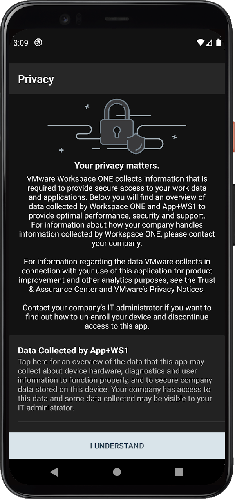

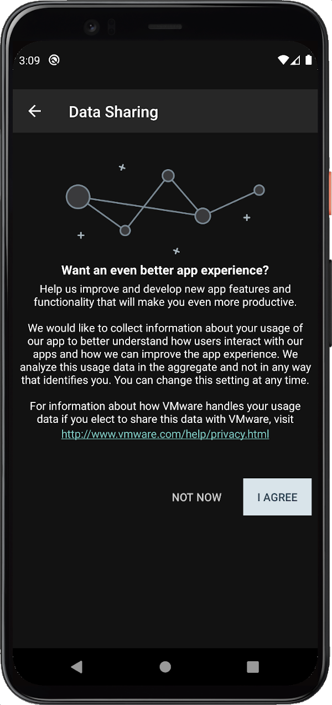

If you want to test the above interaction, you can clear the app storage and
restart it. See the [Appendix: How to reset application state] for instructions,
if needed.

If everything is as expected, you are ready to proceed to the next 
[Task: Add Agreement Review].

# Task: Add agreement review
Adding a review option is a Workspace ONE privacy agreements integration task
for Android application developers.

An option to review agreement content should be made available in any app that
requires consent to a privacy agreement. The privacy module has a built-in user
interface for this.

In the review user interface, the user can read again the contents of the
agreement that they accepted. They can also opt in or out of additional data
sharing. They cannot withdraw consent to the main privacy agreement from the
review user interface, but see the [Task: Add Agreement Revocation].

The add agreement review task is dependent on the
[Task: Add a consent check at application launch]. These instructions
assume that the dependent task is complete already.

The code snippets in this section are taken from an Open Source sample
application. The application is published in the Workspace ONE Software
Development Kit Integration Samples repository. See:  
[github.com/.../workspace-ONE-SDK-integration-samples/.../privacyKotlin](https://github.com/vmware-samples/workspace-ONE-SDK-integration-samples/tree/main/IntegrationGuideForAndroid/Apps/privacyKotlin)

## Instructions
Proceed as follows.

1.  Add a utility method to the privacy helper.

    Implement a utility method that starts the review consent user interface
    flow for the agreement whose content has been configured in the helper.

    Kotlin code for the method could look like the following.

        open class PrivacyBase(...) {

            ...

            fun reviewPrivacy(context: Context, callback: (result: AWPrivacyResult) -> Unit) {
                AWPrivacyController.previewPrivacy(
                    context, agreement, privacyCallback(callback)
                )
            }
        }
    
    The new method has similar parameters and structure to the
    startPrivacyFlow() method.

2.  Call the utility method from a handler in an Activity.

    For example, add a TextView, button or other clickable element to the main
    Activity that already has a property for the privacy helper instance. In the
    click event listener, add code like this:

        privacy.reviewPrivacy(context, this::privacyCallback)

## Next Steps
Build and run the application, and test the change just made.

-   The privacy agreement content should be the same as when it was accepted.
-   The option to accept, I Understand, won't be present.
-   The user can return to the app user interface by

    -   selecting a reverse navigation option.

    -   tapping the Android back button.

    The location of the reverse navigation option is shown in the configuration
    screen capture images in this document. See [Privacy Splash].

If everything is as expected, you are ready to proceed to the next 
[Task: Configure agreement content].

# Task: Configure agreement content
Configuration of the agreement is a Workspace ONE privacy module integration
task for Android application developers.

The configure agreement task is dependent on the
[Task: Add a consent check at application launch]. These instructions
assume that the dependent task is complete already.

There are many aspects of the privacy agreement that can be configured. The
programming interface for agreement configuration is the AWPrivacyConfig and
AWPrivacyContent classes. The general approach to configuration is to set the
properties of an instance of one of those classes.

If you are unfamiliar with the privacy agreement sections, take a look at the
[Privacy Sections] annotated screen capture images.

If you follow these instructions you will make minimal customizations of the app
permissions section of the privacy agreement, then the data collection section.
Having done that, you and your code will be ready to complete the configuration
of the privacy agreement according to your requirements.

## Add custom app permission text
Proceed as follows.

1.  Add a privacy content item factory function to the privacy helper.

    Implement a factory function for instantiating new privacy content items.
    This will facilitate building lists for configuration later.

    The Kotlin code for a factory function could look like the following.

        class PrivacyBase(...) {

            companion object {
                // ... Other companion object code here.

                fun privacyContent(
                    title: String, summary: String
                ) : AWPrivacyContent = AWPrivacyContent().apply {
                    this.title = title
                    this.summary = summary
                }
            }
        }

2.  Create a privacy helper subclass and override the content initialization
    method.

    Use a subclass to separate general utility code from specific code for each
    app. The base privacy helper class can then be re-used in other apps.

    Kotlin code for the subclass declaration could look like the following.

        class Privacy(context: Context) : PrivacyBase(context) {

            override fun configureAgreement(context: Context): AWPrivacyConfig
            { return super.configureAgreement(context).apply {

                appPermissionTitle = "My App Permissions"
                appPermissionItems = ArrayList( listOf(
                    privacyContent(
                        "Custom permission", "My permission, without an icon, goes here.")

                    // ToDo: More app permission items here.
                ))

                // ToDo: Other agreement configuration here.
            } }

        }

    Note that the AWPrivacyConfig appPermissionItems property is a Java-style
    ArrayList. It can be constructed from a Kotlin immutable list.

3.  Instantiate the subclass instead of the privacy helper base class.

    Change PrivacyBase to Privacy wherever it is used, for example as in the
    following code.

        // private val privacy by lazy {PrivacyBase(this)}
        private val privacy by lazy {Privacy(this)}

Build and run the application to test the changes just made:

-   The app permissions section title in the privacy consent and review user
    interfaces should be the value set in the code.
-   On the screen that opens when the app permissions title is tapped, the
    custom permission should appear.

If everything is as expected, you are ready to continue to the next step.

## Add an app permission with a custom icon
In the previous step a custom app permission was added. In this step, an icon
will be added to represent a custom app permission.

Proceed as follows.

1.  Add an icon resource to your application.

    If you don't have an icon to hand, you can create a placeholder using the
    tools that come with Android Studio. Instructions can be found here, for
    example:  
    [https://developer.android.com/studio/write/image-asset-studio#access](https://developer.android.com/studio/write/image-asset-studio#access)  
    (Some PDF viewers incorrectly escape the hash anchor marker in the above
    links. If that happens, edit the link in the browser address bar.)

    The instructions in either of the following sections will help you create a
    suitable placeholder.

    -   Create adaptive and legacy launcher icons.
    -   Create a notification icon.

    Save your image, in `res/drawable`, or in `res/mipmap` for example. Note the
    resource name for later.

2.  Add a new privacy content item factory function to the privacy helper base
    class.

    Implement a factory function for instantiating new privacy content items
    with icon resources. The function can be based on the factory function
    created in the preceding step.

    The Kotlin code for the factory function could look like the following.

        class PrivacyBase(...) {

            companion object {
                // ... Other companion object code here and previous factory function.

                fun privacyContent(
                    title: String, summary: String, id: Int
                ) : AWPrivacyContent = privacyContent(title, summary).apply { this.id = id }
            }
        }

3.  Add a new item to the privacy agreement app permissions.

    In the code added in the preceding step, in the appPermissionItems list,
    instantiate a new item with code like the following.

        appPermissionItems = ArrayList( listOf(
            privacyContent(
                "Another Permission", "Another permission with a custom icon goes here.",
                R./* mipmap or drawable for example */ . /* resource name */
            ),
            // ... Existing custom permission here.
        ) )

Build and run the application to test that the new permission appears, with its
icon.

If everything is as expected, you are ready to continue to the next step.

## Add an app permission with a built-in icon
The privacy module comes with built-in icon resources that you can use in your
privacy agreement, instead of creating your own custom icons.

Built-in icons are accessed via the AWPrivacyController getPermissionResource
static method. They are represented by the AWPrivacyPermissionType enumerated
constants. Screen captures showing all the icons and constant names are included
in this document, in the [Appendix: Built-In App Permission Icons].

Proceed as follows.

1.  Add a new privacy content item factory function to the privacy helper base
    class.

    Implement a factory function for instantiating new privacy content items
    with built-in icons. The function can be based on the factory function
    created in the preceding step.

    The Kotlin code for the factory function could look like the following.

        class PrivacyBase(...) {

            companion object {
                // ... Other companion object code here and previous factory functions.

                fun privacyContent(
                    title: String, summary: String, id: AWPrivacyPermissionType
                ) : AWPrivacyContent = privacyContent(
                    title, summary, AWPrivacyController.getPermissionResource(id)
                )
            }
        }

2.  Add a new item to the privacy agreement app permissions.

    In the code added in the preceding step, in the appPermissionItems list,
    instantiate a new item with code like the following.

        appPermissionItems = ArrayList( listOf(
            privacyContent(
                "Camera", "Required for taking pictures.", AWPrivacyPermissionType.PERMISSION_CAMERA),
            // ... Existing custom permission here.
        ) )

    In this code, the camera icon has been used. For a list of all the icon
    names, see the [Appendix: Built-In App Permission Icons].

Build and run the application to test that the new permission appears, with its
icon.

If everything is as expected, you are ready to continue to the next step.

## Add custom data collection text
The previous steps customized the app permissions section of the privacy
agreement. The next steps will customize the data collection section.

Customization of the data collection section of the privacy agreement uses the
same classes as customization of the app permissions section. The factory
methods added to the privacy helper for app permissions will be used again.

In the code added for app permission customization, in the configureAgreement
method, customize the data collection text with code like the following.

    override fun configureAgreement(context: Context): AWPrivacyConfig
    { return super.configureAgreement(context).apply {

        appPermissionTitle = "My App Permissions"
        appPermissionItems = ArrayList( listOf( ... ))

        // Following code is added for data collection customization.
        dataCollectionDescription = "Description of data collection by my app."
        dataCollectionItems = ArrayList( listOf(
            privacyContent(
                "Browsing history", "The app will log which sites you browse.")
        ))

        // ToDo: Other agreement configuration here.
    } }

Build and run the application to test the change just made:

-   The data collection section title in the privacy consent and review user
    interfaces will be the value set in the code.
-   On the screen that opens when the data collection title is tapped, the
    custom privacy item appears.

If everything is as expected, you are ready to continue to the next step.

## Add a built-in data collection item
The privacy module comes with built-in data collection items that you can use in
your privacy agreement. These are "canned" full items each with a short title
text, longer description text, and icon.

Built-in data collection items are accessed via the AWPrivacyController
getAppDataContent static method. An Android Context is required as a parameter.
Items are represented by the AWPrivacyAppDataType enumerated constants. Screen
captures showing all the items and constant names are included in this document,
in the [Appendix: Built-In Data Collection Types].

In the code added in the preceding step, in the dataCollectionItems list,
instantiate a new item with code like the following.

    dataCollectionItems = ArrayList( listOf(
        AWPrivacyController.getAppDataContent(
            context, AWPrivacyAppDataType.APP_DATA_DEVICE_HARDWARE)!! ,

        // ... Existing data collection items here.
    ) )

Build and run the application to test that the new permission appears, with its
icon.

## Next Steps
You have now configured some representative parts of the privacy agreement, and
your code has a structure that can accommodate all the configuration options of
the privacy module.

Think about your requirements for privacy agreements and check the
[Configuration Reference] section in this document to see how they can be
implemented. That section lists the configuration properties of the Workspace
ONE privacy module and illustrates their positions with annotated screen capture
images.

### Notes on content configuration
The following notes apply to agreement content configuration.

-   The privacy module has a built-in default list of data collection items.

    A mutable copy of the built-in list can be created by calling the
    AWPrivacyConfig dataCollectionDefaultItems static method. An Android Context
    is required as a parameter. Kotlin code to access the list could be like the
    following.

        val items = AWPrivacyConfig.dataCollectionDefaultItems(context)

-   The privacy module user interfaces support Android night mode, also known as
    dark mode. The built-in app permission icons and data collection items come
    with light- and dark-mode versions of their graphics.
    
    You can provide night-mode versions of custom icons in your agreement
    configuration. Use the Android alternative resources mechanism with the
    "night" suffix.

    The following screen capture shows a night-mode alternative for the
    `privacy_placeholder_2.png` resource in the Android Studio project view of
    the Open Source privacy module sample application.

    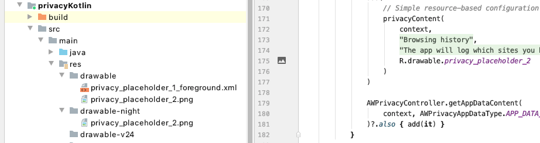

    For details, see the Android developer website, for example:  
    [https://developer.android.com/.../providing-resources#AlternativeResources](https://developer.android.com/guide/topics/resources/providing-resources#AlternativeResources)

# Task: Remove data sharing opt-in
Removing the opt-in for data sharing is an optional Workspace ONE privacy
agreements integration task for Android application developers.

Data here means additional data gathered for analytical and other non-essential
purposes. For example, recording which features of the app are actually used so
that usage patterns can be analysed with a view to informing product development
decisions. This type of data isn't essential to the operation nor security of
the app.

By default, the privacy module offers a data sharing opt-in to the user. The
user can accept or decline the opt-in, separately to consenting to the main
privacy agreement. For screen capture images, see [Privacy Splash] and
[Data Sharing Opt In] in this document.

If your app doesn't gather and share additional data, remove the opt-in from the
privacy agreement user interface by following the instructions below.

This task is dependent on the [Task: Configure agreement content]. These
instructions assume that the dependent task is complete already.

## Instructions
Set the AWPrivacyConfig property dataSharingShow to false to remove the opt-in.

In your privacy helper subclass, in the code added for app permission
customization, in the configureAgreement method, remove the opt-in with code
like the following.

    override fun configureAgreement(context: Context): AWPrivacyConfig
    { return super.configureAgreement(context).apply {

        dataSharingShow = false

        // ... Other agreement content configuration here.
    } }

## Next Steps
Build and run the application, and test the changes just made.

-   In the consent and review user interfaces, the opt-in shouldn't appear on
    the privacy splash screen.

-   After consenting to the main privacy agreement, you shouldn't be prompted to
    opt in to additional data sharing.

This completes removal of the additional data sharing opt-in.

# Task: Configure agreement rejection
Configuring rejection is an optional Workspace ONE privacy agreements
integration task for Android application developers.

By default, the privacy module treats the privacy agreement as mandatory. The
module's consent flow user interface won't offer an option to reject the
agreement unless configured to do so. For details of the consent flow, see the
[Task: Add a consent check at application launch].

If your app has some features that can be used without acceptance of the privacy
agreement, you can allow rejection of the agreement. Follow the instructions
below.

The configure agreement rejection task is dependent on the
[Task: Configure agreement content]. These instructions assume that the
dependent task is complete already.

## Instructions
Proceed as follows.

1.  Set privacyRejectShow:true to allow rejection of the agreement.

    In your privacy helper subclass, in the code added for app permission
    customization, in the configureAgreement method, allow rejection with code
    like the following.

        override fun configureAgreement(context: Context): AWPrivacyConfig
        { return super.configureAgreement(context).apply {

            privacyRejectShow = true

            // ... Other agreement content configuration here.
        } }

2.  Update your privacy result receipt callback to recognize rejection.

    For example, in the sample code under [Launch Activity Change] the privacy
    receipt callback is the privacyCallback method. It receives an
    AWPrivacyResult as a parameter.

    You can check for rejection of the agreement with code like the following.

        private fun privacyCallback(result: AWPrivacyResult) {
            val rejected = result.privacyResultType == AWPrivacyResultType.CANCEL

            // ToDo: If rejected, only show app features that can be used without
            // acceptance of the privacy agreement.
        }

3.  Restrict your app user interface and features in the rejected case.

    Whichever features of your app cannot be used without acceptance of the
    privacy agreement must be blocked if it was rejected.

## Next Steps
Build and run the application, and test the changes just made.

-   In the consent flow user interface, a reverse navigation option should
    appear on the privacy splash screen. The location is shown in the
    configuration screen capture images in this document. See [Privacy Splash].

-   In case you already accepted the agreement in your app as installed, you can
    do one of the following to force the consent flow to open.

    -   Uninstall and reinstall the app.
    -   Revoke the agreement and restart the app, if you have completed the
        [Task: Add Agreement Revocation].
    -   Clear the app storage and restart it. See the
        [Appendix: How to reset application state] for instructions, if needed.

This completes configuration of agreement rejection.

# Task: Add agreement revocation
Adding revocation is an optional Workspace ONE privacy agreements integration
task for Android application developers.

An option to revoke the privacy agreement could be an offered in your app user
interface. To revoke the privacy agreement, call the AWPrivacyController reset
static method. Kotlin code to do this could be as follows.

    AWPrivacyController.reset()

After revoking the privacy agreement, the app code must re-run the consent check
and any ensuing updates to its user interface. If the privacy agreement is
mandatory, for example, then the main app user interface mustn't be shown after
revocation until the agreement is accepted again.

## Next Steps
Build and run the application, and test the change just made.

# Configuration Reference
There are many aspects of the privacy agreement that can be configured. The
programming interface for agreement configuration is the AWPrivacyConfig and
AWPrivacyContent classes. The general approach to configuration is to set the
properties of an instance of one of those classes.

The following table lists all the configuration properties.

AWPrivacyConfig property     | Type    | Note
-----------------------------|---------|------------------------
Banner that appears at the top of the privacy details screen:|||
`aboutPrivacyTitle`          |`String` |Heading.
`aboutPrivacyDescription`    |`String` |Statement.

Data collection section:               |||
`dataCollectionTitle`        |`String` |Section heading.
`dataCollectionDescription`  |`String` |Statement.
`dataCollectionItems`        |`ArrayList <AWPrivacyContent>`|List of collected data types.

App permissions section:               |||
`appPermissionTitle`         |`String` |Section heading.
`appPermissionDescription`   |`String` |Statement.
`appPermissionItems`         |`ArrayList <AWPrivacyContent>`|List of app permissions.

Privacy policy section:                |||
`enterprisePolicyShow`       |`Boolean`|Whether to show the section.
`enterprisePolicyTitle`      |`String` |Section heading.
`enterprisePolicyDescription`|`String` |Statement.
`enterprisePolicyLink`       |`String` |URL to open for more information.

Additional data sharing opt in:        |||
`dataSharingShow`            |`Boolean`|Whether to show the opt in.
`dataSharingTitle`           |`String` |Section heading.
`dataSharingDescription`     |`String` |Statement.
`dataSharingNavigation`      |`String` |How to get to the option in the app user interface.

Other:                                 |||
`applicationName`            |`String` |App name as it should appear in the privacy agreement user interface.
`privacyRejectShow`          |`Boolean`|Whether the agreement can be rejected.

AWPrivacyContent property    | Type    | Note
`title`                      |`String` |Heading.
`summary`                    |`String` |Statement.
`id`                         |`Int`    |Android resource identifier for the icon.
[**Table 2:** Configuration properties]

## Agreement Structure
The order in which the sections of the privacy agreement appear is fixed. Data
collection is first, then app permissions, then privacy policy is last, if it is
shown.

The hierarchy of the privacy agreement is also fixed. The data collection and
app permissions sections each have a list of constituent items. Additional
custom list-based sections cannot be added. Constituent items cannot be added to
any other section of the agreement.

## Agreement Consent Tracking
The privacy module tracks end user consent to the privacy agreement. At the
point of consent, the privacy module generates and stores an acceptance record
for tracking purposes.

The record includes an acceptance check value that is generated from the privacy
agreement as it was configured when consent was given. The following parts of
the agreement are factors in the generation of the acceptance check value.

-   The enterprisePolicyLink URL.
-   All of the appPermissionItems AWPrivacyContent summary texts.
-   All of the dataCollectionItems AWPrivacyContent summary texts.

The app could change the agreement configuration after end user consent in such
a way that the acceptance check value would be different. In that case, the
user's previous consent no longer applies. The user must be prompted to consent
to the changed agreement before continuing to use the app.

The [Task: Add a consent check at application launch] has instructions for
checking the need for user consent, and for starting the consent flow.

## See Also
For instructions and sample code, see the following sections of this document.

-   [Task: Configure agreement content].
-   [Task: Configure agreement rejection].

For pictures that show where the configurable properties appear in the privacy
user interface, see the [Configuration Screen Capture Images] in this document

# Configuration Screen Capture Images
The following screen capture images shows configurable properties in the
Workspace ONE privacy agreement user interface.

### Privacy Splash
The following screen capture image shows configurable properties on the privacy
splash screen. The splash screen is the first screen in the consent and review
user interfaces.

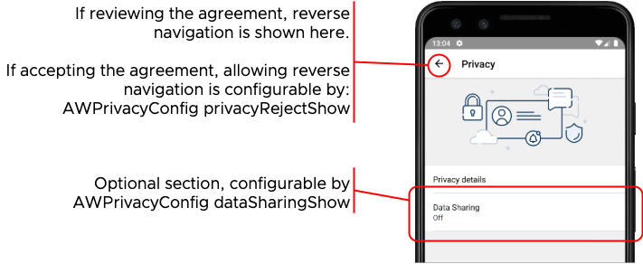

### About Privacy
The following screen capture image shows configurable properties in the about
privacy banner.

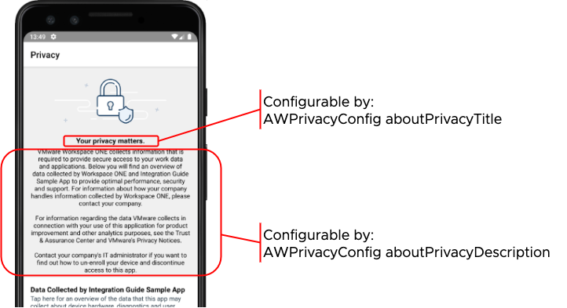

### Privacy Sections
The following screen capture image shows configurable properties in the privacy
sections.

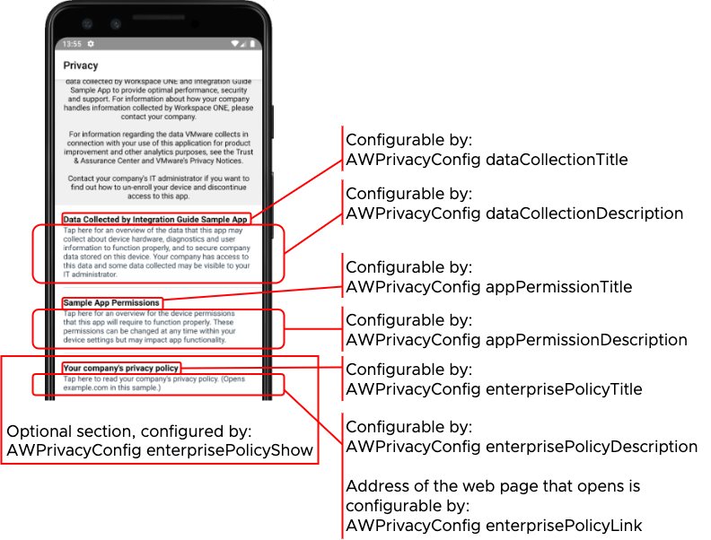

Note that the Android system permission INTERNET would be required for the app
to open the web page configured in the enterprisePolicyLink.

### Data Collection Items
The following screen capture image shows configurable properties in the data
collection items.

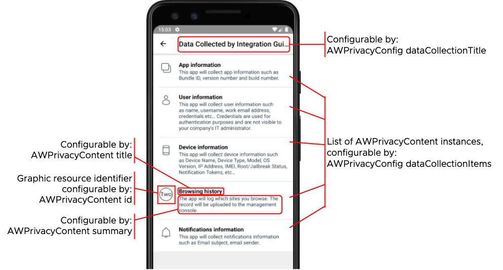

### App Permission Items
The following screen capture image shows configurable properties in the app
permission items.

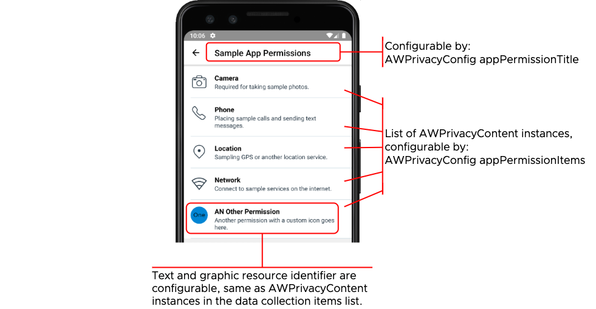

### Data Sharing Opt In
The following screen capture image shows configuration of the data sharing opt
in screen.

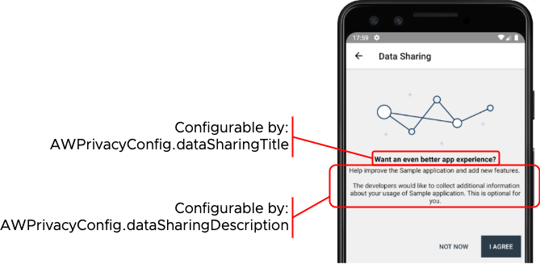

### Data Sharing Navigation
The following screen capture image shows configuration of the data sharing
navigation instructions.

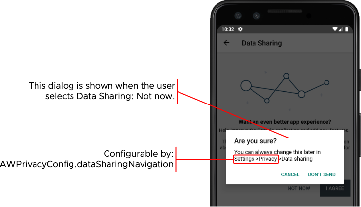

# Appendix: Built-In App Permission Icons
The following screen capture images show the built-in app permission icons that
come with the privacy module.

For instructions how to use these icons, see  
[Add an app permission with a built-in icon].

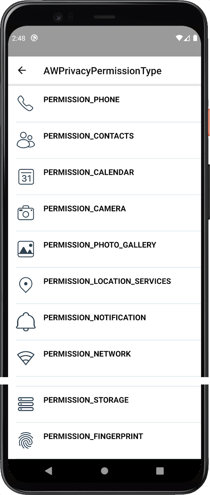

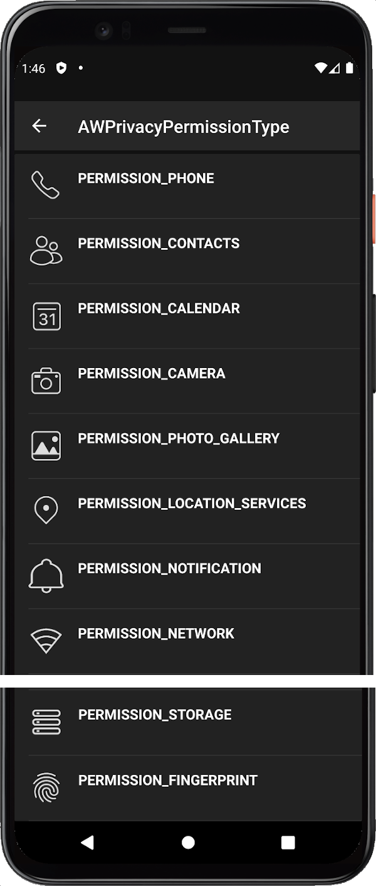

(There is a break in the image because the icons don't all fit on a single
screen.)

# Appendix: Built-In Data Collection Types
The following screen capture image shows the built-in data collection items that
come with the privacy module.

For instructions how to use these items, see
[Add a built-in data collection item].

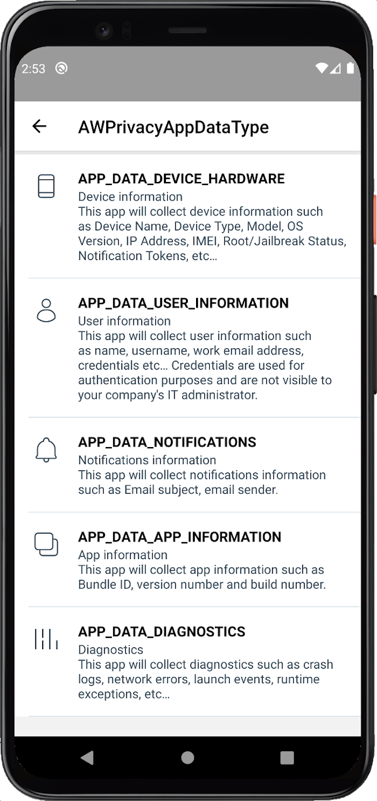

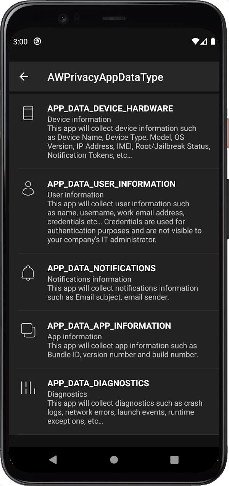

# Appendix: How to reset application state
You can reset an application to its just-installed state by following these
instructions.

1.  Open the App Info screen for the application whose data you want to reset.

    For example, do one of the following.

    -   From the device home screen, long press the application icon and then
        select App info in the context menu that appears.
    -   Open the device Settings and search for the application by its long
        name. (The long name isn't necessarily the same as the package
        identifier.)
    -   Open the device Settings and navigate to Apps and notifications, then
        select the application from the recent list, or from the all list.

2.  Select Storage & cache.

    This opens the Storage management screen for the application.

3.  Select to Clear Storage, and confirm this if prompted.

All application data has now been deleted and any privacy agreement consent will
have been reverted.

# Document Information
## Published Locations
This document is available

-   in Markdown format, in the repository that also holds the sample code:  
    [https://github.com/vmware-samples/...Privacy.md](https://github.com/vmware-samples/workspace-ONE-SDK-integration-samples/blob/main/IntegrationGuideForAndroid/Guides/05Privacy/WorkspaceONE_Android_Privacy.md)

-   in Portable Document Format (PDF), on the VMware website:  
    [https://developer.vmware.com/...Privacy.pdf](https://developer.vmware.com/docs/13425/WorkspaceONE_Android_Privacy.pdf)

## Revision History
|Date     |Revision                                      |
|---------|----------------------------------------------|
|12jul2021|First publication, for 21.5.1 SDK for Android.|
|20aug2021 to 09dec2021|Updated, for 21.7 to 21.11 SDK for Android releases.|
|26Jan2022|Updated, for 22.1 SDK for Android.            |
|28Feb2022|Updated, for 22.2 SDK for Android.            |
|04Apr2022|Updated, for 22.3 SDK for Android.            |
|29Apr2022|Updated, for 22.4 SDK for Android.            |
|06Jun2022|Updated, for 22.5 SDK for Android.            |
|05Jul2022|Updated, for 22.6 SDK for Android.            |
|23Aug2022|Updated, for 22.8 SDK for Android.            |
|04Nov2022|Updated, for 22.10 SDK for Android.           |
|13Dec2022|Updated, for 22.11 SDK for Android.           |
|25Jan2023|Updated, for 23.01 SDK for Android.           |
|15Mar2023|Updated, for 23.03 SDK for Android.           |           
|27Apr2023|Updated, for 23.04 SDK for Android.           |
|06Jun2023|Updated, for 23.06 SDK for Android.           |
|24Jul2023|Updated, for 23.07 SDK for Android.           |
|07Sep2023|Updated, for 23.09 SDK for Android.           |
|25Oct2023|Updated, for 23.10 SDK for Android.           |
|18Dec2023|Updated, for 23.12 SDK for Android.           |
|25Jan2024|Updated, for 24.01 SDK for Android.           |

## Legal
-   **VMware LLC** 3401 Hillview Avenue Palo Alto CA 94304 USA
    Tel 877-486-9273 Fax 650-427-5001 www.vmware.com
-   Copyright © 2024 VMware LLC All rights reserved.
-   This content is protected by U.S. and international copyright and
    intellectual property laws. VMware products are covered by one
    or more patents listed at
    [https://www.vmware.com/go/patents](https://www.vmware.com/go/patents).
    VMware is a registered trademark or trademark of VMware LLC and its
    subsidiaries in the United States and other jurisdictions. All other marks
    and names mentioned herein may be trademarks of their respective companies.
-   The Workspace ONE Software Development Kit integration samples are
    licensed under a two-clause BSD license.  
    SPDX-License-Identifier: BSD-2-Clause