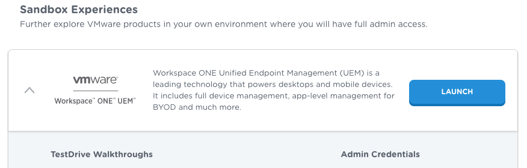

# Task: Set up a management console
Setting up a management console is a system administrator task for application
developers. You can skip this task if you already have an administrator account
on a UEM console with the required permissions.

## App Development Support System Administrator Permissions
To support app development, you will need the following system administrator
permissions on your UEM.

-   Android EMM access, which requires registration from the UEM with Google.
-   Upload an application package (APK) file.
-   Either create an organisation group for an end user, or get the name of an
    existing group.
-   Either create a new end user with a suitable profile for development
    purposes, or get the name of an existing suitable user.
-   Either create enrolment credentials for an end user, or get existing
    credentials.

If you have UEM access and all these permissions then you can skip this task.

Otherwise, you can utilize the Omnissa TestDrive service.

## How to set up a management console in Omnissa TestDrive
Omnissa operates a service, Omnissa TestDrive, that can be used to host a
Workspace ONE UEM management console to support application development efforts.

To set up a TestDrive UEM, proceed as follows.

1.  Register at [https://testdrive.omnissa.com](https://testdrive.omnissa.com)

    When you open the above link, your browser will be redirected to the service
    home page. The home page will have a link or some other way to initiate the
    sign-up process.

    Sign up and set a passcode with one of the following email addresses.

    -   Your Omnissa.com email address if you are a member of staff at Omnissa, or
        a contractor, or otherwise have an omnissa.com email address.
    -   An email address from an account or domain registered in the Omnissa
        Partner Connect portal if you are a member of the Omnissa Technology
        Alliance Program (TAP).
    -   An email address from an account or domain registered in the Omnissa
        Customer Connect portal if you are a customer of Omnissa.

2.  Launch the Sandbox Experience: Workspace ONE UEM.

    Navigate to My Products, Digital Workspace, Sandbox Experiences, Omnissa
    Workspace ONE UEM, and click Launch.

    Ignore the Ready to Use Experiences, which aren't suitable for support of
    app development.

    

    The UEM login page will open, in a new browser tab or window.

3.  Log in to the UEM.

    The credentials you will need can be found in the TestDrive user interface,
    as follows.

    -   In list mode, click the expand control.
    -   In grid mode, click the i in a circle.

    You will need the Admin Credentials username and password.

This completes setting up a management console. You are now ready to continue
with the next [Task: Register for Android Enterprise Mobility Management](../02Task_Register-for-Android-Enterprise-Mobility-Management/readme.md).

