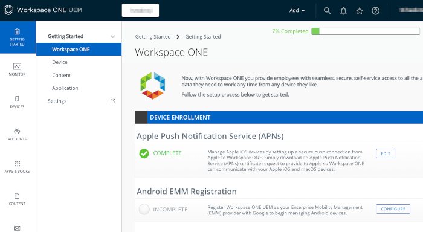
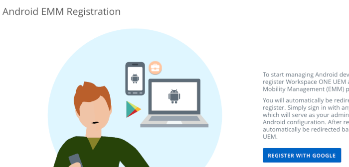
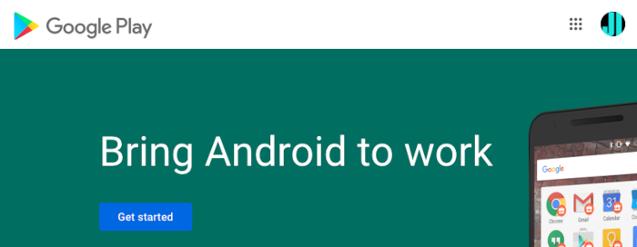
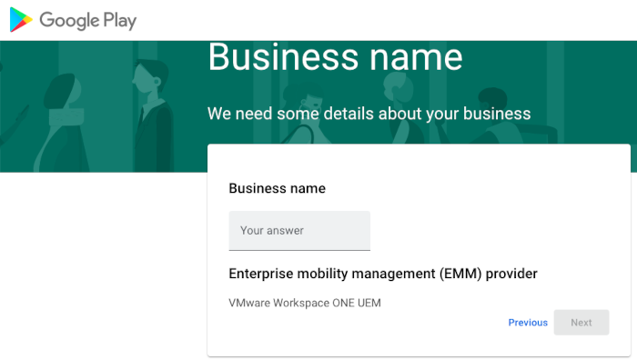
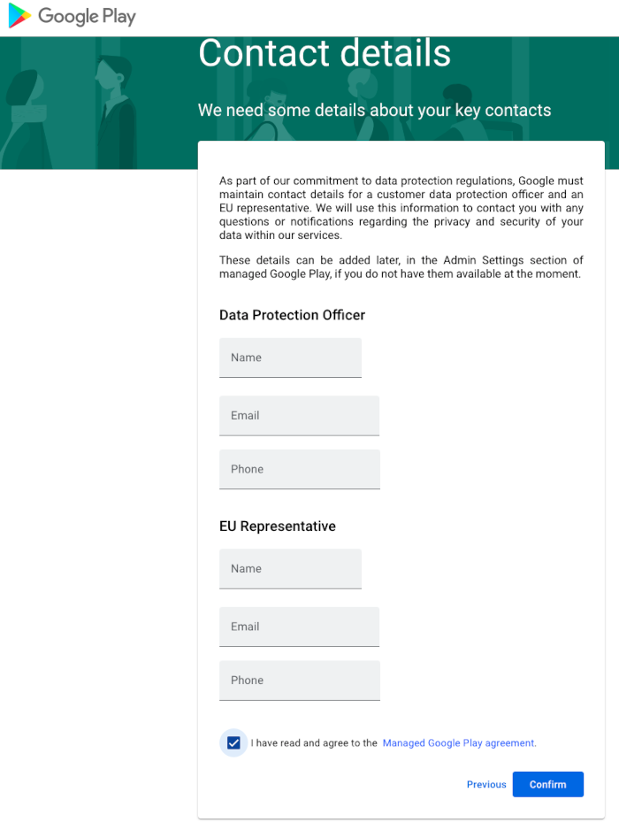
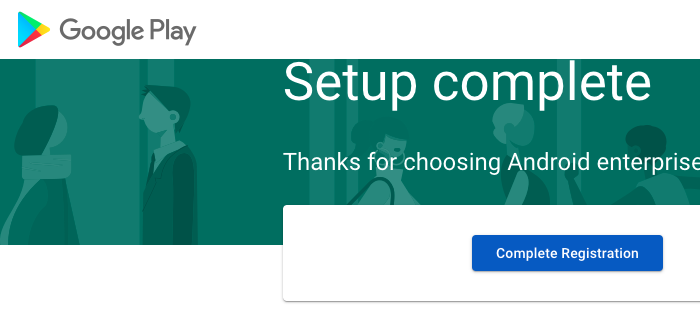

# Task: Register for Android Enterprise Mobility Management
Registering for Android EMM is a system administrator task for application
developers. You can skip this task if your UEM console is already registered. If
you don't have access to a UEM, see the preceding
[Task: Set up a management console](../01Task_Set-up-a-management-console/readme.md).

Note that the UEM must be registered for EMM with Google, even if you aren't
using any form of device management.

You will need a gmail.com email address or other Google account. You might want
to create one for the purpose, in case you have a personal gmail.com address
already and don't want to use it for EMM registration.

1.  Open the UEM Getting Started page.

    Launch and log in to your TestDrive sandbox UEM. Navigate to Getting
    Started, Workspace ONE, if it isn't open by default.

    The following screen capture shows you the location in the UEM user
    interface.

    

2.  Select to configure Android EMM Registration.

    This opens a screen that describes the necessary interactions, which will
    take place in the Google Play website. The following screen capture shows
    the page.

    

3.  Select to Register With Google.

    This will open a first page in the Google Play website. In the top right
    corner, **check that the Google account is as expected**. If it isn't, then
    log out and log in with the required account. The following screen capture
    shows the page.

    

4.  Click the button: Get started.

    This will open a page on which you register a business name and EMM
    provider. The following screen capture shows the page.

    

    You can use your own name as the business name. You'll only be managing your
    own devices. The EMM provider should be pre-populated.

5.  Enter your own name as the business name and click next.

    This will open a page on which you must confirm that you accept the relevant
    agreement. On this page you can also enter contact details, or you can leave
    them blank. The following screen capture shows the page.

    

6.  Accept the relevant agreement and click Confirm.

    This will open a final page on which you complete registration. In the top
    right corner, **check that the Google account is as expected**. If it isn't,
    close the page and start again after logging in with your correct Google
    account. The following screen capture shows the page.

    

This completes registration for Android Enterprise Mobility Management. You are
now ready to continue with the next
[Task: Configure management console enrollment](../03Task_Configure-management-console-enrollment/readme.md).

# License
Copyright 2022 VMware, Inc. All rights reserved.  
The Workspace ONE Software Development Kit integration samples are licensed
under a two-clause BSD license.  
SPDX-License-Identifier: BSD-2-Clause