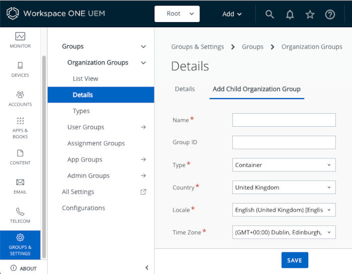

## How to set up the recommended Organization Group structure
To set up the [Recommended Organization Group Structure](../01Recommended-Organization-Group-Structure/readme.md),
proceed as follows.

1.  Log in to the UEM and navigate to: Groups & Settings, Groups, Organization
    Groups, Details.

    This opens the root OG in the Details view.

2.  Set the name and Group ID of the root OG.

    In the Details view, enter the following field values.

    -   Name: `Root`
    -   Group ID: `og`

    There is no need to set any other field values.

    The following screen capture shows how the screen could look when the values
    have been entered.

    

    Click the Save button at the bottom of the screen to save the changes.

    A message will be displayed to confirm that the change has been made.

3.  Add a first child OG.

    Still in the Details view of the root OG, select the option to Add Child
    Organization Group. This option appears as a tab. The following screen
    capture shows the location and appearance after selection.

    

    Enter the following field values for the first child OG.

    -   Name: `Managed`
    -   Group ID: `ogm`

    Click the Save button at the bottom of the screen to save the changes. This
    will create the child OG and select it.

4.  Select the root OG.

    At the top of the page, locate the OG selection control. It will be
    displaying the name of the root OG and child OG separated by an oblique, as
    shown in the following screen capture.

    

    The name of the root OG mightn't have updated to reflect the recent name
    change. In that case, refresh the browser view.

    Click to expand the control and then click to select the root OG.

    The control will change to show the name of the root OG only. If it doesn't,
    try again.

    The following screen capture shows the required OG selection.

    

    **Note:** Check the current OG selection whenever you make configuration
    changes in the UEM. Almost all configuration will be applied at the OG
    level.

5.  Add the other child OGs.

    Repeat the preceding steps to add the second child OG, with the following
    values.

    -   Parent: root OG.
    -   Child Name: `Profile`
    -   Child Group ID: `ogp`

    Save, reselect the root OG and then repeat the process again with the
    following values.

    -   Parent: root OG.
    -   Child Name: `Registered`
    -   Child Group ID: `ogr`

    Save, reselect the root OG and then repeat the process again with the
    following values.

    -   Parent: root OG.
    -   Child Name: `Standalone`
    -   Child Group ID: `ogs`

    Save and then continue to the next instruction.

6.  Configure registered mode enrollment.

    First, check that registered mode isn't the default in the root OG. Select
    the root OG, see above, and navigate to: Groups & Settings, All Settings,
    Devices & Users, General, Enrollment, Management Mode. By default, the
    option to enrol without device management should be disabled.
    
    The following screen capture shows the location and setting.

    

    The managed OG and profile OG should inherit the same Management Mode
    settings. Check this by selecting each one and navigating as necessary.

    Next, select the registered OG, navigate to Management Mode and set the
    option to enrol without device management to enabled and in all devices in
    the OG. If necessary, select Current Setting: Override at the top of the
    settings.
    
    The following screen capture shows the location and setting.

    

    

    Save and then continue to the next instruction.

7.  Configure managed mode enrollment.

    Select the managed OG, see above, and navigate to: Groups & Settings, All
    Settings, Devices & Users, Android, Android EMM Registration, Enrollment
    Restrictions. Select Allow Work Profile Enrollment: disable. If necessary,
    select Current Setting: Override at the top of the settings.

    The following screen capture shows the location and setting.

    

    Save your changes.

    Check that the root OG has the default setting, Allow Work Profile
    Enrollment: enable. Also check that the profile OG inherits that setting.

8.  Configure profile mode enrollment.

    Select the profile OG, see above, and navigate to: Groups & Settings, All
    Settings, Devices & Users, Android, Android EMM Registration, Enrollment
    Settings. Set the option Management Mode for Corporate Devices: Corporate
    Owned Personally Enabled. If necessary, select Current Setting: Override at
    the top of the settings.

    The following screen capture shows the location and setting.

    

    Save and then continue to the next instruction.

9.  Configure standalone enrollment.

    First, select the standalone OG, see above, and navigate to: Groups &
    Settings, All Settings, Content, Applications, Workspace ONE Content App.  
    Set the option Block Enrollment via Content, Boxer, and Web: Disabled.  
    If necessary, select Current Setting: Override at the top of the settings.

    The following screen capture shows the location and setting.

    

    Next, with the standalone OG still selected, navigate to Groups & Settings,
    All Settings, Devices & Users, General, Enrollment, Management Mode and set
    the option to enrol without device management to enabled and in all devices
    in the OG. (This configuration is also required for the registered OG,
    above.)  
    If necessary, select Current Setting: Override at the top of the settings.
    
    The following screen capture shows the location and setting.

    

    

    Save and then continue to the next instruction.

10. Configure OG selection at enrollment time.

    Select the root OG, see above, and navigate to: Groups & Settings, All
    Settings, Devices & Users, General, Enrollment, Grouping.  
    Select Group ID Assignment Mode: Prompt User To Select Group ID.  
    If necessary, select Current Setting: Override at the top of the settings.

    The following screen capture shows the location and setting.

    

    Next, select the standalone OG, see above, and navigate to the same screen:
    Groups & Settings, All Settings, Devices & Users, General, Enrollment,
    Grouping.  
    For this OG, select Group ID Assignment Mode: Default.  
    If necessary, select Current Setting: Override at the top of the settings.

    The following screen capture shows the location and setting.

    

    

This completes enrollment mode configuration. Check that the OG structure and
settings are the same as shown in the [Recommended Organization Group Structure](../01Recommended-Organization-Group-Structure/readme.md)
diagram.

Now is a good time to review [How to log in and select an Organization Group](../03How-to-log-in-and-select-an-Organization-Group/readme.md).

# License
Copyright 2022 VMware, Inc. All rights reserved.  
The Workspace ONE Software Development Kit integration samples are licensed
under a two-clause BSD license.  
SPDX-License-Identifier: BSD-2-Clause