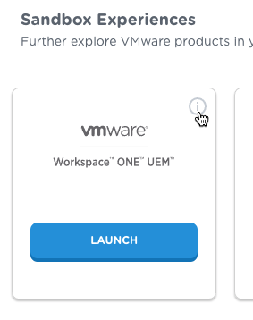
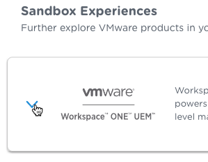
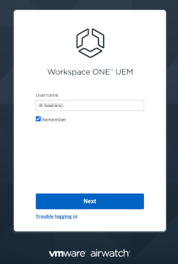
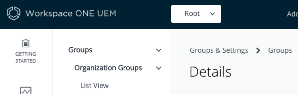

## How to log in and select an Organization Group
Whenever you log in to the UEM, you should check the OG selection. You should
also check the OG selection before changing a configuration setting, creating an
end user, adding an application, or taking any other system administration
action. Almost all system administration is applied at the OG level.

Proceed as follows.

1.  Get the administrator login credentials.

    If you are using a VMware TestDrive UEM, you can get the default credentials
    from the service home page. Note that if you change your login credentials,
    the TestDrive home page won't be updated and will still show the default
    credentials.
    
    Navigate to this address in a web browser:
    [https://testdrive.vmware.com](https://testdrive.vmware.com)

    When you open the above link, your browser will be redirected to the service
    home page. Log in to TestDrive using the credentials with which you
    registered.
    
    (If you haven't registered and don't have access to another UEM, see the
    [Task: Set up a management console](../../01Task_Set-up-a-management-console/readme.md) for instructions.)

    Navigate to My Products, Digital Workspace, Sandbox Experiences, VMware
    Workspace ONE UEM. The credentials you will need can be found as follows.

    -   In list mode, click the expand control.
    -   In grid mode, click the i in a circle.

    The following screen captures show where to click in the TestDrive user
    interface.

    

    

    

    You will need the Admin Credentials username and password.

2.  Open the UEM console login page.

    If you are using TestDrive, navigate to My Products, Digital Workspace,
    Sandbox Experiences, VMware Workspace ONE UEM, and click Launch.

    The UEM login page will open, in a new browser tab or window.

3.  Log in to the UEM.

    The initial appearance of the login screen is shown in the following screen
    capture.

    

    Enter the admin username if it isn't pre-populated and click Next, then
    enter the admin password and click Log In.

    You are now logged in to the UEM.

4.  Select the required OG.

    At the top of the page, locate the OG selection control. It might already
    display the required OG.

    The following screen capture shows the OG selection control.

    

    In the above screen capture, the selected OG is: Root.

    If the required OG isn't already displayed then click to expand the control
    and then click again to select the required OG. The control will change to
    show the name of the required OG, and its hierarchy if it is a child OG. If
    it doesn't, try again.

This completes logging in to the console and selecting an OG.

If you haven't already done so, you are now ready to continue to the next
[Task: Set up the mobile application catalog](../../04Task_Set-up-the-mobile-application-catalog/readme.md).

# License
Copyright 2022 VMware, Inc. All rights reserved.  
The Workspace ONE Software Development Kit integration samples are licensed
under a two-clause BSD license.  
SPDX-License-Identifier: BSD-2-Clause