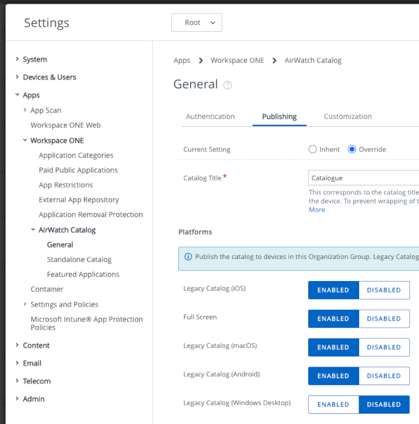

# Task: Set up the mobile application catalog
Setting up the mobile application catalog is a system administrator task for
application developers. This task is dependent on the [Task: Configure management console enrollment](../03Task_Configure-management-console-enrollment/readme.md).
The following instructions assume that the dependent task is complete already.

The mobile application catalog will be used to make your app in development
available to install onto your developer device. Installation could be via
selection in Hub, or by pushing from the UEM.

Setting up the catalog is a common task for UEM administrators and the relevant
online documentation will be used here.

Set up the Workspace ONE mobile application catalog as follows.

1.  Log in to the UEM and select the root OG.

    For instructions, see [How to log in and select an Organization Group](../03Task_Configure-management-console-enrollment/03How-to-log-in-and-select-an-Organization-Group/readme.md).

2.  Activate Hub Services.

    Follow the instructions here:
    [Activate Hub Services for Existing UEM Customers](https://docs.vmware.com/en/VMware-Workspace-ONE/services/intelligent-hub_IDM/GUID-46439DA0-CD4C-4F2C-A98A-08B1B1B79D08.html)

3.  Create your catalog.

    Follow the instructions here: [Customize the App Catalog in Hub Services](https://docs.vmware.com/en/VMware-Workspace-ONE/services/intelligent-hub_IDM/GUID-C3535277-304A-4A89-8ED6-AC8179A27D37.html)

4.  Activate the AirWatch Catalog.

    In some cases, it has seemed necessary to activate the legacy AirWatch
    catalog feature. To do so, navigate to: Groups & Settings, Apps, Workspace
    ONE, AirWatch Catalog, General, Publishing. Select Legacy Catalog (Android):
    enabled.

    The following screen capture shows the location and setting.

    

This completes setting up the mobile application catalog. You are now ready to
continue to the next [Task: Configure end users](../05Task_Configure-end-users/readme.md).

# License
Copyright 2022 VMware, Inc. All rights reserved.  
The Workspace ONE Software Development Kit integration samples are licensed
under a two-clause BSD license.  
SPDX-License-Identifier: BSD-2-Clause