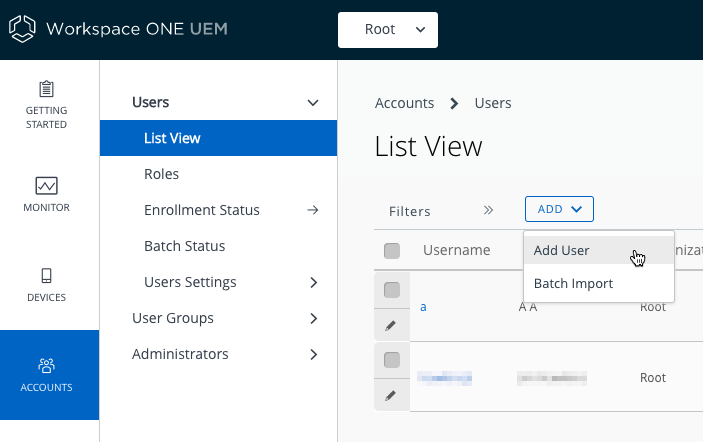
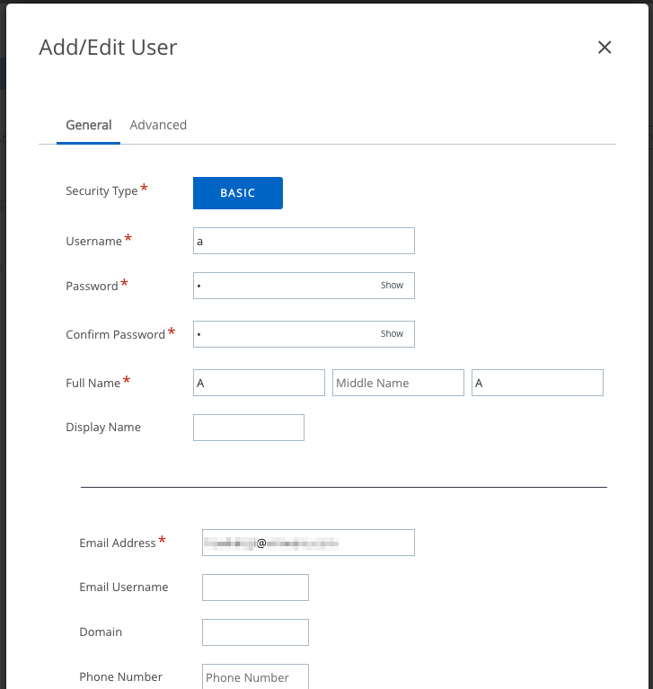
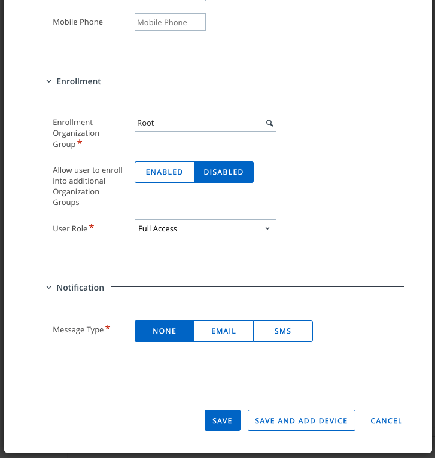

## How to create an end user account
To create an end user account in line with the above recommended configuration,
proceed as follows.

1.  Log in to the UEM and select the root OG.

    For instructions, see [How to log in and select an Organization Group](../../03Task_Configure-management-console-enrollment/03How-to-log-in-and-select-an-Organization-Group/readme.md).

2.  Navigate to Accounts, Users, List View.

    Clicking on Accounts might do the whole navigation.

3.  Select to add an end user.

    The following screen capture shows the location of the control in the user
    interface. The Root OG has been selected.

    

    The Add/Edit User screen will open.

4.  Fill in the details for the new end user, for example as follows.

    -   Security Type: Basic.
    -   Username: Enter a short value, for example "a".
    -   Password: Enter the Username value.
    -   Confirm Password: Enter the Username value again.
    -   Full Name: Enter a short value, for example "A" in the First Name and
        Last Name fields.
    -   Email address: Enter your email address.
    -   Enrollment Organization Group: Root, the default.
    -   Allow user to enroll into additional Organization Groups: Disabled, the
        default.
    -   User Role: Full Access, the default.
    -   Notification Message Type: None.

    The following screen capture shows sample filled-in values.

    

    

    

    

5.  Click Save to add the user account.

This completes end user account creation. The end user can be used for the
[Task: Enroll a developer device](../../06Task_Enroll-a-developer-device/readme.md).

# License
Copyright 2022 VMware, Inc. All rights reserved.  
The Workspace ONE Software Development Kit integration samples are licensed
under a two-clause BSD license.  
SPDX-License-Identifier: BSD-2-Clause