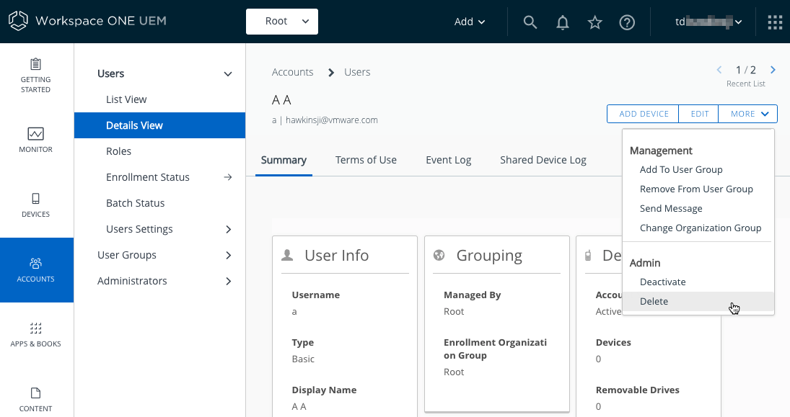

## How to delete an end user account
In case you want to delete an end user account, proceed as follows.

Your TestDrive UEM will come with a single automatic end user account. You
mightn't be allowed to delete the automatic account.

1.  Log in to the UEM and select the root OG.

    For instructions, see [How to log in and select an Organization Group](../../03Task_Configure-management-console-enrollment/03How-to-log-in-and-select-an-Organization-Group/readme.md).

2.  Navigate to Accounts, Users, List View.

    Clicking on Accounts might do the whole navigation.

3.  Click anywhere blank in the row for the end user you wish to delete.

    This opens a detailed view of the end user account.

4.  In the actions at the top right, click More to expand the actions then,
    under Admin click Delete.

    The following screen capture shows the expanded actions in the user
    interface.

    

    If the Delete action doesn't appear then the user cannot be deleted.

5.  A confirmation message will be displayed. Click OK to dismiss it.

The end user account has now been deleted.

# License
Copyright 2022 VMware, Inc. All rights reserved.  
The Workspace ONE Software Development Kit integration samples are licensed
under a two-clause BSD license.  
SPDX-License-Identifier: BSD-2-Clause