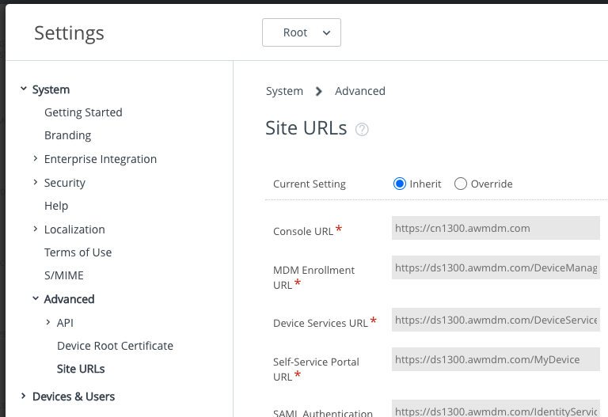

## How to find out the enrollment server address
To find out the enrollment server address for a UEM proceed as follows.

1.  Log in to the UEM and select the root OG.

    For instructions, see [How to log in and select an Organization Group](../../03Task_Configure-management-console-enrollment/03How-to-log-in-and-select-an-Organization-Group/readme.md).

2.  Navigate to: Groups & Settings, All Settings, System, Advanced,
    Site URLs.

    This opens a page with a list of site uniform resource locator (URL) values.

3.  Locate the Device Services URL in the list.

The enrollment server address is the host portion of the Device Services URL.

The following screen capture shows the location of the required address in the
user interface.

In the above screen capture, the enrollment server address is:
`ds1300.awmdm.com`

Make a note of the address and then proceed to one of these sets of instructions,
depending on which type of enrollment you are using.

-   [How to enroll an Android device in Device Owner managed mode](../02How-to-enroll-an-Android-device-in-Device-Owner-managed-mode/readme.md)
-   [How to enroll an Android device in Profile Owner managed mode](../03How-to-enroll-an-Android-device-in-Profile-Owner-managed-mode/readme.md)
-   [How to enroll an Android device in Registered mode](../04How-to-enroll-an-Android-device-in-Registered-mode/readme.md)

# License
Copyright 2022 VMware, Inc. All rights reserved.  
The Workspace ONE Software Development Kit integration samples are licensed
under a two-clause BSD license.  
SPDX-License-Identifier: BSD-2-Clause