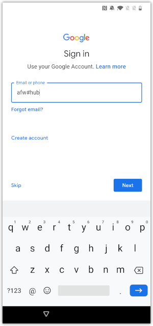

## How to enroll an Android device in Device Owner managed mode
In general, only new or factory reset devices can be enrolled in Android Device
Owner (DO) managed mode. In order to use an ordinary Android smartphone or
tablet as your developer device in DO mode, you must first reset it to factory
defaults and erase all data.

These instructions assume that the [Recommended Organization Group Structure](../../03Task_Configure-management-console-enrollment/01Recommended-Organization-Group-Structure/readme.md)
has been configured in the UEM. Some steps will be different if that isn't the
case.

1.  Switch on your developer device if it is new, or reset it to factory
    defaults and erase all data.

2.  Follow the out-of-box activation instructions until you reach the Google
    sign-in screen.

    -   You can skip any instructions that don't apply to developer devices such
        as restoring preferences, apps, and data from an earlier device.
    -   You will require an internet connection, either mobile data or Wi-Fi.

3.  On the sign-in screen, enter the Workspace ONE Intelligent Hub special
    identifier instead of an email address or phone number.

    The identifier is: `afw#hub`

    The following screen capture shows how this might appear as entered on the
    sign-in screen.

    

4.  Tap Next and then follow the ensuing instructions until you reach a screen
    with the Workspace ONE Intelligent Hub logo and a prompt for email address
    or server.

    The instructions will include installing Workspace ONE Intelligent Hub and
    setting up as a work device, as well as setting some user preferences. You
    will be warned that the device isn't private. There is no need to switch on
    any optional Google Services.

    The following screen capture shows the screen with logo and prompt.

    

5.  Enter the enrollment server address and tap Next.

    See the instructions [How to find out the enrollment server address](../01How-to-find-out-the-enrollment-server-address/readme.md)
    if necessary.

    There will be some processing and then the prompt will reappear with an
    additional field requiring entry: Group ID.

6.  Enter the Group ID of your root OG.

    In the [Recommended Organization Group Structure](../../03Task_Configure-management-console-enrollment/01Recommended-Organization-Group-Structure/readme.md)
    the Group ID is: `og`

    There will be some more processing and then you will be prompted to select a
    group for your device.

7.  Select the group Managed and tap to continue.

    You will be prompted for a Username and Password.

8.  Enter the username and password of an end user account and tap Next.

    If the [Recommended End User Configuration](../../05Task_Configure-end-users/01Recommended-End-User-Configuration/readme.md)
    has been set up then the username and password could both be: `a`

    There will be some more processing. You might be prompted to save the
    password just entered but this can be ignored.

    When enrollment processing has finished, you will be prompted to accept a
    privacy agreement.

9.  Accept the privacy agreement by tapping: I Understand.

    You will be prompted to opt in to additional data sharing.

10. Select "Not Now" and confirm by tapping "Don't Send" when prompted.

    There will be some more processing and device set-up will finalize.

11. Set a passcode for the device if prompted to do so. Acknowledge any other
    warnings.

This completes Android Device Owner managed mode enrollment. The device is now
ready for developer use.

For instructions with screen captures of every stage, see this tutorial on the
VMware Tech Zone website:  
[https://techzone.vmware.com/managing-android-devices-workspace-one-operational-tutorial#_1211546](https://techzone.vmware.com/managing-android-devices-workspace-one-operational-tutorial#_1211546)

# License
Copyright 2022 VMware, Inc. All rights reserved.  
The Workspace ONE Software Development Kit integration samples are licensed
under a two-clause BSD license.  
SPDX-License-Identifier: BSD-2-Clause