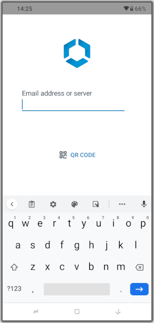

## How to enroll an Android device in Registered mode
A device that isn't already enrolled with Workspace ONE, and doesn't have any
standalone enrolled apps installed, can be enrolled in registered mode.

The Workspace ONE Boxer email app, the Workspace ONE Web browser, and other apps
in the VMware productivity suite support standalone enrollment. Any of those
apps that are on the device might stop working when the device is enrolled in
registered mode.

These instructions assume that the [Recommended Organization Group Structure](../../03Task_Configure-management-console-enrollment/01Recommended-Organization-Group-Structure/readme.md)
has been configured in the UEM. Some steps will be different if that isn't the
case.

Proceed as follows.

1.  Install the Workspace ONE Intelligent Hub mobile application.

    The Hub can be installed from the Google Play Store. Search for "workspace
    one intelligent hub", for example.

2.  Open the Hub app.

    The screen will show the Workspace ONE Intelligent Hub logo and a prompt for
    email address or server, as in the following screen capture.

    

3.  Enter the enrollment server address and tap Next.

    See the instructions [How to find out the enrollment server address](../01How-to-find-out-the-enrollment-server-address/readme.md)
    if necessary.

    There will be some processing and then the prompt will reappear with an
    additional field requiring entry: Group ID.

4.  Enter the Group ID of your root OG.

    In the [Recommended Organization Group Structure](../../03Task_Configure-management-console-enrollment/01Recommended-Organization-Group-Structure/readme.md)
    the Group ID is: `og`

    There will be some more processing and then you will be prompted to select a
    group for your device.

5.  Select the group Registered and tap to continue.

    You will be prompted for a Username and Password.

8.  Enter the username and password of an end user account and tap Next.

    If the [Recommended End User Configuration](../../05Task_Configure-end-users/01Recommended-End-User-Configuration/readme.md)
    has been set up then the username and password could both be: `a`

    There will be some more processing. You might be prompted to save the
    password just entered. Ignore or decline the option.

    When enrollment processing has finished, you will be prompted to accept a
    privacy agreement.

9.  Accept the privacy agreement by tapping: I Understand.

    You will be prompted to opt in to additional data sharing.

10. Select "Not Now" and confirm by tapping "Don't Send" when prompted.

    There will be some more processing.

This completes Registered mode enrollment. The device is now ready for developer
use.

# License
Copyright 2022 VMware, Inc. All rights reserved.  
The Workspace ONE Software Development Kit integration samples are licensed
under a two-clause BSD license.  
SPDX-License-Identifier: BSD-2-Clause