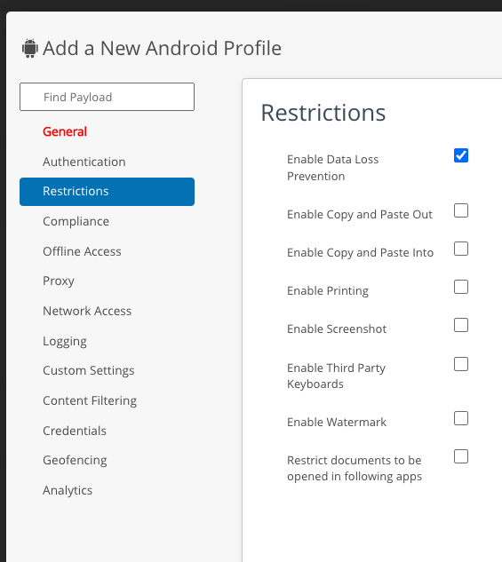

# Task: Configure security settings
Configuring security settings is a system administrator task for application
developers. This is an optional task that you may do in order to demonstrate or
test the features of the Workspace ONE software development kit (SDK).

This guide doesn't cover security settings configuration in depth. See the
system administrator user guides for the Workspace ONE product for authoritative
and complete information.

Default security settings are set at the organization group (OG) level. For an
introduction to the OG concept, see the [Task: Configure management console enrollment](../03Task_Configure-management-console-enrollment/readme.md).
Security settings from the OG can be overridden for specific apps, by using a
custom SDK profile.

Security settings includes data loss prevention (DLP) settings. Those will be
used as an example here.

## How to configure data loss prevention at the Organization Group level
To configure DLP settings at the OG level proceed as follows.

1.  Log in to the UEM and select an OG.

    See the instructions [How to log in and select an Organization Group](../03Task_Configure-management-console-enrollment/03How-to-log-in-and-select-an-Organization-Group/readme.md)
    if necessary.

    If you are unsure which OG to select, use the one that is managing your app.
    You can find out the OG name by navigating to Resources (or it may be
    labelled Apps or Apps & Books), Apps, Native. Then select the tab on which
    your app appears. This will be Internal if your app APK was uploaded
    directly to the UEM, or Public if the APK was uploaded to your enterprise
    app store.

    This screen capture shows how the list view might appear in the console user
    interface.

    

    In this screen capture there are two apps: App+WS1 hawkinsji and DevDetOne.
    Both are managed by the OG: Root.

2.  Navigate to: Groups & Settings, All Settings, Apps, Settings and Policies,
    Security Policies.

    This opens the Security Policies configuration screen, on which a number of
    settings can be switched on and off, and configured.

4.  For the Data Loss Prevention setting, select Enabled.

    When Enabled is selected, further controls will be displayed.

    This screen capture shows the location of the setting in the console user
    interface.

    

5.  For actions that end users aren't allowed to do, select No.

    If you find the console user interface difficult to interpret, here's are some tips.

    -   To check which setting is in effect, check if the Yes or No next to the
        action has the same color scheme as the Enabled next to Data Loss
        Prevention. For example, if the Yes next to Enable Copy and Paste Out
        has the same color scheme as the Enabled next to Data Loss Prevention,
        then copy and paste out is allowed.

    -   Most of the individual action selectors have the opposite sense to the
        Data Loss Prevention (DLP) selector. DLP Enabled means that restrictions
        are in effect; Enable Printing Yes means that printing isn't restricted.

6.  To superimpose a watermark on the app user interface (UI), select Enable
    Watermark: Yes.

    UI Watermark is only supported by the SDK for Android at time of writing.

7.  Select Save to commit your changes to the configuration.

This concludes DLP configuration at the OG level.

## How to override data loss prevention configuration for a specific app
You can override the DLP configuration for a specific app by setting up a custom
SDK profile and assigning it to the app. Proceed as follows.

1.  Log in to the UEM and select an OG.

    See the notes on the same step in the preceding instructions
    [How to configure data loss prevention at the Organization Group level].

2.  Navigate to: Groups & Settings, All Settings, Apps, Settings and Policies,
    Profiles.

    This opens a page that lists any SDK custom profiles that have already been
    created.

    This screen capture shows the appearance of the Profiles page and its
    location in the UEM console user interface.

    

3.  Either select an existing profile, or select to add a profile.

    If you selected to add a profile, a Select Configuration Type dialog will
    open. Select: SDK Profile.  
    A second dialog will then open on which you have a choice of mobile
    operating systems, Android or Apple iOS. Select whichever your app runs on.

    A page on which you can create or edit the profile will open.

4.  Select the Restrictions item in the navigation panel.

    If you selected to edit a profile, and the profile already had a DLP
    configuration, the configuration will be shown.  
    If you created a new profile, or if the profile you selected didn't have a
    DLP configuration, no configuration will be shown. Instead, there will be a
    Configure button. Click the button and a default configuration will be
    shown.

    

5.  Configure the allowed and disallowed end user actions.

6.  Click Save to create the new profile, or to save your changes to the
    existing profile.

    If you selected to create a new profile, you will have to give it a name
    before you can save.

    Make a note of the name of the profile that you created or edited.

7.  Close the Profiles page by clicking the X in the top left corner.

8.  Open the app list.

    Navigate to Resources (or it may be labelled Apps or Apps & Books), Apps,
    Native. Then select the tab on which your app appears. This will be Internal
    if your app APK was uploaded directly to the UEM, or Public if the APK was
    uploaded to your enterprise app store.

    This opens a table view in which each row is either an app or an app
    version.

9.  Open the details of your app's configuratiion.

    Click on the pencil icon next to the version of your app. This screen
    capture shows the location in the UEM console user interface.

    

    This opens an Edit Application dialog.

10. Set the app to use the custom SDK profile.

    Select the More drop-down in the Edit Application dialog, and then the SDK
    menu item, as shown in this screen capture.

    

    In the SDK Profile drop-down that appears, select the custom SDK profile 
    that you created or edited earlier.

    

    In that screen capture the custom SDK profile being selected is:
    Boxer-Passcode.

11. Finalise the SDK profile setting.

    Click Save & Assign on the Edit Application dialog, then click Save on the
    assignment dialog, then click Publish on the preview dialog.

    The app version screen will open, on the Assignment tab.

This concludes overriding data loss prevention configuration for a specific app.

## Next Steps
Test the DLP settings in your app, or in one of the sample apps from the Open
Source repository.

# License
Copyright 2022 VMware, Inc. All rights reserved.  
The Workspace ONE Software Development Kit integration samples are licensed
under a two-clause BSD license.  
SPDX-License-Identifier: BSD-2-Clause