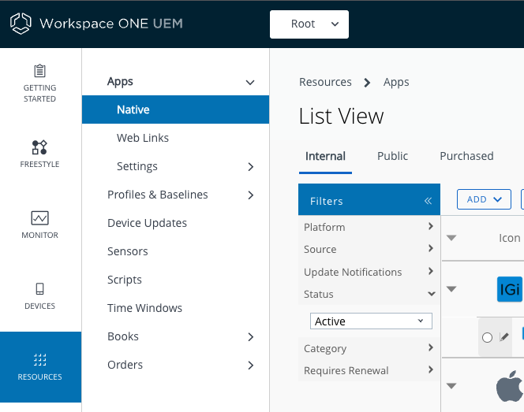

# Troubleshooting
In case of difficulties, check these troubleshooting tips.

## Security Code
You might be prompted to enter a security code to complete a destructive action,
such as deleting an uploaded app. The default security code for a UEM hosted by
the TestDrive service is 1234.

## Apps missing from list view
You might find that an app you expect to see in a list view in the UEM doesn't
appear. This could be due to an implicit filter.

You can check what filters have been applied to the current list view, as
follows.

1.  Look for the word Filters in the row of controls just above the column
    headings. Next to Filters will be a double chevron, >>, indicating
    expandability. Click to expand the Filters.

2.  Check the filters in the expanded list. A common cause of missing items is
    the Status filter. Expand it and check if only active apps are included, for
    example.

This screen capture shows the expanded controls.

If you, for example, set the Status filter to All then the expected app might
appear.

# License
Copyright 2022 VMware, Inc. All rights reserved.  
The Workspace ONE Software Development Kit integration samples are licensed
under a two-clause BSD license.  
SPDX-License-Identifier: BSD-2-Clause