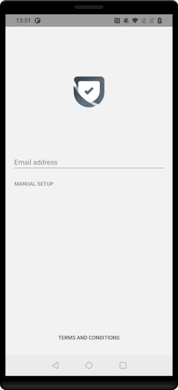
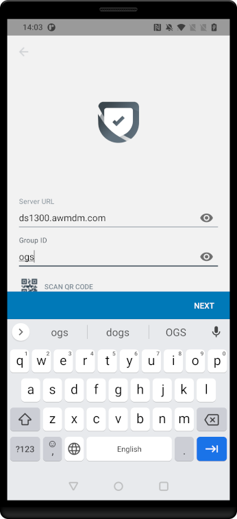

# Appendix: How to enroll an app in standalone mode
Enrolling an app in standalone mode isn't a common task for application
developers but is convenient to include here. The instructions in this guide
could also be used to set up a demonstration or laboratory environment in which
standalone enrollment could play a part.

Standalone enrollment is supported by the Workspace ONE Boxer email app, the
Workspace ONE Web browser, Workspace ONE PIV-D Manager, and other apps in the
VMware productivity suite. However, these apps won't enroll standalone if
Workspace ONE Intelligent Hub is already installed on the device.

These instructions refer to some concepts introduced in the
[Task: Configure management console enrollment](../03Task_Configure-management-console-enrollment/readme.md),
and assume that the [Recommended Organization Group Structure](../03Task_Configure-management-console-enrollment/01Recommended-Organization-Group-Structure/readme.md)
has been configured in the UEM. Some steps will be different if that isn't the
case.

Proceed as follows.

1.  Install the mobile app, for example from the Google Play Store, and launch
    it.

    The screen will show the app logo and a prompt for email address, as in the
    following screen capture.

    

2.  Select the Manual Setup option. You will now be prompted for the Server URL
    and Organization Group ID. Enter the enrollment server address and the Group
    ID of the standalone OG.
    
    See the instructions [How to find out the enrollment server address](../06Task_Enroll-a-developer-device/01How-to-find-out-the-enrollment-server-address/readme.md)
    if necessary.

    In the [Recommended Organization Group Structure](../03Task_Configure-management-console-enrollment/01Recommended-Organization-Group-Structure/readme.md)
    the Group ID is: `ogs`

    This screen capture shows the user interface with filled-in values.

    

3.  Tap Next.

    There will be some processing and you will be prompted for a Username and
    Password.

4.  Enter the username and password of an end user account and tap Next.

    If the [Recommended End User Configuration](../05Task_Configure-end-users/01Recommended-End-User-Configuration/readme.md)
    has been set up then the username and password could both be: `a`

    There will be some more processing.

    When enrollment processing has finished, you will be prompted to accept a
    privacy agreement.

5.  Accept the privacy agreement by tapping: I Understand.

    You will be prompted to opt in to additional data sharing.

6.  Select "Not Now" and confirm by tapping "Don't Send" when prompted.

    There will be some more processing.

The app has now been enrolled in standalone mode and is ready for use.

# License
Copyright 2022 VMware, Inc. All rights reserved.  
The Workspace ONE Software Development Kit integration samples are licensed
under a two-clause BSD license.  
SPDX-License-Identifier: BSD-2-Clause