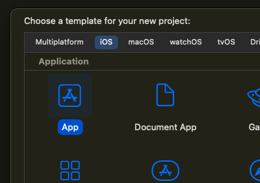
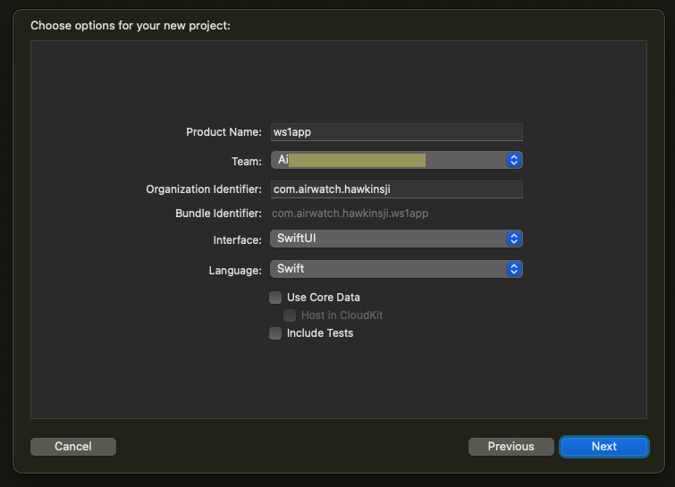

# Task: Select or create an application to integrate
Integrating an application with Workspace ONE will involve changes to the
application source code. You will need access to the Swift source, bundle files,
project files, and to any other files required to build the application.

You can integrate Workspace ONE with a mobile application of your own for which
you already have the source. If you choose to do that then you can skip this
task and continue with the next
[Task: Generate an application installer file](../04Task_Generate-an-application-installer-file/readme.md).

You can instead create a sample application from an Xcode project template, by
following these instructions. These are provided here for convenience; for
definitive information, see the Apple developer website.

1.  Open the Xcode application.

2.  In the menu, select File, New, Project…

    This opens a dialog on which you select a project template.

3.  Select the iOS App template, which could be the default, and click Next.

    This screen capture shows selection in the Xcode user interface.

    

    When you click Next a dialog will open on which you can specify options for
    the new project.

4.  For the Product Name, enter `ws1app` or any name you like.

    Tip: If you use all small letters the bundle identifier will also be all
    small letters and won't have to be edited later.

5.  If you have a developer account, select its organization as the Team.

    For a discussion about developer and personal accounts see the
    [Appendix: Apple Accounts](../21Appendix_Apple-Accounts/readme.md).

    If you don't have a developer account then you can select a Personal Team
    instead.

6.  For the Interface, select SwiftUI or Storyboard as you prefer.

    Both user interfaces are supported by Workspace ONE for iOS. SwiftUI is
    recommended.

7.  For the Language, select Swift or Objective-C as you prefer.

    Both languages are supported by Workspace ONE for iOS. Swift is recommended,
    and will be the only option if you chose SwiftUI for the Interface.

8.  There is no need to Use Core Data, nor to Include Tests.

    This screen capture shows the dialog as it might appear.

    

    (The team name begins "Ai" but is otherwise hidden.)

9.  Check the values and click Next.

10. Choose a location to save your project.

    It can be a good idea to create a new sub-directory for the project.

    When you have chosen the location Xcode will generate the project files,
    which might take a little while. Wait for processing to finish.

11. Run the new app on a device once.

    To confirm that the project, your developer environment, and your device are
    all set up correctly, run the new app on your developer device from Xcode.

    Your device might show an error like Untrusted Developer. The error message
    will have instructions for how to clear the error condition. Follow the
    instructions and try again to run the app.

12. Uninstall the app.

    Uninstall the app so that you can install it from Workspace ONE.

This completes the creation of a sample application. You are now ready to
continue with the next
[Task: Generate an application installer file](../04Task_Generate-an-application-installer-file/readme.md).

# License
Copyright 2023 VMware, Inc. All rights reserved.  
The Workspace ONE Software Development Kit integration samples are licensed
under a two-clause BSD license.  
SPDX-License-Identifier: BSD-2-Clause