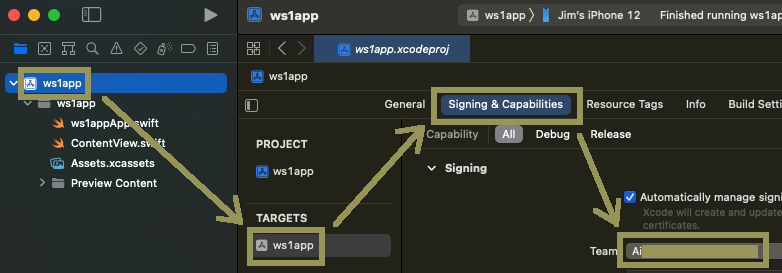
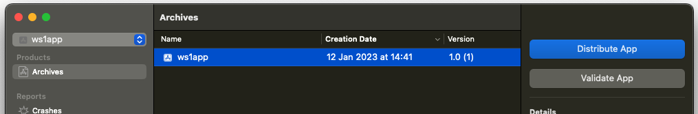
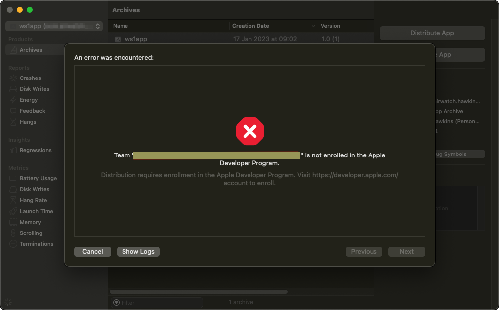
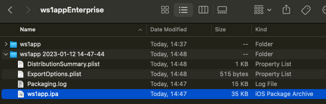

## Instructions for developer accounts
If you have an Apple developer account you can generate an application installer
file by following these instructions. These are provided here for convenience;
for definitive information, see the Apple developer website. If you don't have a
developer account, or aren't sure what type of account you have, then review the
introduction to the
[Task: Generate an application installer file](../readme.md).

1.  Open the application project in Xcode.

2.  Ensure that your developer account and organization are the selected team
    for the app.

    This screen capture shows the location of team selection in the Xcode user
    interface.

    

    For more tips on accounts and organizations, see the
    [Appendix: Apple Accounts](../../21Appendix_Apple-Accounts/readme.md).

3.  Ensure that your developer device is connected and is the chosen build
    target.

    If necessary, set up your device for developer use, for example by following
    the instructions on the Apple developer website here.  
    [developer.apple.com/…/enabling-developer-mode-on-a-device](https://developer.apple.com/documentation/xcode/enabling-developer-mode-on-a-device)

4.  In the Xcode menu select Product, Archive.

    Wait for the success message, shown in this screen capture, or for the
    Organizer window to open.

    

5.  In the Xcode Organizer Window, select to distribute the archive you just
    created.

    If the window didn't open automatically when archiving succeeded, you can
    open it manually from the Xcode menu by selecting Window, Organizer.

    Click the Distribute App button, shown in this screen capture.

    

    This will start an interaction spread across multiple screens, beginning
    with selecting a method of distribution.

6.  Select Development distribution and click Next.

    All being well, Xcode will process for a short time and then open the next
    screen, on which you will select options for development distribution.

    If the team selected for the app isn't associated with membership of a
    developer organization then processing will fail. An error will be displayed
    that the team isn't enrolled in the developer program.

    This screen capture shows the error message.

    

    If this happens then check that you have a developer account and that it is
    selected for the app. See also the
    [Appendix: Apple Accounts](../../21Appendix_Apple-Accounts/readme.md). If
    you don't have a developer account then you will have to follow
    the [Instructions for personal accounts](../02Instructions-for-personal-accounts/readme.md)
    instead.

7.  On the developer distribution options screen, leave the default selections
    in place and click Next.

    The default selections are App Thinning: None and no Additional Options.

    An option like Rebuild from Bitcode might be offered. If you are following
    the recommended sequence and generating an installer for a non-integrated
    app then the Bitcode option doesn't matter. However, if the app has been
    integrated with the Workspace ONE SDK then any Bitcode option must be
    deselected. The SDK binaries don't support Bitcode.

    When you click Next, the re-sign screen opens.

8.  Select to Automatically manage signing and click Next.

    Xcode processes for a short time and then opens the next screen, on which
    you review the package contents.

9.  Check the details and click Export.

    This opens a file chooser dialog. The default location will be in a new
    directory at the level above the Xcode project.

10. Make a note of the location and click Export to finish.

    Xcode will create an iOS Package Archive (IPA) installer file in the chosen
    location. Open the location in the Finder and locate the .ipa file.

    This screen capture shows how it might appear.

    

This completes generation of an application installer file for a developer
account. You are now ready to continue with the next
[Task: Add the application to the management console](../../05Task_Add-the-application-to-the-management-console/readme.md).

# License
Copyright 2023 VMware, Inc. All rights reserved.  
The Workspace ONE Software Development Kit integration samples are licensed
under a two-clause BSD license.  
SPDX-License-Identifier: BSD-2-Clause