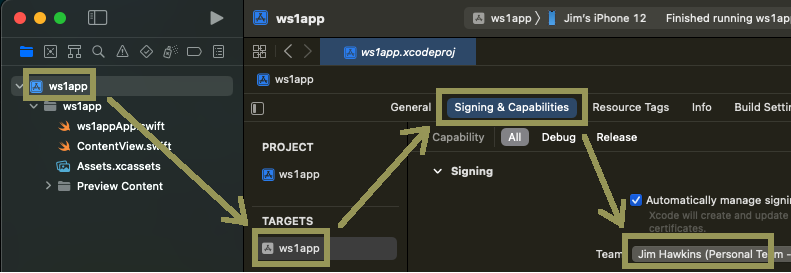
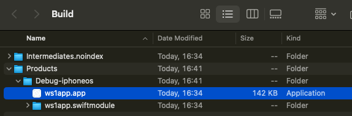
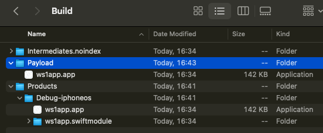
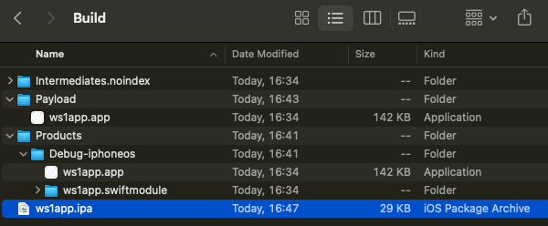
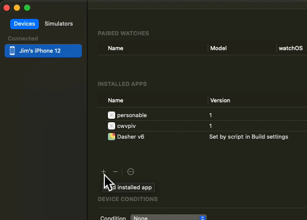

## Instructions for personal accounts
If you don't have an Apple developer account you can generate an application
installer file by following these instructions. If you do have a developer
account then you should use that instead and follow the
[Instructions for developer accounts](../01Instructions-for-developer-accounts/readme.md).
If you aren't sure what type of account you have, then review the introduction
to the [Task: Generate an application installer file](../readme.md).

1.  Open the application project in Xcode.

2.  Check the account and organization that are selected team for the app.

    This screen capture shows the location of team selection in the Xcode user
    interface.

    

    For more tips on accounts and organizations, see the
    [Appendix: Apple Accounts](../../21Appendix_Apple-Accounts/readme.md).

3.  Ensure that your developer device is connected and is the chosen build
    target.

    If necessary, set up your device for developer use, for example by following
    the instructions on the Apple developer website here.  
    [developer.apple.com/…/enabling-developer-mode-on-a-device](https://developer.apple.com/documentation/xcode/enabling-developer-mode-on-a-device)

4.  In the Xcode menu select Product, Build.

    Wait for the success message, shown in this screen capture.

    

5.  In the Xcode menu select Product, Show Build Folder in Finder.

6.  In the build folder, locate the .app item for your application.

    The required item could be under the Products/ directory, in a
    sub-directory.

    Finder displays it as a plain file with type Application. However, the .app
    item is actually a type of folder structure. You can cd into it using the
    command line in a terminal for example.

    This screen capture shows how the .app item might appear in Finder.

    

7.  Create a new folder named `Payload`

    The new folder can be in the build folder or elsewhere on your computer.

8.  Copy or move the .app item under the new Payload folder.

    This screen capture shows how the Payload folder might appear.

    

    (In this case, the .app has been copied.)

9.  Compress the Payload folder, for example by highlighting it and then
    selecting File, Compress in the Finder menu.

    This creates a `Payload.zip` file.

    The Payload folder is no longer required and you can delete it now, if you
    like.

10. Rename `Payload.zip` to `ws1app.ipa`

    Finder might warn you that changing the extension may cause the file to open
    in a different application. If it does then confirm that you want to use the
    .ipa extension.

    You could change the name part of the file to something different, if you
    chose a different name for your app for example.

    This screen capture shows a possible final state of the build folder and
    renamed file.

    

    You could proceed to uploading the .ipa file to the UEM now. However, it's a
    good idea to test the file first. You can do this by side loading it to your
    developer device using Xcode as described here.

11. In the Xcode menu select Window, Devices and Simulators.

    This opens the Xcode device management window.

12. In the left pane, select Devices and your developer device, if it isn't
    selected by default.

13. In the right pane, scroll down to the list of installed apps.

14. Click the plus button under the list of installed apps.

    This screen capture shows the location of the button.

    

    This opens a file chooser.

15. In the file chooser, select the .ipa file.

    **Tip**: If you have the .ipa file highlighted in Finder, you can copy its
    path by pressing Cmd+Alt+C. If you then type an oblique, `/`, in the Xcode
    file chooser, it will open a text box in which you can paste the copied
    path. Delete the oblique before pasting.

    Xcode will install the app in the .ipa file to your developer device.

16. Check the app opens and the user interface appears as expected.

17. Remove the app from the device.

    You can do this on the device, or in the Xcode device manager window.

This completes generation of an application installer file for a personal
account. You are now ready to continue with the next
[Task: Add the application to the management console](../../05Task_Add-the-application-to-the-management-console/readme.md).

# License
Copyright 2023 VMware, Inc. All rights reserved.  
The Workspace ONE Software Development Kit integration samples are licensed
under a two-clause BSD license.  
SPDX-License-Identifier: BSD-2-Clause