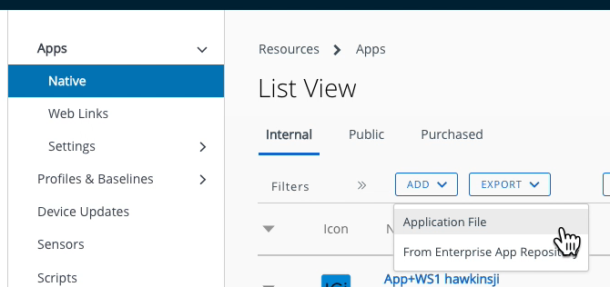

## Upload the application installer
Uploading the application installer is part of the
[Task: Add the application to the management console](../readme.md).
Proceed as follows.

1.  Log in to the UEM and select the Organization Group (OG) of the end user
    that you are using for development.

2.  Navigate to: Resources, Apps, Native.

    Depending on your console version and customization the navigation could be
    different.
    
    -   Resources might be labelled Apps & Books instead.
    -   Apps might be labelled Applications instead.

    However you navigate, a list of applications will open.

3.  Select the Internal tab if it isn't selected by default.

4.  Expand the Add control and select Application File.

    The following screen capture shows the location in the user interface.

    

    This opens the Add Application dialog.

5.  Select the group of the end user that you are using for development if it
    isn't selected by default.

6.  Click Upload, which opens the Add dialog.

7.  On the Add dialog: select Local File, then click Choose file.

    This opens a file chooser dialog.

8.  Locate and select your IPA file, then click Save.

    **Tip**: If you have the .ipa file highlighted in Finder, you can copy its
    path by pressing Cmd+Alt+C. If you then type an oblique, `/`, in the browser
    file chooser, it will open a text box in which you can paste the copied
    path. Delete the oblique first.

    The file will be uploaded and progress will be indicated on the screen.

    When the upload finishes, the Add dialog closes and you return to the Add
    Application dialog. The file name will have been filled in.

9.  On the Add Application dialog, click Continue.

    This opens the next step, which is a dialog in which the details can be
    edited.

Continue with the instructions
[Configure and publish the application](../02Configure-and-publish-the-application/readme.md).

# License
Copyright 2022 VMware, Inc. All rights reserved.  
The Workspace ONE Software Development Kit integration samples are licensed
under a two-clause BSD license.  
SPDX-License-Identifier: BSD-2-Clause