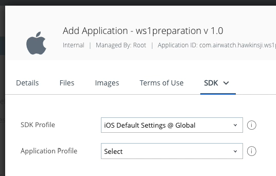

## Configure and publish the application
Configuring and publishing the application is part of the 
[Task: Add the application to the management console](../readme.md).
These instructions come after
the [Upload the application installer](../01Upload-the-application-installer/readme.md)
instructions.

Proceed as follows.

1.  In the application details dialog, append your user name to the application
    name, if you like.

    Appending your user name will make clear, to anybody with access to the
    console, that you are responsible for this application.

2.  In the same dialog, ensure that an SDK profile is selected.

    If you are following the recommended installation order and have uploaded an
    app without Workspace ONE integration, then this step is in theory
    unnecessary. In practice however, this is a convenient point at which to
    make the selection and it might be forgotten later when integration work is
    in progress and it's essential.

    Select the SDK tab in the dialog, then select an SDK profile if one isn't
    selected already. The SDK tab might be under a More drop-down.
    
    The following screen captures show the interaction and a selected profile.

    

    

    

    (In the above screen capture, the selected profile is "iOS Default
    Settings @ Global".)

    Ignore the Application Profile selection.

    Click Save & Assign. The Assignment Distribution dialog will open.

3.  Set the Name and Assignment Groups as follows.

    -   Set Name to `all` or any other name you like.
    -   Select the assignment group for all devices in the Organization Group
        (OG).

    The following screen capture shows selection of the group.

    

    (In the above screen capture the OG name is Root.)
    
    There is no need to add or enable any other items, like restrictions, at
    this time.

    Click Create and a dialog will open in which you can review the new
    assignment.

4.  On the assignment review dialog, click Save.

    This opens the Preview Assigned Devices dialog.

5.  Check that your developer device appears in the preview of assigned devices.

    If it doesn't appear, retrace your steps and check you followed all the
    instructions. Also check which UEM Organization Group (OG) the end user is
    enrolled into. That OG must be the same as the one the app was added to, or
    be a child OG of the one the app was added to.

6.  Click Publish.

    This finalizes the addition and returns you to the Applications part of the
    console. The detail view of the app you just added will be open.

This completes adding the application to the management console. You are now
ready to continue with the next
[Task: Install the application via Workspace ONE](../../06Task_Install-the-application-via-Workspace-ONE/readme.md).

# License
Copyright 2023 VMware, Inc. All rights reserved.  
The Workspace ONE Software Development Kit integration samples are licensed
under a two-clause BSD license.  
SPDX-License-Identifier: BSD-2-Clause