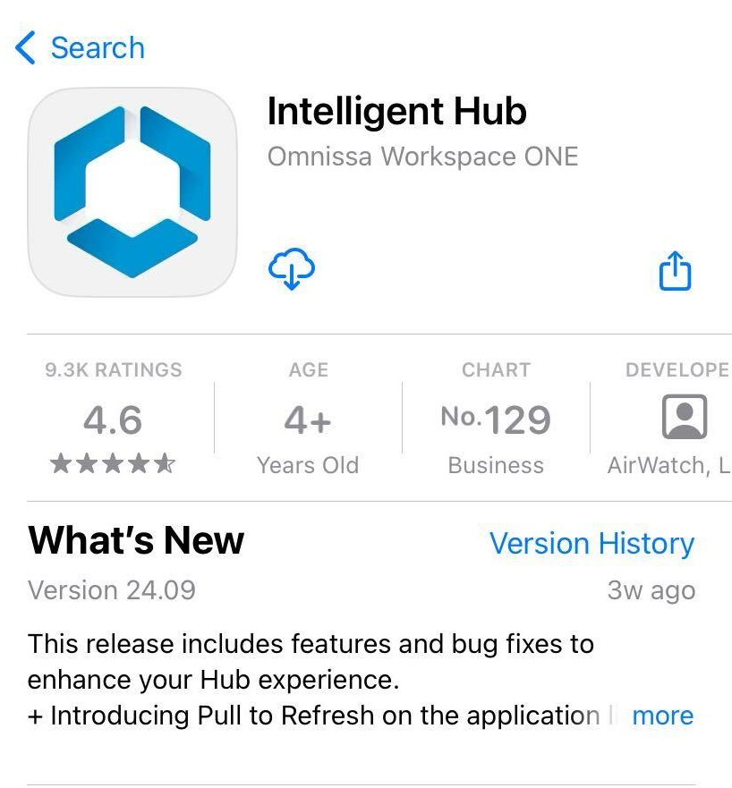

# Task: Install the application via Workspace ONE
Installing the application via Workspace ONE is a platform integration task for
iOS and iPadOS application developers. The task is dependent on the
[Task: Add the application to the management console](../05Task_Add-the-application-to-the-management-console/readme.md).
The following instructions assume that the dependent task is complete already.

Proceed as follows.

1.  Install and enrol the Workspace ONE Intelligent Hub application.

    Workspace ONE supports installation of custom apps on managed and unmanaged
    devices. In either case, the Hub app must be installed and enrolled before
    the custom app is installed. The Hub can be installed from the Apple app
    store. Search for "workspace one intelligent hub", for example.

    This screen capture shows the top of the Apple app store page for the Hub
    app.

    

    If you are installing Hub other than from the app store then check the
    [Compatibility](../02PrerequisiteConditions/01Compatibility/readme.md) table
    for a recommended version of Hub.

    Follow the instructions in the Hub application to complete enrollment. You
    will need to know the server address and a set of end user enrollment
    credentials. Enrolling Hub establishes trust between the device and the UEM
    console.

    **Tip**: Set a device passcode before you begin enrollment. Typical UEM
    configurations will require a passcode, as a security policy. If a device
    passcode isn't set at the start of the enrollment interaction, you will be
    forced to  set it as an enrollment step, which sometimes doesn't go
    smoothly.

    **Warning**: The Hub application cannot be enrolled with more than one
    management console at a time. If the Hub is already installed and enrolled
    on your developer device, then it must now be unenrolled, or removed and
    re-installed. Unenrolling or removing the Hub may cause removal of any
    associated applications from the device.
    
    You may want to try different enrolment options such as managed and
    unmanaged modes, or into a different organization group (OG) with other
    policy settings. In all cases, it will be necessary to unenroll the Hub, or
    wipe it from the console, and uninstall Hub and all the apps before trying
    the next option.

2.  Install your application from Hub.

    Your application can now be installed from the Hub app on the device. Find
    it in the Apps tab and select to install it.

    In case your application doesn't appear, try these troubleshooting steps.

    -   Open the Hub application Apps tab and pull down to refresh.
    -   Open the Hub application and select Support, then your developer device
        which will be labelled as (Current), then Sync Device.
    -   Terminate the Hub using the device task manager, then open Hub again.

    If you are using an Apple developer account, then the installed app can now
    be run. If you are using only a personal account then the installed app
    might actually be a placeholder that cannot be run. The next instruction
    fixes this.

3.  Side load your application from Xcode.

    To confirm that your setup is ready to begin Workspace ONE integration work,
    connect your developer device to your computer and install and run your app
    from Xcode in the usual way. Don't uninstall the app, so the Xcode side load
    will be installed as an upgrade.

    Make a superficial but obvious change to your app first, so you can check
    that the side load worked. For example, if your app has a hello-world type
    of message in its user interface, change it to "Hello World 2".

    If you earlier used a personal account to generate the IPA file, the side
    load will now overwrite the placeholder with the full app that can be run on
    the device.

This completes the task.

**Warning**: Don't uninstall Hub nor your app from this point until you finish
the SDK integration work.

You can now proceed to the [Next Steps](../07Next-Steps/readme.md).

# License
Copyright 2023 VMware, Inc. All rights reserved.  
The Workspace ONE Software Development Kit integration samples are licensed
under a two-clause BSD license.  
SPDX-License-Identifier: BSD-2-Clause