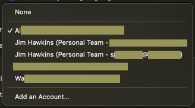

# Appendix: Apple Accounts
You will need an Apple account to complete the work of integrating an iOS or
iPadOS application with Workspace ONE. For the purposes of that work there are
two types of Apple account, developer and personal. Some instructions for
checking your account type are given below. These are provided here for
convenience; for a full discussion of account types and memberships, see the
Apple developer website, for example here.  
[https://developer.apple.com/support/compare-memberships/](https://developer.apple.com/support/compare-memberships/)

(Sensitive information in the screen captures in this section has been hidden.)

## How to check account type
A developer account is one that is a member of a developer organization. Follow
these instructions to check the organizations of which your account is a member.

1.  Log in to your account on the
    [developer.apple.com](https://developer.apple.com) website.

2.  If you are a member of multiple organizations, select one of them.

    This screen capture shows selection in the Apple developer website.

    

    In this screen capture the user is a member of two organizations. The name of one
    organization starts with "Ai" the name of the other starts with "Wa". The organization
    starting "Ai" is selected.

    If you aren't a member of any organizations, then you have a
    *personal account* and can skip the remaining steps.

3.  Scroll down to the Membership details.

    The top of the section might look like one of these screen captures.

    

    

    

    

4.  Check if the word Developer appears in the Program name for the
    organization.

    If it does then you have a *developer account*. Note that this applies to
    both the developer program and the developer enterprise program.
    
    If it doesn't then you have a *personal account*, unless you're a member of
    multiple organizations, see above, and one of the others has Developer in
    the Program name.

The account type has now been determined.

## Association of Apple accounts with application projects
An Apple organization of some kind is associated with every iOS or iPadOS app,
at build time. The associated organization may be referred to as having *signed*
the app. You can select which organization to associate with an app in Xcode.

1.  Open the app project in Xcode.

2.  In the navigator select the project itself.

    By default, the project itself will be the first item in the navigator.

3.  In the project editor, select the app target that you're using for
    integration.

    By default, each app project has only a single target.

4.  In the target editor, select the Signing & Capabilities tab.

5.  Select the required account and organization with the Team drop-down
    menu.

These screen captures show the location in the Xcode user interface and the
expanded Team drop-down menu.

In this screen capture there are two Personal Team organizations and three other
organizations. The name of the selected organization begins Ai.

## Account availability in the integrated developer environment
Your Apple account and organization membership must appear in Xcode in order to
complete Workspace ONE integration work.

You can check this by opening Xcode and selecting Xcode, Settings, and then
the Accounts tab.

This screen capture shows how the tab might appear.

In this screen capture there are two Apple accounts, of which the first is
selected. The Apple ID of the selected account is a vmware.com email
address. The Apple ID of the second begins sj and is an email address. The
selected Apple ID is a member of an organization whose name begins Ai.

If the Apple ID you want to use doesn't appear, you can add it by clicking
the plus button at the bottom left of the window. Also ensure that the
organization membership you want to use appears on this screen. Membership
issues can sometimes be resolved by removing and re-adding the account, or
by closing and re-opening Xcode, or by power cycling your developer
computer, or by liaising with the account administrator.

## Benefits of a developer account during integration work
There are some benefits to using a developer account instead of a personal
account during integration work. The benefits relate to the generation of iOS
Package Archive (IPA) installer files for your application.

-   You can generate IPA files automatically using just Xcode if you are using a
    developer account. If you are using a personal account you must take
    additional manual steps every time you generate an IPA file.

-   The IPA file generated by a developer account can be installed by Workspace
    ONE on a device and run. The IPA file generated by a personal account can be
    installed by Workspace ONE on a device but will only be a placeholder. You
    will have to side load over the app from Xcode in order to run it. This
    limitation isn't important during integration work because you will anyway
    be side loading quite often during the process.

-   The IPA file generated by a developer account can be installed and run on,
    at least, any device in the same organization. The IPA file generated by a
    personal account can be installed and run only on devices registered to the
    same Apple ID.

For instructions and background, see the
[Task: Generate an application installer file](../04Task_Generate-an-application-installer-file/readme.md).

# License
Copyright 2023 VMware, Inc. All rights reserved.  
The Workspace ONE Software Development Kit integration samples are licensed
under a two-clause BSD license.  
SPDX-License-Identifier: BSD-2-Clause