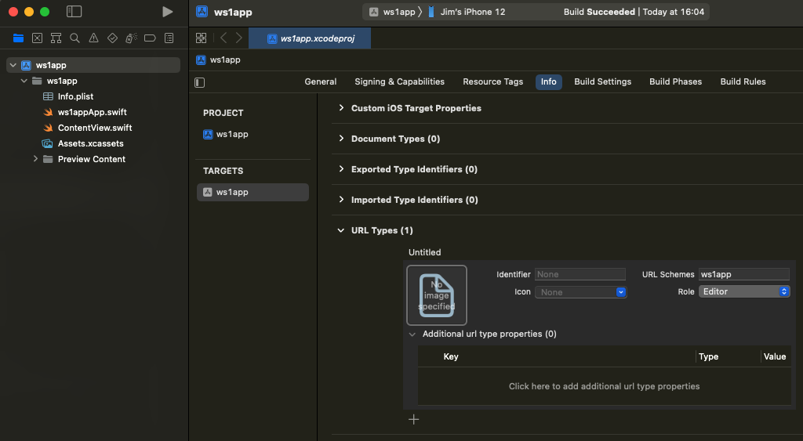

## Declare a custom URL scheme
Start the [Task: Configure application properties](../readme.md) by declaring a
custom URL (Uniform Resource Locator) scheme for your app.

**If you haven't installed your application via Workspace ONE** at least once,
then do so now. If you don't, the application under development won't work when
installed via Xcode. Instructions for installing via Workspace ONE can be found
in the Integration Preparation Guide discussed in the
[Welcome](../../01Welcome/readme.md) section.

To declare a custom URL scheme proceed as follows.

1.  Open the application project in Xcode.

2.  In the navigator select the project itself, and then the target that you're
    using for integration.

    By default, the project itself will be the first item in the navigator, and
    each app project has only a single target.

3.  In the target editor, select the Info tab, and then expand the URL Types
    list.

    By default the URL Types list is empty.

4.  Click the plus button to add a URL Type.

    This adds an Untitled item to the list.

5.  Enter a suitable value like `ws1app` in the URL Schemes text box.

    The value will be used as the scheme in a URL (Uniform Resource Locator).
    This means that it cannot include characters such as space, underscore, and
    full stop (period).

    None of the other fields matter for this task.

    This screen capture shows how the added URL Type might appear in the Xcode
    user interface.

    

6.  Install and run the app on your developer device to confirm that no mistakes
    have been made.

7.  Check that the custom URL scheme invokes the app.

    First, terminate the app, for example by using the device task switcher.

    If your device is synchronized with your computer, open the Apple Notes app
    and create a new note. Add a URL like this to the note.

        ws1app://dummypath

    The URL has the value you entered in Xcode as the scheme, and has a dummy
    path.

    Wait for the note to synchronise to your developer device, typically only a
    second or two, then open the mobile Notes app, open the note, and tap the
    URL. What should happen is that your app is opened.
    
    If your app doesn't open then review the above instructions to check that no
    mistakes were made. Also check any settings related to Info.plist in Xcode.

    If your Notes aren't synchronised you could instead open Safari on the
    device and type the URL into the address bar. Safari should open your app.

That completes declaration of a custom URL scheme.

Xcode might or might not have added a visible property list file named
Info.plist to the project when you added an item to the URL Types list. It might
or might not be possible to have added the declaration and to add the other
required properties, below, by editing the Info.plist file. This guide assumes
that it isn't possible.

Continue the task with the instructions
[Add Queried URL Schemes and other required properties](../02Add-Queried-URL-Schemes-and-other-required-properties/readme.md).

# License
Copyright 2023 VMware, Inc. All rights reserved.  
The Workspace ONE Software Development Kit integration samples are licensed
under a two-clause BSD license.  
SPDX-License-Identifier: BSD-2-Clause