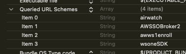
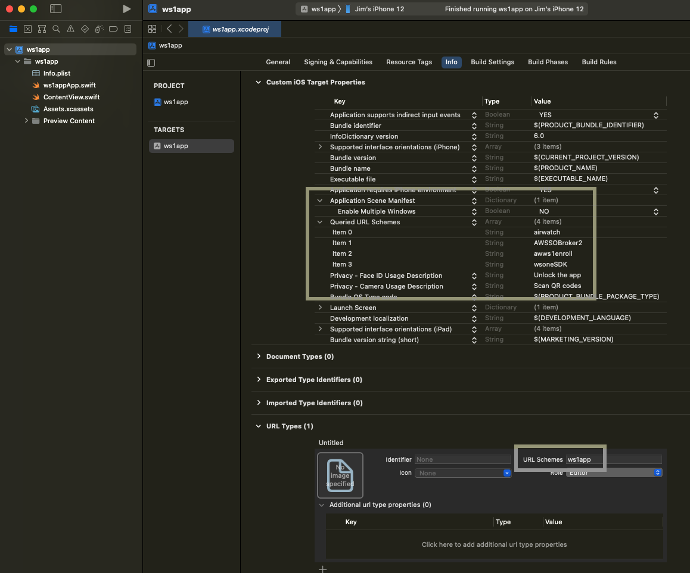

## Add Queried URL Schemes and other required properties
After following
the [Declare a custom URL scheme](../01Declare-a-custom-URL-scheme/readme.md)
instructions, add the other required Workspace ONE properties.

Here are some tips for adding properties in Xcode.

-   App properties can be edited on the same screen as the custom URL scheme is
    declared, see above, but in the Custom iOS Target Properties list.
-   When you right-click on a non-array key in the list, a context menu will
    appear. That menu is referred to here as the *properties context menu*.
-   The list can show keys in either a raw form or in a wordy form. You can
    switch between the two in the properties context menu.
-   Properties can be added by selecting the Add Row option in the properties
    context menu.
-   After you add a row you first enter the key for the new property. The Xcode
    helper for key entry here is case sensitive.
-   Properties of type Array or Dictionary can have sub-properties.
    Sub-properties can be added by expanding the top-level property and then
    clicking the plus button that appears.
-   Changes made in the property list can be reversed using the usual undo
    interactions, Cmd+Z for example.

This is a list of the required Workspace ONE app properties and values. Keys are
given in raw form and wordy form.

-   `LSApplicationQueriesSchemes` Queried URL Schemes.  
    Array of String. Items can be in any order.
    -   `airwatch`
    -   `AWSSOBroker2`
    -   `awws1enroll`
    -   `wsoneSDK`
-   `NSCameraUsageDescription` Privacy - Camera Usage Description.  
    String "Scan QR codes" or something similar.
-   `NSFaceIDUsageDescription` Privacy -  Face ID Usage Description.  
    String "Unlock the app" or something similar.
-   `UIApplicationSceneManifest` Application Scene Manifest.  
    Dictionary.
    -   `UIApplicationSupportsMultipleScenes` Enable Multiple Windows.  
        Boolean NO

You can add those properties as you like if you are familiar with the editor
already, or follow these step-by-step instructions.

1.  In Xcode, in the target editor, on the Info tab, expand the Custom iOS
    Target Properties list.

2.  Add a top-level property row with the key: Queried URL Schemes.  
    Raw equivalent is `LSApplicationQueriesSchemes`.

    Ensure that the type of the property is Array, and the type of items in the
    array is String. Those could be the defaults.

3.  Add an item for each of these values to the new array.

    -   `airwatch`
    -   `AWSSOBroker2`
    -   `awws1enroll`
    -   `wsoneSDK`

    This screen capture shows the new key and array as they appear in the Xcode
    user interface.

    

4.  Add a top-level property row with the key: Privacy - Camera Usage
    Description.  
    Raw equivalent is `NSCameraUsageDescription`.

    Ensure that the type of the property is String. This should be the default.

    Set the value to something like: "Scan QR codes".

5.  Add a top-level property row with the key: Privacy -  Face ID Usage
    Description.  
    Raw equivalent is `NSFaceIDUsageDescription`.

    Ensure that the type of the property is String. This should be the default.

    Set the value to something like: "Unlock the app".

6.  Check if your app has a top-level property row with the key: Application
    Scene Manifest.  
    Raw equivalent is `UIApplicationSceneManifest`.

    If your app doesn't have this property you can skip the remaining steps.

    This property will be of type Dictionary.

7.  Expand the dictionary and find the sub-property row with the key: Enable
    Multiple Windows.  
    Raw equivalent is `UIApplicationSupportsMultipleScenes`.

    Ensure that the type of the sub-property is Boolean. This should be the
    default.

    Set the value to: NO.

That completes the configuration of application properties. This screen capture
shows how the target Info tab could look.

**If you haven't installed your application via Workspace ONE** at least once,
then do so now. If you don't, the application under development won't work when
installed via Xcode. Instructions for installing via Workspace ONE can be found
in the Integration Preparation Guide discussed in the
[Welcome](../../01Welcome/readme.md) section.

Build and run the application from Xcode to confirm that no mistakes have been
made.

You are now ready to proceed to either of the following.

-   The instructions
    to [Add a shared keychain group](../03Add-a-shared-keychain-group/readme.md)
    if you are developing more than one custom app.
-   The
    next [Task: Add the software development kit package](../../03Task_Add-the-software-development-kit-package/readme.md)
    if you are developing a single app at this time.

# License
Copyright 2023 VMware, Inc. All rights reserved.  
The Workspace ONE Software Development Kit integration samples are licensed
under a two-clause BSD license.  
SPDX-License-Identifier: BSD-2-Clause