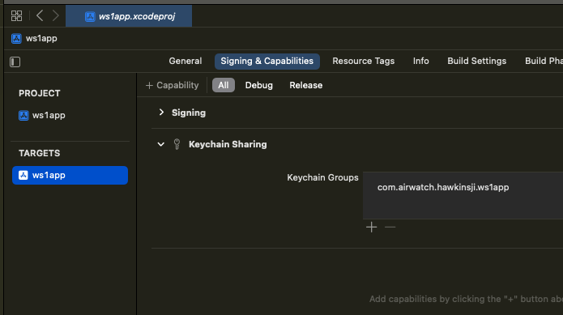

## Add a shared keychain group
The instructions to add a shared iOS keychain group may be followed after those
in the other sections in the
[Task: Configure application properties](../readme.md), but are optional. An iOS
shared keychain group is only required if you have multiple custom SDK apps that
work together as a suite.

If you add a shared keychain group then the apps in the suite

-   must be signed by the same app developer team.
-   can share an app single sign-on (SSO) session, if configured in the
    management console security policies.
-   can exchange data securely, via the pasteboard for example.

To add a shared keychain group proceed as follows.

1.  In Xcode, in the target editor, select the Signing & Capabilities tab.

2.  Click the plus button to add a capability.

    This screen capture shows the location in the Xcode user interface.

    

    This opens a dialog on which you can select a capability.

3.  Search for, or scroll to, the capability Keychain Sharing.

    This screen capture shows how it might appear in the Xcode user interface.

    

4.  Double click on Keychain Sharing.

    This closes the capability selection dialog. You will be returned to the
    Xcode target editor. The capability Keychain Sharing has now been added to
    your app.

5.  Click the plus button under the prompt to Add keychain access groups here.

    This screen capture shows the location in the Xcode user interface.

    

    That adds a keychain group with the same name as your app's bundle
    identifier. This screen capture shows it might appear in the Xcode user
    interface.

    

6.  Change the name of the keychain group to `awsdk`.

    You can double click on the name of the new group to edit it.

That completes the addition of a shared iOS keychain group.

This screen capture shows it might appear in the Xcode user interface.

Build and run the application to confirm that no mistakes have been made.

**Warnings:**

-   Never delete the awsdk group.
-   Don't use the awsdk group in your apps. The group must be left for exclusive
    use by the SDK.
-   If you add another keychain group for your apps to use, the awsdk group must
    always be first in the list.
-   Keychain group access can only be shared between apps signed by the same
    developer team.

You are now ready to proceed to the next
[Task: Add the software development kit package](../../03Task_Add-the-software-development-kit-package/readme.md).

# License
Copyright 2023 VMware, Inc. All rights reserved.  
The Workspace ONE Software Development Kit integration samples are licensed
under a two-clause BSD license.  
SPDX-License-Identifier: BSD-2-Clause