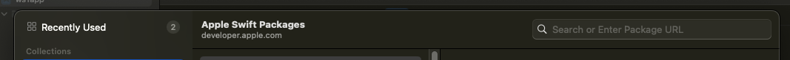
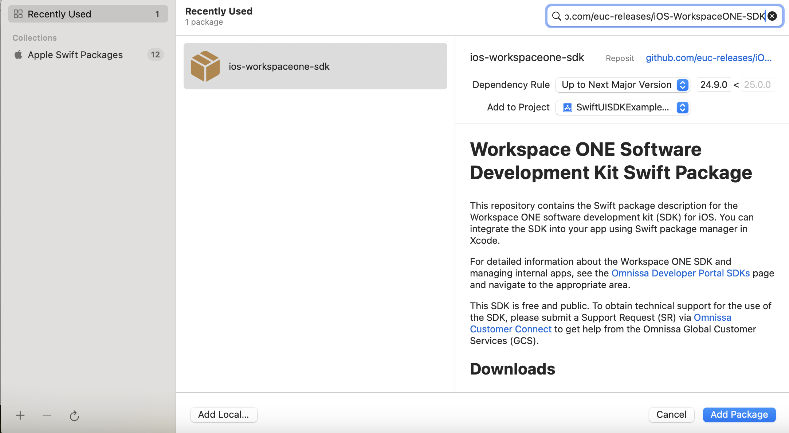
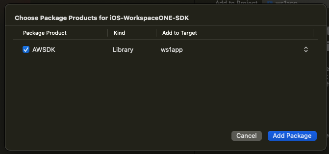
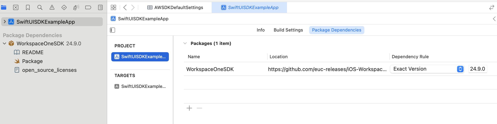
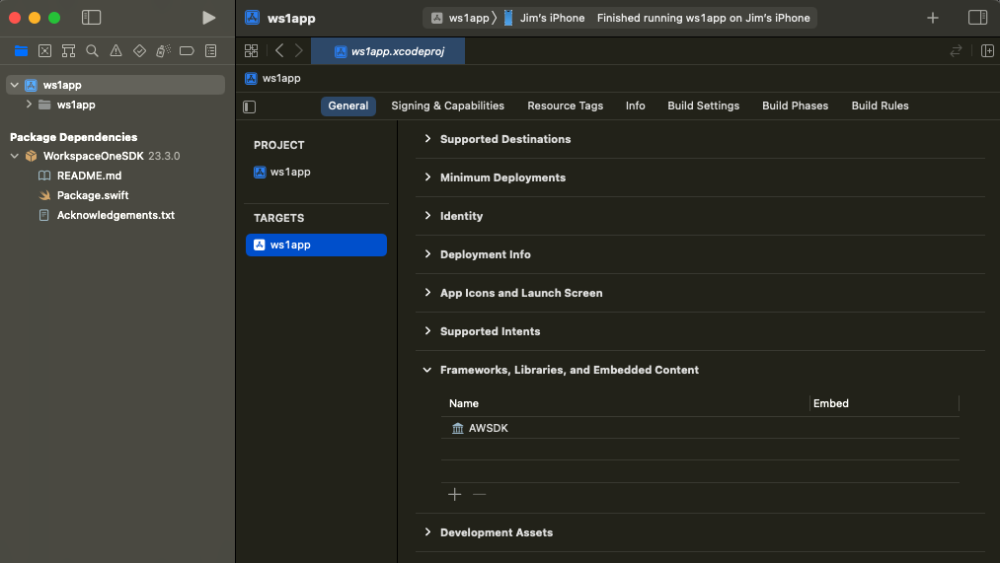
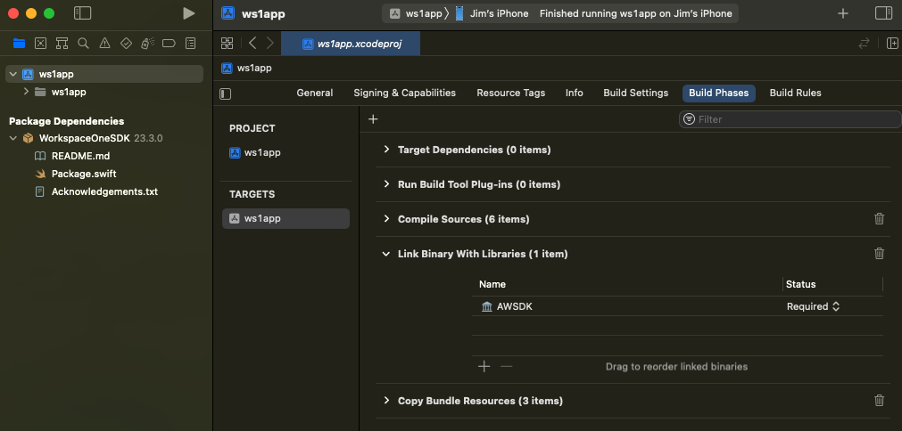

# Task: Add the software development kit package
Adding the SDK package is a Workspace ONE platform integration task for mobile
application developers. This task can be done after the
[Task: Configure application properties](../02Task_Configure-application-properties/readme.md).
These instructions assume that task is complete already.

**If you haven't installed your application via Workspace ONE** at least once,
then do so now. If you don't, the application under development won't work when
installed via Xcode. Instructions for installing via Workspace ONE can be found
in the Integration Preparation Guide discussed in the
[Welcome](../01Welcome/readme.md) section.

Proceed as follows to add the SDK package.

1.  Open the application project in Xcode.

2.  In the Xcode menu select File, Add Packages...

    This opens a first add package dialog. The dialog has a search control at
    the top. This screen capture shows the location of the search control.

    

    The prompt is Search or Enter Package URL. (URL is an abbreviation for
    Uniform Resource Locator.)

3.  Select the search control and paste in the URL for the Workspace ONE SDK
    Swift Package.  
    `https://github.com/vmwareairwatchsdk/iOS-WorkspaceONE-SDK`

    The add package dialog changes to show controls for specifying the package
    version.

4.  Select Dependency Rule: Exact Version and 23.3.0 as the parameter, or other
    values if preferred.

    You can check the latest version by opening the package URL and then opening
    the list of tags. The package uses Git tags for SDK versions.

5.  Select Add to Project: ws1app or your app name if it isn't selected by
    default, and then select Add Package.

    This screen capture shows the location of the selections in the Xcode user
    interface.

    

    Xcode will fetch and verify the contents of the package. When it finishes, a
    package product selection dialog is displayed.

6.  In the dialog select to add the library AWSDK to the target for your app.

    Those selections could be the default and are shown in this screen capture.

    

    When the selections are as required, click the Add Package button.

7.  Check that the package has been added to the app project and to the target.

    In the Xcode project navigator select the project itself and then the tab
    Package Dependencies. Check that the Workspace ONE SDK appears. This screen
    capture shows how this appears in the Xcode user interface.

    

    Then, in the Xcode project navigator select the app target that you're using
    for integration, and then the tab General and expand the Frameworks,
    Libraries, and Embedded Content list. Check that AWSDK appears. This screen
    capture shows how this appears in the Xcode user interface.

    

    Still in the app target, select the tab Build Phases and expand the Link
    Binary With Libraries list. Check that AWSDK appears. This screen capture
    shows how this appears in the Xcode user interface.

    

This completes adding the software development kit to the application. Build the
application to confirm that no mistakes have been made, and to force Xcode to
recognize the package's module for import. After that, continue with the next
[Task: Initialize the software development kit runtime](../04Task_Initialize-the-software-development-kit-runtime/readme.md).

# License
Copyright 2023 VMware, Inc. All rights reserved.  
The Workspace ONE Software Development Kit integration samples are licensed
under a two-clause BSD license.  
SPDX-License-Identifier: BSD-2-Clause