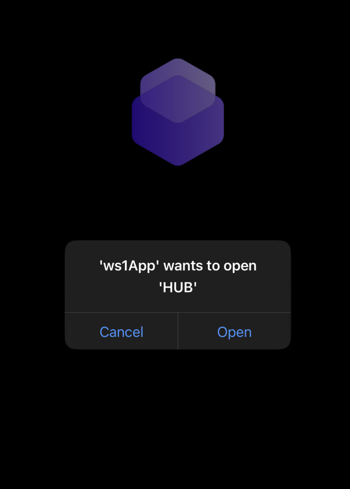
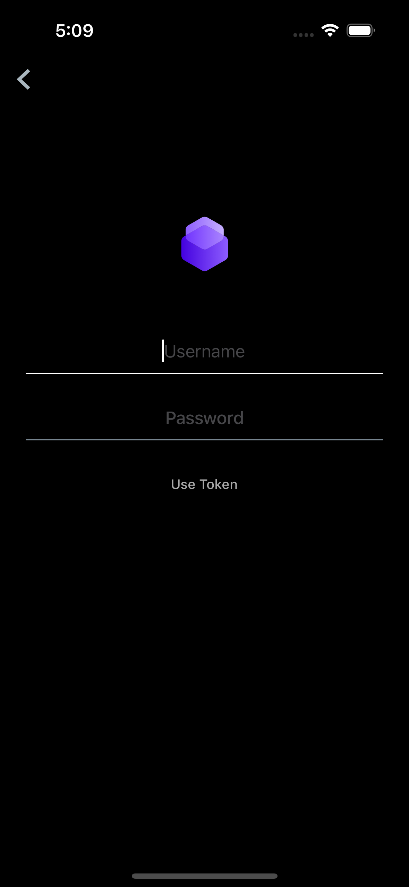
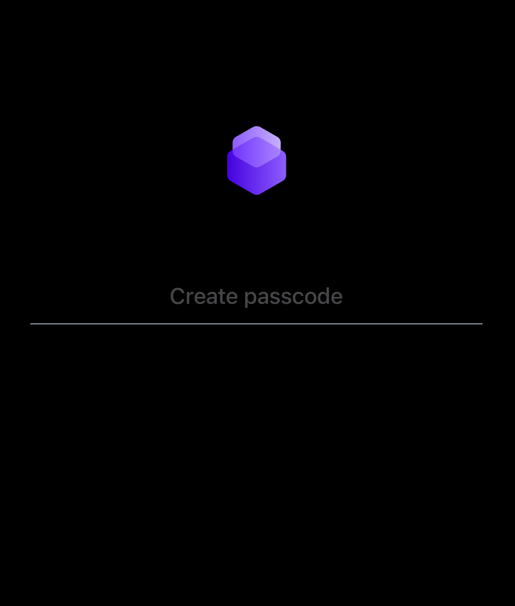
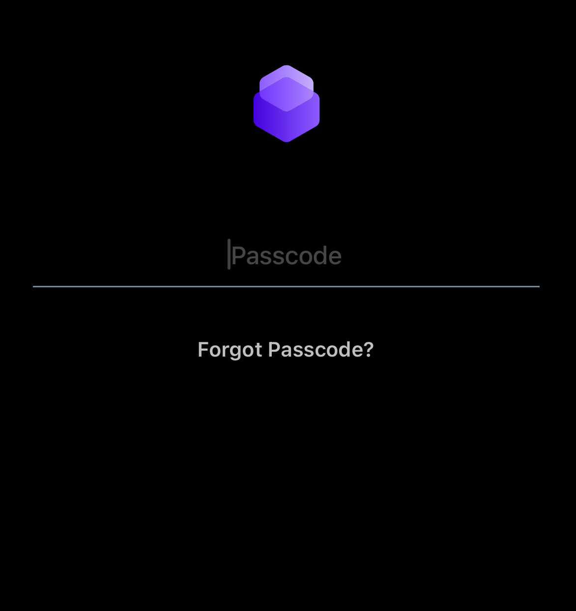

## Test runtime initialization
Test initialization of the SDK runtime after completing either
the [Initialize from SwiftUI](../01Initialize-from-SwiftUI/readme.md)
instructions or
the [Initialize from Storyboard](../02Initialize-from-Storyboard/readme.md)
instructions.

Build and run the application.

### First Launch App Enrollment
The first time the app is launched it will have to enroll with the UEM. The SDK
runtime will first retrieve some enrollment details from Hub. That retrieval
will require the device user interface to flip to Hub and then back to your app.
Then the end user must authenticate to UEM in order to complete app enrollment.

These screens and user interfaces should appear in order.

1.  SDK splash screen.

    

    The splash screen might appear only briefly.

2.  Open Hub confirmation.

    

    This is an operating system prompt. Tap Open to continue enrollment by
    opening Hub.

3.  The device user interface flips to the Hub app.

    Hub might require authentication of the end user, for example by entering an
    app passcode.

    After authentication, if any, the device user interface flips back to your
    app.

4.  Authenticate to enroll.

    The appearance of this screen depends on UEM configuration. If basic
    authentication is configured then the screen could look like this.

    

    If Security Assertion Markup Language (SAML) is configured then a web view
    will open instead. The web view will display an enterprise authentication
    page.

    The operating system adds an option to go back to Hub at the top left of the
    screen. Ignore that option.

    Enter the credentials of the user account, which will be the same as used to
    enroll the Hub app during Preparation.

5.  Create app passcode, if required.

    Depending on UEM security policy configuration, you may be required to set
    and confirm an app passcode. This is a new separate passcode to the password
    that was used to enroll the app and Hub. The app passcode is only used on
    the device. The device doesn't require an internet connection to check the
    app passcode.

    The first screen of the interaction looks like this.

    

    Set and confirm an app passcode to continue.

6.  App user interface.

    When app enrollment has completed, the app user interface will open. The
    `controllerDidFinishInitialCheck` callback that you implemented in the
    previous instructions will be invoked.

The first app launch, and app enrollment, are now complete. If the steps didn't
play out as above, or if an error was passed to the initial check callback,
check the tips in
the [Appendix: Troubleshooting](../../22Appendix_Troubleshooting/readme.md)
and review the earlier instructions.

Otherwise, terminate the app and launch it again.

### Subsequent Launch
The second and subsequent times the app is launched these screens and user
interfaces should appear.

1.  SDK splash screen as in the first launch, perhaps only briefly.

2.  Enter app passcode, if required.

    If the UEM security policy configuration required that an app passcode was
    created, then you may be prompted to enter the passcode when the app
    launches. The screen could look like this.

    

    Passcode entry isn't always required. A full discussion is out of scope of
    this guide but note the following scenarios.
    
    -   App single sign-on (SSO) can be configured in the UEM security policies.
        Entering the app passcode in a one app then starts an authentication
        session that other apps join without requiring the app passcode to be
        entered.
    -   If the app was recently active and hasn't been terminated then the app
        passcode won't be required when the app returns to foreground.

3.  App user interface.

    When authentication, if any, has completed, the app user interface will
    open. The `controllerDidFinishInitialCheck` callback that you implemented in
    the previous instructions will be invoked.

When you have verified first launch and subsequent launch, you are ready to
continue with the next
[Task: Declare supported features](../../05Task_Declare-Supported-Features/readme.md).

# License
Copyright 2023 VMware, Inc. All rights reserved.  
The Workspace ONE Software Development Kit integration samples are licensed
under a two-clause BSD license.  
SPDX-License-Identifier: BSD-2-Clause