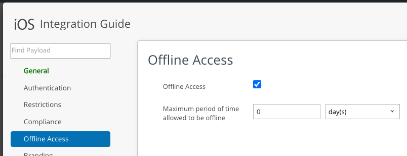

# Task: Demonstrate Basic Features
The following basic features are now integrated into your application and can be
demonstrated. In most cases the policies and settings in the UEM must be
configured to activate features in the SDK. Brief instructions for application
developers are given here for convenience. Full documentation can be found in
the online help and product documentation.

## Authentication of the end user
The end user can be forced to authenticate

-   when the app opens for the first time after the device is switched on.
-   after an inactivity time out has expired.

Authentication can be by entry of their domain username and password, or by a
separate app passcode that they create on the device.

This feature can be configured in the Organization Group (OG). This screen
capture shows the location of the setting in the console user interface.

This feature can also be configured in a custom SDK Profile. These screen
captures show how to navigate to SDK Profile management in the console user
interface, and the location of the setting in the profile editor.

Notes on this feature.

-   If Authentication Type is set to Disabled then the feature is deactivated.

-   There is an additional option to Use Device Pin for Authentication. If this
    option is selected then the end user can authenticate by entering the
    passcode that they use to unlock their device. See the Require Device
    Passcode Technical Brief, here
    [developer.vmware.com/docs/17711/RequireDevicePasscode.pdf](https://developer.vmware.com/docs/17711/RequireDevicePasscode.pdf)
    for details.

-   There is an additional option for Biometric Mode authentication. If this
    option is selected then the end user can authenticate by Touch ID or Face
    ID.

-   There is an additional option for Single Sign-On. If this option is selected
    then the same passcode will be used by all apps that have access to a shared
    keychain group. See also
    the [Add a shared keychain group](../02Task_Configure-application-properties/03Add-a-shared-keychain-group/readme.md)
    instructions.

## Access to the app offline
The end user can be blocked from access to the app offline. If offline access is
blocked then the app user interface will be blocked by an informative error
message when the device is offline. That can be tested by engaging flight mode
for example.

This feature can be configured in the Organization Group (OG). This screen
capture shows the location of the setting in the console user interface.

This feature can also be configured in a custom SDK Profile. This screen capture
shows the location of the setting in the profile editor.

## Device compromise protection
Device compromise is the deactivation of the built-in security features of a
mobile device operating system. It is commonly referred to as *jailbreaking*, if
applied to iOS and iPadOS devices. Device compromise increases the vulnerability
of enterprise data on the device to unauthorized access, either by accidental
leakage or by deliberate attack.

The SDK can protect enterprise data by wiping its credentials and encryption
keys when device compromise is detected. The SDK will also report device
compromise to the UEM.

This feature can be configured in the Organization Group (OG). This screen
capture shows the location of the setting, Compromised Protection, in the
console user interface.

This feature can also be configured in a custom SDK Profile. This screen capture
shows the location of the setting in the profile editor.

To demonstrate this feature on iOS or iPadOS you would have to jailbreak the
device. Instructions aren't provided.

## Logging
Log files written by the SDK can be uploaded to the UEM console to aid in
diagnosis of problems.

To request logs proceed as follows.

1.  Log in to the UEM and select the Organization Group (OG) of the end user
    that you are using for development.

2.  Navigate to Devices, List View.
3.  Locate your developer device in the list and click to open the Details View.
4.  In the details view, select the Apps tab.
5.  Locate your app in the list of apps that appears and select its row.

    This screen capture shows how the screen looks after selection of the app.

    

6.  Click the Request Logs button that appears.

On your device, open the app. If the app was already running then terminate it
using the device task manager first. That ensures the app will contact the UEM
and receive the log request now.

To check the upload proceed as follows.

1.  Navigate to the Details View of the device, same as in the above
    instructions.

2.  Open the Attachments tab, which could be behind a More drop-down.

    This screen capture shows the location in the console user interface.

    

3.  On the Attachments tab, select the Documents sub-tab.

The files appear with description App Log. This screen capture shows how the
screen appears.

Download a log file zip archive to view the contents.

## On-device app compliance enforcement
The SDK has an app compliance feature that can enforce conditions like the
following.

-   Minimum application version.
-   Application cannot be inactive beyond a number of days.
-   Minimum operating system version.

This is a separate feature to the UEM Compliance Policies engine, which is much
broader in scope.

The SDK App Compliance feature can be configured in the Organization Group (OG).
This screen capture shows the location of the setting in the console user
interface.

(Ignore the Security Patch Date, which only applies to Android.)

SDK App Compliance will be enforced on managed and unmanaged devices, and
doesn't require the device to be online at the point of enforcement.

## Protected pasteboard
The protected pasteboard is a Workspace ONE data loss prevention feature
implemented by the SDK. The feature has the following parts.

-   Outbound protection, in which data copied from an SDK app cannot be pasted
    into a non-SDK app.
-   Inbound protection, in which data copied from a non-SDK app cannot be pasted
    into an SDK app.

The feature can be configured in the Organization Group (OG). This screen
capture shows the location of the setting in the console user interface.

This feature can also be configured in a custom SDK Profile. This screen capture
shows the location of the setting in the profile editor.

Support for the protected pasteboard requires build-time configuration in the
mobile app. For instructions see the
[Task: Declare supported features](../05Task_Declare-Supported-Features/readme.md).

## Further integrations
Those are some basic feature that can be demonstrated already. For further
integrations, see the [Next Steps](../07Next-Steps/readme.md).

# License
Copyright 2023 VMware, Inc. All rights reserved.  
The Workspace ONE Software Development Kit integration samples are licensed
under a two-clause BSD license.  
SPDX-License-Identifier: BSD-2-Clause