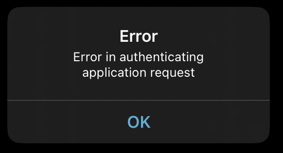
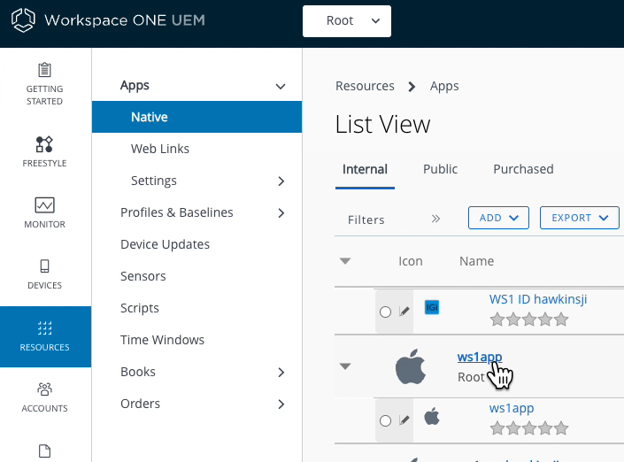
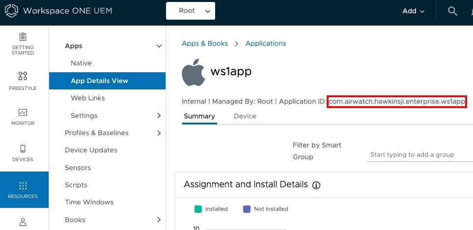
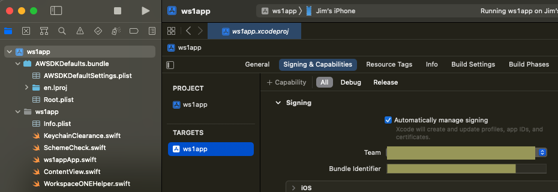

# Appendix: Troubleshooting
In case of difficulty when following the instructions to
[Test runtime initialization](../04Task_Initialize-the-software-development-kit-runtime/10Test-runtime-Initialization/readme.md),
check these troubleshooting tips first.

Tips that mention flipping to Hub only apply to initial enrollment of the app.
Subsequent launches after enrollment has finished don't require a flip to Hub.

## OpenURLRequestFailed error and no flip to Hub
It could happen that the device **doesn't flip to Hub** and the initial check
callback receives an **OpenURLRequestFailed** error.

The full error could appear like one of these.

    controllerDidFinishInitialCheck failed (extension in AWSDK):
    AWError.AWError.SDK.OpenURLRequestFailed.airWatchApplicationNotInstalled.

    controllerDidFinishInitialCheck failed (extension in AWSDK):
    AWError.AWError.SDK.OpenURLRequestFailed.airWatchApplicationSchemeNotInAllowedLists.

Check the app property `LSApplicationQueriesSchemes` (Queried URL Schemes) is
present and has all the required items.

The [Add Queried URL Schemes and other required properties](../02Task_Configure-application-properties/02Add-Queried-URL-Schemes-and-other-required-properties/readme.md)
instructions list the required items and how to configure them.

## No flip back from Hub
It could happen that the device flips to Hub but **doesn't flip back** to your
app and the initial check callback isn't invoked.

-   Check that the custom URL scheme is registered correctly.

    Instructions for registration are in
    the [Task: Configure application properties](../02Task_Configure-application-properties/readme.md)
    in the [Declare a custom URL scheme](../02Task_Configure-application-properties/01Declare-a-custom-URL-scheme/readme.md)
    instructions. The last instruction includes a way to confirm
    registration.

-   Check that the correct custom URL scheme is specified to the SDK.

    The scheme is specified by the app code accessing the AWController singleton
    and setting its `callbackScheme` property before starting the SDK.

    See the instructions 
    to [Initialize from SwiftUI](../04Task_Initialize-the-software-development-kit-runtime/01Initialize-from-SwiftUI/readme.md)
    or [Initialize from Storyboard](../04Task_Initialize-the-software-development-kit-runtime/02Initialize-from-Storyboard/readme.md)
    for detailed steps.

## OpenURLRequestFailed error after flipping to Hub and back
It could happen that the device **flips to Hub and back** but the initial check
callback receives an **OpenURLRequestFailed** error.
    
The Hub app could be showing an error like this.

The error returned to the callback could appear like this.

    controllerDidFinishInitialCheck failed (extension in AWSDK):
    AWError.AWError.SDK.OpenURLRequestFailed.failedToFetchEnvironmentDetailsFromAnchor.

The problem could be that the app isn't recognized by Hub or UEM as one that
the enrolled end user should be running.

-   If the app hasn't been installed via Workspace ONE at least once then do
    so now. Instructions can be found in the Integration Preparation Guide
    discussed in the [Welcome](../01Welcome/readme.md) section.

-   Check the bundle identifier is the same in the UEM as in your app project.

    You can check what bundle identifier the UEM has by following these steps.

    1.  Log in to the UEM and select the Organization Group (OG) of the end user
        that you are using for development.

    2.  Navigate to: Resources, Apps, Native.

        Depending on your console version and customization the navigation could be
        different.
        
        -   Resources might be labelled Apps & Books instead.
        -   Apps might be labelled Applications instead.

        However you navigate, a list of applications will open.

    3.  Select the Internal tab if it isn't selected by default.

    4.  Select your app from the list.

        Select the upper row for the app, not the version row.

        This screen capture shows the location in the console user interface.

        

        A detail screen will open for the app.

    

    The Application ID on the detail screen will be the bundle identifier.

    The required value is below the app icon and name, and above the Summary and
    Device tab selectors. This screen capture shows the location in the console
    user interface.

    

    In that screen capture the bundle identifier and Application ID is
    `com.airwatch.hawkinsji.enterprise.ws1app`

    Compare that value with the Bundle Identifier in the Xcode project. You can
    see it in the target editor. The location in the Xcode user interface is
    shown in this screen capture.

    

    In that screen capture the bundle identifier is
    `com.airwatch.hawkinsji.enterprise.ws1app`

    

    If the bundle identifiers are different, then do one of the following.

    -   Change the bundle identifier in Xcode to be the same as the Application
        ID in UEM.
    
    -   Generate a new app installer file for your app and upload it to the UEM
        console. Instructions can be found in the Integration Preparation Guide
        discussed in the [Welcome](../01Welcome/readme.md) section.

    Otherwise, if the bundle identifiers are the same, then check the following.

-   Ensure that the app is assigned to the end user.

    Setting end user assignment should have been done as part of following the
    Integration Preparation Guide discussed in the
    [Welcome](../01Welcome/readme.md) section.

    The easiest way to check could be to step through the instructions to
    Configure and publish the application, which is where the app assignment is
    set.

-   Ensure that the app is being signed by the same developer team now as when
    the app installer was uploaded to UEM. There's no way to check the signing
    team in the UEM user interface. If you aren't sure then you have to generate
    a new app installer file for your app and upload it to the UEM console.
    Instructions can be found in the Integration Preparation Guide discussed in
    the [Welcome](../01Welcome/readme.md) section.

-   Ensure that the correct team identifier has been passed to the SDK.

    Check for the error code 9109. It could appear in the Xcode console in a
    message like this.

        [E] ErrorResponse received from anchor app:
        Optional(AWOpenURLClient.OpenURLError.ErrorResponse("9109"))
        [com.air-watch.sdk.main AWController+OpenURLRequestResponse:228]

    It could also appear in the open URL received by your app. For example, if
    the custom URL scheme is "ws1app" then the received URL could be like this.  
    `ws1app://appRegisterResponse?erc=9109`

    That error code could mean that the `teamID` property is set to a different
    value to the identifier of the team that signed the app. That causes Hub
    verification of the app to fail. Rectify it by setting the property to the
    correct value.

    See
    the [Task: Initialize the software development kit runtime](../04Task_Initialize-the-software-development-kit-runtime/readme.md)
    for details of how to obtain and set the required value.

## Repeat enrollment or reset app state
In case you want to repeat the enrollment process, or want to completely reset
the state of the app on the device, note the following.

-   Removing an app from an iOS or iPadOS device doesn't clear the app keychain.

    The SDK will store some identifiers and other management data in the app
    keychain. The operating system doesn't provide any user interface to clear
    the app keychain, other than by resetting the whole device to factory
    defaults.

    You can add code to your app to delete its keychain. See
    the [Appendix: Keychain Clearance Sample Code](../23Appendix_Keychain-Clearance-Sample-Code/readme.md)
    for some Open Source sample code.

    Clearing the keychain won't delete any other data such as files written by
    the SDK.

-   Removing the app from a device will remove any files written by the app or
    SDK.

So a reset sequence could be like this.

1.  Clear the keychain from within the app.
2.  Uninstall the app.
3.  Install the app via Workspace ONE. Instructions can be found in the
    Integration Preparation Guide discussed in the
    [Welcome](../01Welcome/readme.md) section.

# License
Copyright 2023 VMware, Inc. All rights reserved.  
The Workspace ONE Software Development Kit integration samples are licensed
under a two-clause BSD license.  
SPDX-License-Identifier: BSD-2-Clause